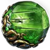

<!--
# Download: <a href="/public/BellowingRoar.zip" download>Download BellowingRoar.zip</a>
-->

# Bellowing Roar

### 우레와같은 울부짖음 


## Diablo 시즌11 시작일: 2025년 12월 11일
## POE2(0.4.0) 12월 13일 새시즌 시즌4

[다린의 비동기 거래소](https://www.youtube.com/watch?v=tKMsVT0MHt0)
1. 첫화면 상단의 프로필(카나미#1111) 누르고 my account누른다
    - 왼쪽에 상의 탭 업그레이드 눌러서  프리미엄 보관함 탭이 쭉나오고 오른쪽에 '상인의 탭 업그레이드'
    - 은신처 npc 앤지에게 확인
    - 기존 내 캐릭터 확인해봐
    - 특정 퀘스트 완료 필요: 게임 초반부 '적대적 영역(4장)' 퀘스트 중 "은신처로 이동해 앤지와 대화하기"가 표시되면 그때부터 상인의 탭을 사용할 수 있습니다.
```
POE2 '적대적 영역(Hostile Takeover)' 퀘스트는 액트 4의 필수 퀘스트로, 주로 킹스마치(Kingsmark) 지역에서 시작되며, 은신처를 마련하고 특정 NPC(마코르 등)와 대화하며 진행되는데, 퀘스트 위치는 특정 지역이 아닌 맵 내의 오브젝트 찾기 및 NPC 상호작용으로 이어집니다. 핵심은 킹스마치에서 시작해 여러 섬(혈쪽의 섬, 와카파누 섬 등)으로 이동하며 지도 조각을 모으고 보스(디아모, 흉물스러운 설인 등)를 처치하는 일련의 퀘스트 라인을 따라가면 됩니다. 

퀘스트 진행 경로 및 핵심 위치:
1. 시작 (킹스마치): 킹스마치에서 두 건 쓴 자와 대화하여 퀘스트를 받고, 은신처를 찾으라는 미션이 주어집니다.
2. 혈쪽의 섬 (Blood-Slick Isle):
    - 망가진 뼈 오브젝트를 찾아 찢어진 지도 조각 1번째 획득.
    - 눈먼 짐승 처치, 화산 땅굴에서 혈쪽의 군주 크루을 처치.
3. 다세만 (Duskward):
    - 죽은 자의 상자를 통해 찢어진 지도 조각 2번째 획득.
    - 여정의 끝에서 하란 선장 처치.
4. 와카파누 섬 (Wakapahu Island): *** 4막 클리어후에도 상점검색이 안되면, 여기로 가봐 ***
    - 석화된 해적을 찾아 찢어진 지도 조각 3번째 획득.
    - 노래하는 암굴로 이동하여 디아모 처치.
    - 부르는 조개 오브젝트 완료 (선택적 보상).
5. 히네코라의 눈 (Hinekora's Eyes): 세 조각을 모으면 히네코라의 눈으로 가는 퀘스트가 주어지고, 죽음의 전당에서 시험 3종 세트 완료.
6. 때까치 섬 (Magpie Island): 시신 둥지에서 찢어진 지도 조각 4번째 획득. 

팁:
    - 퀘스트 진행 중 NPC(앤지 등)와 대화가 안 되면, 알바를 통해 다른 은신처로 이동 후 다시 대화하면 해결될 수 있습니다.
    - '적대적 영역' 퀘스트는 액트 4의 핵심 퀘스트 라인 중 하나로, 진행 경로를 따라가며 필요한 오브젝트를 찾고 보스를 처치하는 것이 중요합니다


처음 시작할때 솔로 모드로 하면 그렇게되요 ㅎㅎ
케릭터 선택창으로 가셔서 리그 이전 누르면 해결되요    

해안선 은신처로 가야 된대

```

[전리품의 패스파인더 엔드게임](https://www.youtube.com/watch?v=QIqlN1WsIqg)
1. 활 20디바인: dps 450이상,모든공격스킬레벨+3,치명타 확률 4%
2. 반지에서는 저항우선 1디바인: 발견하는 아이템 희규도 36%이상,피해+저항이 같이 있는거
3. 세스케 백작 룬: 9디바인
4. 에너지숼드 450+ 저항합 90이상의 투구교체: 2디바인 이상
5. 우물의심장 주얼 : 피해의 12%를 추가 카오스 피해로 획득

[맵핑시 이 옵션이 있으면 죽는다](https://www.youtube.com/watch?v=57CDX8JXO8A)
1. 몬스터의 피해의 #%를 냉기,화염,번개,카오스피해로 줌
2. or 몬스터가 피해의 특정퍼센트를 (냉기,화염,번개,카오스)피해로 줌
3. or 플레이어의 저황최대치 #% 감소 옵션
4. or 몬스터의 피해가 #% 원소 저항관통 옵션
5. or 플레이어가 시간의 사슬 저주에 걸림
6. 위옵션은 무조건 걸러야 
7. 의문사 맵 4가지 :
    - 부패(시체폭발 몹존재),
    - 바알공장,바알주조소(강력한 원거리)
    - 진창(좁은 골목,의식 위험)

[맵핑의 이해](https://www.youtube.com/watch?v=TT4mKFAjAFk)


[전리품의 폐사 막는 패스파인더 엔드게임 루트 9단계](https://www.youtube.com/watch?v=QIqlN1WsIqg)
1. 타락지역을 찾아다니며 아틀라스 포인트를 모으고 계실텐데요
2. 진짜 엔드게임은 아틀라스 40포인트를 모두 확보한뒤,중재자를 처치해서 서판을 모두 레어로 만들수 있는 해금작업을 끝낸 시점 부터 시작됩니다.
3. 환영과 균열 입장권이 필요 세계관문에서 입장
4. 의식은 '왕 알현'을 세계관문에 넣어서 입장
5. 탐험은 탐험일지가 필요 세계관문이 아니라 npc 대닉에게 입장이 가능
6. 중재자 스킬포인트는 '불타는 거석'을 완료해야 하며(철의 성채,구리의성채,돌의성채를 클리어한후 조각을 모아서 입장)
    - 아틀라스 지도를 아무리리 돌아도 성채를 찾지 못했다면, 화페거래소에서 위기의조각 3개를 구매하여 넣어도 된다
    - 중재자를 처치하면 성채궤스트를 하지 않아도 스킬 포인트를 획득할 수 있다.
7. 타락이 많은 지역은 수량이 많은 서판(방사능은 몬스터+1)사용! 타락지역도 몬스터 레벨 +1,고로 서로 겹쳐야!
8. 방랑상인맵은 필수로 확인, 고유아이템을 살수 있다
9. 지도 보스 스킬 포인트는 79레벨이상의 지도에서 보스를 처치시 획득 8개까지, 그후로 더올릴려면 중재자를 잡고 +2를 얻을 수 있다.
10. 아틀라스 스킬 40포인트 = 고유지도클리어(10)+타락한지역(30포인트)로 얻을수 있다.


[김학구 중독패스파인더 총정리](https://www.youtube.com/watch?v=MW8YaCeSpFM)
1. *** 역병손가락 Plaguefinger 거즈 싸개(3딥이 넘어)/전도성균열(1딥이하) 
1. 생명력: 1575,보호막: 2686 마나:626 정신력: 205 회피:71%
1. 갑옷회피 2000 투구에쉴 400 
1. 활 dps 300, 450~500, 600이상+치명타
1. 카디로(Cadiro's Gambit)의 책략 화살통
1. *** 하이리(Hyrri's Ire)의 노여움 가슴

[석쓰의 중독 패스파인더](https://www.youtube.com/watch?v=-4-Fsi8PMIw)

[청운하의 가성비 미쳐버린 중독빌드](https://www.youtube.com/watch?v=okEJA7tgpI0)
```
패시브스킬 : 9:53
가스화살(dps 11,534) - 중량 - 치명적인중독 - 터져나오는 역병 - 효과집중 -
절망 - 사슬의꽃 -저주받은 지대 - 고조된 저주 - 지속성
역병의전령 - 정밀함(10) - 식인(15)   
연금술사의 은혜(30) - 생명력과 마나 회복!
지속되는 환상(30) - 구르기시 어그로 환영

바람의 무희 -적당한 보조젬! 혼란유발 - 힘줄 절단 - 실명
패시브에서 카오스피해증가 옵션 아무리올려도 중독피해는 안올라~
명중을 하는 물리데미지+카오스데미지의 합이 중독피해 데미지!


상태이상가속,지속시간의 관계
```

[게이머비누의 가스폭발 중독 패스파인더 빌드콘테스트](https://www.youtube.com/watch?v=nDlk7kIX-sc)
1. 전염성오염 전직패시브
    - 구름 주변의 적들도 잡을 수 있다
1. 집요한 추적(플레이어의 속도가 감속의 영향을 받지않음) 전직패시브
    - 냉각,힘줄절단,시간의사슬등에 영향을 안받어!

1. 위축을 쓸려면 지속시간을 늘려주는 '연장','지속되는 맹공',지속되는 독소' + 지속시간연장2 보조젬이 있어야 위축지속시간이 18초정도 늘어서 10중첩이 될수 있다 
    - 연장(스킬효과 지속시간 20%증가,상태이상15%증가)은 8시방향에 
    - 지속되는 맹공(지속시간 16%)
    - 위축 강도를 증가 시키는 '페누무스의 고갈의 룬'도 있다
    - 위축강도 40%증가 룬 
1. 목걸이는 투사체레벨이 가장 중요    
1. 주얼은 처치시 생명력 2%이상  효과큼, 플레이어가 유발하는 상태이상의 강도 증가/중독의 강도 증가등 

1. 굶주린 무리(버프) - 실명+힘줄절단 보조젬 연결 사용    
1. 절망 저주 
1. 바람의 무희 - 회피 최대 30%증폭

1. 가스유탄젬의 보조젬
    - 격화되는 중독: 중독최대 중첩수를 +1 만큼 늘려준다
    - 치명적인 중독2 : 명중시 피해가 조금 줄어들지만,대신 중독피해를 크게 늘려
    - 아라칼리의 욕망:
    - 유지되는 대지 3: 중독구름이 기폭되지 않게 
1. 절망
    - 범위확대2
    - 의식의 저주
    - 고조된 저주
    - 지속시간 연장2

[중독 출혈 방폭 워리어](https://www.youtube.com/watch?v=I9LcEX68f0g)

```
    공명하는 방패 - 중독3,부식,격노3,방어구폭발,출혈3
    방패돌진 - 중독3,출혈3  ,짓밟는지대,타카티의진노,초치명타
    방패의벽(보스시 양손무기 사용) - 중독3 리그월드,무리,출혈3,초치명타
    피의전령 - 중독3,부식,우르크,방어구폭발,방어구파괴3  :피의전령으로 터진 방어구 파괴는인내생성 가능
    역병의전령은 레벨이 올라갈수록 범위가 늘어난다
    장갑과벨트에룬은 플레이어가 유발하는 피해를 주는 상태이상의 강도 15%증가
    보조장비 중독확률 99% ? 확인해봐
    주얼: 상태이상의 강도 %증가
```
[석쓰의 독 패스파인더](https://www.youtube.com/watch?v=VKJAFDdcgcs&t=201s)
1. 독폭발화살 - 출혈3,치명적인중독2,터져나오는 역병,폭발투사체,거역2
2. 피의전령에서  독과출혈
3. 맹독성 종양 - 긴퓨즈2,극기2/치명적인중독2,범위집중,아라칼리,
4. 가스화살 - 폭발투사체1,유지되는 대지3,치명적인중독2,극기2
5. 바람의유희 - 원소병기2,중독3,치명적인 중독2,출혈3

[kuro의 원버튼 중독 패스파인더](https://www.youtube.com/watch?v=2F4MVF3f9RY)
[원버튼 세팅 문서](https://docs.google.com/spreadsheets/d/1TGx2oKwnbIZaWUYNQa1IKAdO4kuuTsdAnrGfsE1Quxw/edit?gid=2048696002#gid=2048696002)

[패스파인더 무기로드맵](https://www.youtube.com/watch?v=52eAi-z7Jlg)

- 70레벨에는 투구를 에너지쉴드 320이상으로 '기만의 가면'노드 찍으면 안정감
- 79레벨부터는 치명타 전환 준비
- 50렙에 부족활이 공속이 높아서 45렙의 포대활보다 액트4구간이 수월 검색기준은 DPS200이상
- 59레벨에 지지자활또는 62렙에 호전적인활  검색은 DPS 270이상/물리DPS 200이상 : 77에서79레벨의 엔드게임을 버틴다

[학구의 중독패스파인터 스타터 VER2](https://www.youtube.com/watch?v=QMz3WsiV9JE)
1. 패시브 21:18
1. 중독은 지속 카오스테미지를 주는 상태이상으로 기본적으로 2초 지속
    - 중독을 많이 주려면 -> 명중으로 주는 물리및카오스 피해량의 20% 이 많아야! 고로 치명타셋팅해야 차후에 ,피해는 반영되지 않는다.
    - 적의 피해 완화 능력에 영향을 주는 속성과 디버프(예,감전)는 적이 중독으로 받튼 피해에 영향을 줄수 있지만 , 관통은 무관
    - 출혈을 쓰는이유
    - 배합물(보조) : 중독된 적에게 출혈강도 20%증폭/출혈적에게 중독의 강도 20%증폭
    - 중독3 : 중독의 강도 20%증가
    - 독화살에 관통보다는 갈래!,중량
    - 종양:    유지되는 대지2(지대효과가 만료될때를 제외하고는 파괴불가) - 화염플랫을 사용해도 된다!
2. 주얼: 공격치명타,공격피해,상태이상,물리피해등    

1. 딜사이클
    - 맵핑 : 가스화살로 독구름 생성 -> 종양을 발사 하여 기폭
    - 보스 : 가스화살로 독그름 생성 ->(덩굴화살,절망등 사용)-> 종양을 발사하영 기폭
2. 액트4~막간 (패시브스킬 참조)
    - 독폭발화살 생각보다구려 가스화살사용
    - 덩굴화살-고통격화1-지속시간연장1-신중 
    - 고사시키는존재- 지속시간연장1
    - 맹독성종양-격화되는 중독-범위집중-치명적인 중독1-긴퓨즈2
    - 가스화살-잠식하는 지대- 유지되는 대지2-치명적인 중독1-다중사격2
    - 역병의전령

3. 맵핑초기    
    - 바람의무희-범위확대1-고정1
    - 절망-지속시간연장2-고조된저주-저주받은 지대
    - 목걸이 주입: 중량 탄약(죄책감,탐욕,탐욕)
    - 역병손가락 구매이전에는 물리데미지위주 
    
1. 독폭발화살의 원버튼매핑,터져나오는 역병+피의전령(정신력30)
    - 독폭발화살 -터져나오는 역병 - 출혈3-중독3-치명적인중독2-다중사격2


```
독 폭발 화살 - 터져 나오는 역병 - 출혈 III - 중독 III - 치명적인 중독 II - 다중 사격 II					
맹독성 종양 - 긴 퓨즈 II - 범위 집중 - 치명적인 중독 II - 격화되는 중독 - 아라칼리의 욕망					
가스 화살 - 치명적인 중독 II - 유지되는 대지 III - 다중 사격 II - 잠식하는 지대 - 지속시간 연장II					
덩굴 화살 - 고통 격화 II - 신중 - 격화되는 중독 - 치명적인 중독 II					
바람의 무희 - 범위 확대 I - 고정 I					
피의 전령 - 중독 III - 출혈 III - 터져 나오는 역병 - 치명적인 중독 II - 범위 확대 II					
역병의 전령 - 카오스 숙련					
혼의 춤 - 지속시간 압축 II - 명상 II (정신력 부족하면 명상 제외, 20퀄리티 필수)					
					
주의 사항 : 터져나오는 역병 + 피의 전령으로 맵핑을 하다보니 마나 흡수 옵션이 작동 안합니다.					
마나물약을 자주 눌러주시고, 쥬얼에서 처치시 마나 % 회복 옵션도 추천드립니다.					


```


[Fubgun 0.4 Posionburst Pathfinder Leveling Guide](https://mobalytics.gg/poe-2/builds/fubgun-poisonburst-pathfinder-leveling)

1. A will auto proc your B : A가 B를 자동으로 처리한다  가스애로우->독성성장
2. Herald of Blood(피의전령)
3. Artillery Bow(포병보우,45렙)  Fanatic Bow(광신자,79렙)

[석쓰의 독 패스파인더](https://www.youtube.com/watch?v=VKJAFDdcgcs)

[디디 악마인퍼널 ED 뼈폭풍 스타터](https://www.youtube.com/watch?v=GtVwA2EKpi8)
1. 엔드게임진입후 15티어진입
2. 악마의 형상에 압도적인 기동력사용 리치대신 사용
3. 빌드의 핵심
    - 뼈폭풍(Bonestorm) : 꿰뚫기(Penetration)+추출(Extraction)
    - 살아있는번개(Living Lighting)
    - 전염과 정수흡수
4. 작동원리 : 뼈폭풍,꿰뚫기스택중첩 -> 살아있는 번개소환 -> 살아있는 번개 소환수의 꿰뚫기 스택을 추출하여 데미지 유발 (폭풍보주에 살아있는번개를 연결하여 사용)
5. Support Gem Priority : 촉발->빠른시전1->연쇄->고통격화1->포악함1->살아있는번개1->연쇄2->격렬한고통->신중한시전

6. 액트1 지오너백작 : 
    - 뼈폭풍(5레벨스킬젬):빠른시전+포악함
        - 뼈폭풍시전후 다시시전하면 이속패널티없이 무빙샷가능
    - 폭풍보주:살아있는번개+촉발
    - 정수흡수:연쇄+고통격화
    - 시전속도아이템이 많으면 전염에 아니면 뼈폭풍에 퀄리티를 올려준다.
7. 액트2
8. 액트3  33렙이후에 이속20%장화와 36렙렐부터 +3스킬마법봉
9. 보스들의 경우 페이즈 변환시점에서 캐릭터 선택창을 다녀오면 보스피가 그대로 유지
10. [스킬트리링크](https://drive.google.com/file/d/1jsW0DkOALQnfq5-JHYZ94gD3z4ZZ6RtT/view)
11. [문서링크](https://drive.google.com/file/d/1HGpSvu2BpHwcqRaMcKGctM5nhIWkMawG/view)
12. [체크리스트](https://drive.google.com/file/d/1-VK17ml-k6WP-WDlEm3GYTbL4HQyUwIH/view)

[김학구의 리치에서 블메로 위치 스타터#2](https://www.youtube.com/watch?v=Bv5AI2anWz8&t=784s)
[겜창의삶 카오스 제웅 리치 가이드](https://www.youtube.com/watch?v=A1mX-zCnJlU&t=563s)

[담연의 위치 스타터](https://www.youtube.com/watch?v=ZyyS_-e7Lrk&t=4s)


1. 정수흡수 - 시전속도증가 - 관통 - 고통격화
2. 전염 - 효과범위 - 격렬한 고통(2티어보조젬)
3. 절망 - 조고된 저주
4. 고사시키는 존재(버프 정신력) - 지속시간 증폭
5. 3:07 패스브스킬
6. 마법봉에서는 모든카오스주문스킬레벨 +2
7. 엑트1에서는 셉터,이후 집중구


[김학구의 위치 스타터](https://www.youtube.com/watch?v=Bv5AI2anWz8)

[르네의 스타트추천](https://www.youtube.com/watch?v=fJA2QHDiJg8)
1. 추천 레인저 데드아이- 아이스 활계열 + 얼어붙은포화+저격
2. 추천 위치(초반ED 이후 블메)

## POE1 3.27 리그 Keepers of the Flames(불길의 수호자들)

[애롱이 치프틴 rf 액트](https://www.youtube.com/watch?v=Gf5yp-F3kW4&t=675s)
1. 반지고유: 베렉의 유예
2. 패시브트리-액트4 9:32 봐봐

[투별 3.27 rf 액트가이드](https://www.youtube.com/watch?v=YKO5-kWh8U4&t=261s)

1. 시작시 환영무기투척을 바로 구매!(녹빨) 후 양손무기 사용 출혈확률보조 연결
    - 환영무기투척 - 출혈확률보조  녹빨
    - 방패돌진-공격속도증가보조 빨녹  서브쪽에 사용,공격시 주무기는 양손
    - 방열(생명력을 소모하여 물리피해를 준다)을 구매
    - 재의전령 받고,
    - 2장에서  순수의전령,정의의화염,피의격노 구매
    - 격퇴자(명중시 타쇄 물리피해40%)까지 찍고,물리숙련(생명력소모)  방열을사용하면 양손무기가 필요없다! 방열이 초반에는 약하기에 환무투를 당분간 계속 사용
    - 방열의 생명력소모를 활력으로 어느정도 상쇄! 이후에는 환무투를 뺀다! 
    - 16렙에 재의전령을 사용
    - 루비반지에 에센스를 사용하고 작업대에서 화염저항을 붙힌다 정의의화염,방열사용 셉터사용!
    - 미끼토템과 방열(무기를 안탄다)사용 / 화염덫이 초반에 없다
    - 잔혹보조 받아
    - 순수의 전령(물리피해 증폭)을 구매
    - 24렙쯤에 '원소의 순수함'사용 (재의전령과 순수의전령을 빼야)
    - 10:07/19:45 에 있는 패시브 확인!신성한 지배력
    - 방열: 잔혹보조-화염피해보조
    - 도서관 들여야/시오사와 대화하기 - 오만보조 받고 미끼토템/활력에 연결,화염덫 구매후+생명력전환보조 연결
    - 
    - 정의의 화염(파1 필수)
    - 파3빨1 : 원소집중,효력,화상피해보조 //파랑보조중에 제어된파괴보조 를 착용해도 된다
    - 파2빨1녹1 :원소집중,생명력 전환, 고통격화
    - 파1빨2녹1 : 화상피해,생명력 전환,고통격화
    - 파4 : 원소집중,효력,아이템희귀도 
    - 파2빨2 : 원소집중,화상피해,생명력전환
    - 파1빨3 : 화상피해,생명력전환,지속시간감소
    - 
    - 화염덫(녹1필수) 6렙이상은 되어야
    - 녹2빨1파1: 고통격화,생명력전환,제어된파괴
    - 녹1빨2파1: 생명력전환,화상피해,연소
    - 녹1빨1파2: 생명력전환,제어된파괴,연소
    - 녹2빨2: 고통격화,생명력전환,화상피해

    - 3장 전직은 라마콘 굿
    - 화염덫사용을 위한 민첩 패시브 28:41
    - 라마코(지속피해에 대한 화염저항 -20%)를 찍었기에 이제 방열대신 화염덫사용  
    - 지속화염피해중요,물리피해는 중요하지 않다! 
    - 화염플랫데미지 아무런 의미가 없다! 
    - 29:21 봐봐!!!! 
    - 30:29봐봐(지속화염피해배율) 
    - 31:57(데미지올리기)
    - 불의순수함(화염저항증가),원소의순수함(원소저항증가) 젬 착용
    - 5장 키타바
    - 6장 냉기번개저항 챙겨,2차전직을 할수 있다
    - 패스브 42:12

1. 12렙(1장클리어까지는 환영무기투척(무기를 자주교체해야) ),2장16렙부터는 정의의화염,방열사용
1. 양손무기: 물리피해와 원소피해가 높으면 그냥사용!
2. 미끼토템과 방패돌진-빨녹(공격속도증가) 

[투별 분할,복제,분열](https://www.youtube.com/watch?v=P_P2iEotICE)
1. 피의제단에서 분열
[투별 RF초보자 액트중에 실수](https://www.youtube.com/watch?v=sJ15AjfVi1o&t=187s)
1. 원기왕성,화염숙련(1초마다 비제한 화염저항 1%당 생명력 1재생)
[투별 정의화염 범위차이](https://www.youtube.com/watch?v=7ansPbglm_c)
1. 정의화염 퀄리티올려!, 건틀릿에 '효과범위 12%증가' '범위피해 15%증가'
2. 정의화염 - 각성한 원소집중보조 - 각성한 효과범위증가 보조 -  각성한 화상피해 보조
    - 투구에서 '장착된 효과범위 젬레벨 +1', '효과범위 10% 증가'

[투별 치프틴 히네코라 RF](https://www.youtube.com/watch?v=5LyCBQCAU3M)
1. 활력의오라, 원소의순수함,불의순수함,악의의오라
    -  점유효율노드 와 마나숙련노드(스킬의 마나점유 효율 12%증가)
2. '투별 + 정의의 화염과 화염덫의 유효 옵션' 찾아봐!    

[Pohx Righteous Fire](https://pohx.net/)

[김발라 버서커 슬랩 액트가이드](https://www.youtube.com/watch?v=wHFoHhVyWy8&t=10s)

[김발라 쉬트](https://docs.google.com/spreadsheets/d/1aiuDHaIImELNl727MWlVwtLX7_h-f2AbBkph28Viufo/edit?gid=0#gid=0)

1. 12렙까지 방패돌진으로,이후 산산조각으로 쭉
2. 피의격노 : 비취목걸이착용으로 민첩 해결
3. 함성숙련과 격노숙련 찍고나면 액트1에서 인내의 함성 구매
4. 8장 후반부터 신성한 마나 플라스크가 등장,변화의 오브를 사용해 '인내의' 모드를 뽑아야 한다!
    - 해당 모드가 있으면 사용하는 동안 마나가 계속 회복된다
    - 인내의 회복량 66%감소/점유되지 않는 마나가 찼을 때 효과가 제거 되지 않음/효과가 예약되지 않음
5. 지면분쇄는 20퀄리티가 필수, 초반에 세공사의 프리즘을 이용해 올려도 되는데 개비쌈 ,전직하면서 퀄 작업,3차를 조금더 돌자?    
6. 영상에 까먹고 안넣었네요. 밴딧(도적 처리하기)은 알리라 살렸습니다. 액트 5 결백의 방에서 제작법을 꼭 드셔주세요. "함성이 이동 전용 스킬을 전력 공격으로 사용하지 않음"을 얻을 수 있습니다. 판테온은 염수왕 / 가루칸 염수왕은 변함없는 자세 찍고나선 아무거나 써도 되는데 동결 면역 얻고 나면 다시 염수왕 쓰면 됩니다
7. 위협의 함성, 지진 함성, 전투마법사의 함성, 지옥불 함성의 퀄리티를 전부 다르게 셋팅하기!!
    - 최소 1% 이상 차이가 나야합니다.
    - 위의 함성들의 퀄리티를 다르게 하여 쿨타임이 서로 곂치지 않게 되면 제각각 시전되는데 그렇게 해야 가시를 터뜨리기 용이합니다.

[다린 CWS 치프틴](https://www.youtube.com/watch?v=llMZn_KOZjA)
1. CWS(Cast when Stunned Support,기절시 시전 보조): 내가 기절당하면 주문발동
    - '발리륨' 반지로 기절한계치를 낮추어 준다 
    - 불변의 힘(주얼) : 생명력 회복
    - 혈마법
    - 피 석화 
2. 기절시시전보조를 3군데 착용    

[찝개 3.26 구불 버서커](https://www.youtube.com/watch?v=zp07On2y_QY)
1. 70레벨부터는 지도돌면서 장비 하나씩 거래로 구매및 파밍

[별이슬골짜기 역학 비/KB 완더 엘리](https://www.youtube.com/watch?v=Kgod0fOj90E&t=771s)
1. 역학 비(Kinetic Rain),역학 폭발,역학 투사체

[2편 게이머비누 구불거림의 화산균열 버서커 스타터](https://www.youtube.com/watch?v=CTLK2D7ZoLE)
1. 액트 완료후 이거 참조
2. 함성이 자동사용되는 **자동전력** 스킬과 전력공격 갯수에 따라 딜 증폭하는 **전심전력보조**라는 보조젬, 오라를 한나 포기하면 자동전력을 통해 최소 2개~4개의 함성을 자동 사용!하고 여기에 직접사용하는 오라까지 더하면 피해 증폭!
    - 위협의함성: 2배 피해
    - 지진함성: 효과범위50% 증폭
    - 전투마법사의 함성: 스킬 자동 사용 등...
    - 함성 한번에 전력공격 갯수가 막 14개씩 쌓인다! -> 강타빌드가 s티어인 이유 poe3.26에서
3. 총주교와 포식자,메이븐 그리고 우버엘더까지 4돌을 딸 수 있는 세팅, 마지막에 우버킬이 가능한 군주얼 세팅
4. 패시브세팅 액트종료부터 95레벨까지의 세팅
5. **카옴의 탁월함**이라는 도끼
    - 스킬: 구불거림의 화산균열-전심전력-분쇄-전쟁의주먹-공격시원소피해-무자비
6. 목걸이 성유 셋팅전까지
7. 자동전력스킬(4링함성세팅): 자동전력,위협의함성,지진의함성,지옥불함성,전투마법사의함성,응징 마나부족시 지옥불함성꺼애서 사용
8. 화산균열 4링크 색상별추천
    - 화산균열-화염피해보조-공격시원소피해-무자비
    - 화산균열-화염피해보조-공격속도증가-효과집중
    - 화산균열-화염피해보조-공격시원소피해-공격속도증가
9. 


[1편 게이머비누 강타버서커](https://www.youtube.com/watch?v=lrJCS4QdgzM&t=640s)
1. 구불거림의 화산균열,지동의 대지강타,지면분쇄
2. 슬램(강타) : slam 뜻은 꽝하고 문을 닫다, 군사용어로는 타격
3. 머라우더의 스타터
4. 1장 : 
    - 대지강타-무자비,양손도끼 빨-빨-빨,빨-빨-초(기세보조)
    - 미끼토템,방패돌진,출혈확률보조    
    - 구매: 피와 모래,서리점멸
    - 감정주문서3장 -> 철제반지
    - 진화의오브로 청금석목걸이를 사면 '서리점멸'을 사용할수 있다
    - 경멸의에센스는 물리피해를 올려준다
    - 도약강타,공격속도증가보조
    - 구매: 위협의 함성,인내의 함성
        - 1장 스킬세팅
        - 메인스킬: 대지강타-무자비-출혈확률
        - 보조스킬: 미끼토템,위협의 함성
        - 이동기: 도약강타-공격속도증가-(기세보조)
        - 이동기: 서리점멸
        - 오라스킬 : 피와 모래    
    - 산산조각(12렙) : '항상 제자리 공격'을 설정해야,대지강타와 교체   
5. 2장 :
    - 보상: 재의 전령
    - 구매: 순수의전령,피의 격노(생명력과 에너지보호막에 비례하여 지속물리 피해를 받는 대신,공격속도와 생명력 흡수가 증가,적처치시 지속시간이 초기화되고 격분충전을 얻을 수 있다)
    - 보상:근접물리피해 보조(출혈과교체) : 속도가 느려져 답답할 수도, 근접전투보조로 변경해도 
    - 2장 도적퀘스트 : 알리라돕기를 선택해서 모든 원소저항 15% 얻자
    - 스킬 셋팅
        - 산산조각 - 무자비 - 근접물리피해(기세보조)
        - 미끼토템,위협의 함성
        - 도약강타 - 공격속도증가 - 기세보조
        - 서리점멸
        - 오라 스킬(피와 모래,순수의 전령,재의 전령)
        - 버프 스킬(피의 격노)

6. 3장 :
    - 함성숙련: 이동전용 스킬에 전력공격을 소모하지 않음
    - 도끼숙련: 도끼로 명중시 격노 2 획득
7. 6장이후 스킬 세팅
    - 산산조각-무자비-전심전력-근접물리피해(기세)
    - 집결의함성,지옥불함성
    - 도약강타-공격속도증가-(기세)
    - 서리점멸
    - 오라스킬(순수의전령,재의전령,자동전력-위협의함성-지진함성)    
    - 버프스킬(피의격노,피격시시전보조-용암방패)
8. 
    - 7장에서는 출혈면역플라스크나 판테온에서 랄라케쉬의영혼찍어야
    - 저항은 가능하면 75%유지 작업대 활용
    - 8장에서 2차 전직
    - 10장의 무너진방은 맵핑 진입전 아주 좋은 파밍처가 있다! 그래서 아벨리우스 잡기전에 여기서 파밍, 배신몬스터는 운이 좋으면 pDPS 600급 무기도 떨군다, 3차전직 **이자로**

[PoEasy의 치프틴 RF](https://www.youtube.com/watch?v=phNquX8EL78)
1. 2장에서 오라 명상,활력
2. 방열 에 잔혹 연결(빨빨)

1. 3.27 추천 스타터빌드 게이머비누
    * 완더 워든/엘리 - 역학폭발!
    * 지면분쇄 버서커(슬레이어,치프틴,저거넛)
    * RF 치프틴
    * 반동의 독성 혼합물
    * 엘리 물리도트
    * 데드아이 아쳐
    * 데드아이 클로맨(독액선회,코브라 채찍)
    * 출혈 슬램 슬레이어
2. 3.27 시즌에 새롭게 추가된 기원의 나무 스킬 트리

3. Righteous Fire Chieftain Build

[Pohx's RF 빌드](https://www.poe-vault.com/guides/righteous-fire-chieftain-build-guide)
[개굴덱의 RF가이드 보충자료](https://riseweb.tistory.com/83#:~:text=RF%20%EC%A6%89%20%EC%A0%95%EC%9D%98%EC%9D%98%20%ED%99%94%EC%97%BC%EC%9D%80%20%EC%BA%90%EB%A6%AD%ED%84%B0%20%EC%A3%BC%EC%9C%84%EC%9D%98%20%EC%A0%81%EC%9D%84%20%EC%9E%90%EB%8F%99%EC%9C%BC%EB%A1%9C,%EC%A0%9C%20%EA%B0%80%EC%9D%B4%EB%93%9C%EB%A5%BC%20%EB%94%B0%EB%9D%BC%EC%98%A4%EA%B8%B0%EB%B3%B4%EB%8B%A8%20%EC%9B%90%EC%9E%91%EC%9E%90%20%EA%B0%80%EC%9D%B4%EB%93%9C%EB%A5%BC%20%EB%B3%B4%EC%8B%9C%EB%8A%94%EA%B1%B8%20%EA%B6%8C%EC%9E%A5%20%EB%93%9C%EB%A6%BD%EB%8B%88%EB%8B%A4.)

1. 데드아이,워든,역폭스타터,전광판,버서커 지면분쇄,완더 스타터를 성능 픽으로 할 수있다는거 자체가 너무 매력,완더/어센,레인저 충격화살-기세보조

2. 1차 전직 적정레벨은 33 19개의 전직클래스가 있다, 직업마다 고유한 추가 전직 트리, 군주의미궁을 첨 완료시 현재 클래스와 연관된 세 개의 전직 클래스 중 하나를 선택할 수,


3. 듀얼리스트(Duelist): 슬레이어,글래디에이터,챔피온
4. 쉐도우(Shadow): 어쌔신,사보추어, 트릭스터
5. 머라우더(Marauder): 저거넛,버서커,치프틴
6. 위치(Witch): 네크로맨서,오컬티스트,엘리멘탈리스트
7. 레인저(Ranger): 데드아이,워든,패스파인더
8. 템플러(Templar): 인퀴지터,하이로펀트,가디언
9. 사이온(Scion): 어센던트


[게이머비누의 초보를 위한 가장쉽고 강력한 제작법 3가지](https://www.youtube.com/watch?v=yUVAM1K8euk)

```
기본적인 크래프팅 3가지 방법
1. 화폐사용 :  먼저 흰템(다링크)에 작업대(접두접미가 비워있을때)에서 생명력을 붙히고
진화,변화,확자의오브 사용
연금술오브로 한방에 희귀템으로 

2. 에센스사용 : 단계에 따라 연금술오브나 카오스오브와 같이 활용할수 있는 화폐

3. 수확 : (야생...)생기를 사용, 푸르미 제작에서 사용

```


[EasyBabi의 엘리멘탈리스트로 시작](https://www.youtube.com/watch?v=vTtmP38ySiI&t=135s)
```
정의의 화염에서 
셉터 추천 옵션
1. 화상피해 %증가(작업대가능)
2. 지속피해 배율 %
3. 지속 화염피해 배율 %
4. 화염 주문 스킬레벨 _1

2장 
정의의 화염 - 효력 - 원소 집중
작열광선 -깊어지는 집중 -제어된 파괴
서리 점멸
방패돌진 - 기세
원격기폭장치 | 활력(*)

3장
빡센몹은 인화성저주 사용
작열광선으로 노출까지

정의의화염
작열광선
서리 점멸|인화성
방패돌진
원격기폭장치|원소의 순수함
활력(비활성)

원소의 순수함 착용 =초과 화염저항 + 냉기및 번개 저항
    -> 활력은 비활성화

4장/5장
첫번째 전직 태고의군주(골렘) - 34렙
4장의 수정광맥까지 밀면 npc 오연에게서 골렘1개
바냐에게서 나머지 3개를 기회의오브를 주고 구매해야


돌,화염,카오스,번개 골렘세트

정의의 화염 - 효력 - 원소 집중
작열광선 -깊어지는집중 -제어된파괴
서리 점멸|인화성
방패돌진 - 기세
원격기폭장치 | 원소의순수함
돌,화염,카오스,번개 골렘

6장 황혼의 해안 퀘스트완료 하면 모든젬을 구매할수 있다
    정의의 화염 4링크용 화상피해 구매(4링크가 없으면 파우스투스 도박)
    방패가 빨초초라면 공격속도증가 보조 구매
사용하는 오라: 원소의순수함,원격기폭장치,활력(점유노드찍고나서 활력:사용가능마나가 70정도 유지 ) 

7장~10장 젬변동없음

전직은 폭풍의 형성자 


정규식 
전용 정규식: "b-b-b|b-b-[rg]|b-[rg]-b|[rg]-b-b|g-[gr]-r|r-[gr]-g|g-r-g|r-g-r|g-r|r-g|Runn|rint|ll g|y.f|ld.ch|effi|ld.ch|vita|l.fo|ed.de|n.ski|f.ele|us.fi|er.att|rning.da"
```

정규식 사이트 poeregexkr.web.app

https://poeregexkr.web.app/

poe 크래프팅 


1. 시즌주기 약 4개월 25/11/1~
2.  균열을 리메이크한 리그로 균열을 진행하다 보면 보너스장비아이템인 '기생체'를 2개까지 장착할 수 있다, 나무에 먹일 재료인 '기생혈'을 얻을 수 있다.
3. 'poe1 벤더레시피' 로 검색
4. 링크 시스템 (색체,쥬얼러,연결의 오브)
5. 제작대 시스템
6. 경로석과 지도의 차이
7. 포탈 주문서 사용 - 지정해 줘야 - 죽을꺼 같으면 눌러 
8. 2돌,3돌 총포런?
9. 공허석 수집

```
https://poedb.tw/kr/
크롬 웹스토어의 나랏말서미누기 poe 는 poe닌자와 웰시엑자일에서 한글번역으로 만들어준다
poe1.ninja
```

[poe1  뉴비 입문 가이드](https://www.youtube.com/watch?v=rdxpTSh5Iuk)

## 디아4 시즌10

[WusMoon의 맹독 칼춤 도적 엔드셋팅](https://www.youtube.com/watch?v=mzLI0HgkCGQ)

1. amd 궁극의 매끄러운 게임플레이를 위한 권장 설정
    * FreeSync ON
    * Radeon Anti-lag ON
    * Vsync On/Vsysnc and Enhanced Sync OFF
    * Adrenalin Edition의 업데이트관리에서 'amd 소프트웨어 자동으로 최신상태로 유지'옵션을 체크 해제
    * 윈도우는 gpeidt(그룹 정책편집)에서 수정
1. 라데온 그래픽 게임렉 (이레서 라데온은 안사)
    * 아드레날린에서 표준을 선택하면 대부분의기능이 비활성
    * 장치관리자에서 사운드,비디오 및 컨트롤러 에서 'AMD High Definition Audio Device' 체크후 삭제
    * 문제는 amd그래픽 드라이버 설치시 같이 설치되는 amd사운드 드라이버 였습니다.
    * 드라이버설치시 풀설치말고 미니멀설치!
    * 처음 플레이화면에서 2~3분 기다리면 됨(쉐이더 캐시)!
    * 해상도를 임의로 낮거나 높게 변경 했다가 원위치!
    * 모니터 주사율도 게임내 옵션에서 변경후 원위치!

1. 회사컴 : 
    * 가상메모리 15232mb
    * i7-8700 cpu @3.2ghz
    * ram 16gb
    * windows 11 home(12h2)
    * nbidia geforce gtx 1060 6gb

1. 디아블로4 저사양 설정
    * 작업관리자 - 세부사항 - 디아블로 우클릭 - 선호도 설정에서 CPU를 한두개 체크 해제


## Poe2 Season3 Starter
[아즈메리 서판사용법](https://www.youtube.com/watch?v=NbgGxUliyPA&t=10s)
1. 경로석 작업  액체 탐욕3개 넣네  
2. 플레이 -> 오른쪽 설정아이콘 -> 게임설정 ->설치설정변경 -> 고해상도 에셋으로 설치또는 미설치 

1. 희귀도 징조로 150퍼 육박하는 경노석을 만들어 심연으로 뒤덮인 맵으로 ㄱ
2. 서판: 아이템 수량 6~7% 정도가 가격이 나감, 고유서판(대공사 서판,낙원의환영 각각 100,1000엑잘이상)
3. 서판에 환영?을 발라야
3. 발작,경악의 에센스 비싸
3. 반려수 그을린농지 '썩은까마귀' (주기적 무적오라) 점유율 24% ! 근데 느려!
4. 축성이란? 화폐교환 가셔서 '축성'검색하고 설명 읽어봐
5. 흰색 사파이어 반지에 기회의오브발라서 '꿈의조각 사파이어 반지(고유)' 만들면 몇딥

[손떨리는 아재 광포한개 + 포위뚝 이속과가성비 이거스킬노드및 설명 필독!](https://www.youtube.com/watch?v=yJZ6yVzZzPI)
1. 정신력 점유율이 30%(퀄작)
2. 긴요한 시기(정신력)
3. 엔드게임 아열대 초원에서 광포한개(가속의오라) 

[광포한 개 쉽게 잡는법](https://www.youtube.com/watch?v=Jf19R_3yyqE&t=11s)

0. 준비물 레벨9 짐승길들이기
1. 막간의 피난처로 이동
2. 그을린농지로 이동
3. 맵을 돌면서 에센스몹 찾기
4. 에센스몹이 나올때까지 맵을 리셋 (체크포인트를 통해 마을 밖으로 나가고 컨트롤 누르고 그을린 농지로 입장 -> 신규로 들어간다)
5. 에센스몹이 나오면 맵을 다 밝혀주고ㅡ광포한개(가속/가속의오라)가 나올때까지,esc를 누르고 '체크포인트재시작'를 누른다
6. 나오면 잡는다.


[개굴덱 폭발성투사체 70만 DPS  패시브노드참조해!!!!](https://www.youtube.com/watch?v=76qnIVEV1kw)
1. 라키아타의 흐름,독사의모자(고유),목걸이 할당(싸맨화살통) ,장갑(공속룬),장화(이속룬),반지(공격속성부여 +20%)
2. 쌍둥이 활(64렙) : 치명타 9.98 : 피해의 10%를 모든원소추가피해 획득
    * 치명타 확률 +4.98%
    * 물리: 38-72
    * 번개:4-225
    * 피해의 17%를 추가 번개피해로 획득
    * 모든 공격스킬 레벨 +4
    * 맹공획득(공속보다 약간 조음) 
    * 발려수 56%
    

인벤 : 경로석에 턱뼈 바르고, 타워에 3서판 작업하고, 엑자일로 대공사 서판사서 꿀지역만 돈다!
인벤 : <우측결정화의 징조>,<심연의에센스> 몇번클릭 -- 비싼 우측소멸의징조 세이브

[포이지 접두확정 게인활 제작법](https://www.youtube.com/watch?v=4vBVFRHhBRU)

1. 가성비활(광신도활)

    * 이전 활 :  DPS 580 점멸자 물리활
    * 지금 활 :  DPS 324 광신도 게인활 (가성비 )

2.  스펙(물리피해 50-84)
    * 번개피해 4-187
    * 피해의 18%를 추가번개피해로 획득
    * 반려수 59%/40%
    * 민첩
    * 공격속도 23%
    * 모든 공격 스킬 레벨 +4
 
3. 활제작(광신도)

```
접두는 에센스와 훼손옵션으로 확정
접미는 에센스 2개 확정제작(공속과 치확은 운)

접두1: 번개피해 1-234 추가
접두2: 피해의 18%를 추가 번개피해로 획득
접두3: 반려수
접미1: 모든 공격스킬레벨 +4
접미2: 맹공
접미3(확률): 공속/치확

  
완벽한 에센스 3종
    랜덤한 옵션1줄 제거후 확정옵션 추가
    -> 접두와 접미를 가득채워서 에센스 작업해야

    완벽한 전기의에센스(접두) 번개 피해 
    완벽한 전투의에센스(접미) 공격스킬레벨+4

    번개피해(접두)와 민첩(접미 아무거나)인상태의 활에서

    1st 완벽한 가속의에센스(접미)  공격속도옵션 / 맹공
    2nd 접두훼손(좌측강령술사의 징조)+(군와의 징조) 2개를 활성화하고 보존된 턱뼈(무기훼손)를 바른다
    3rd 접미엑잘 작업(왜냐하면 접미3개를 모두 만들고 접두에 에센스 작업을 할용도)  
        -> 우측찬미의 징조로 접미에 상위엑잘 확정
    4th 접두에 완벽한 전기 에센스 추가하기위해
        -> 우측결정화의 징조로 접미옵션제거되고 접두에 에센스옵션 추가(완벽한 전기의 에센스)
    여기서 우물로 가서 접두선택하면  접두3개는 확정된다
    5th 상위엑잘로 접미3줄 만든후에 
        선택1: 공속 치확이 살아있다면 그대로 사용
        선택2: 공속 치확이 모두 없다면 완벽한 에센스작업
            - 완벽한 전투 에센스(접미)
            - 완벽한 가속의에센스(접미) : 이건 운빨

    제거되는 옵션은 징조로 접두와 접미 결정 가능

    우측결정화의 징조 : 완벽한 에센스사용시 접미옵션만 제거
베이스 준비(1~10엑잘)
    마법 광신도활 접두에 번개피해 2티어

접두훼손: 좌측 강령술의 징조

```


[크리티컬 저주에서 해방 1번2번 무기스왑사용법 ](https://www.youtube.com/watch?v=wcBwlC3IwZc)
1. 수호하는물약 노드를 무기세트2번으로 찍어줘야

[개굴덱](https://www.youtube.com/watch?v=LEEi2x5QktM)
1. 물리공격 피해의 %를 마나로 흡수 : 장갑,무기,반지에서 1줄만 챙기면 된다.
    * `야생의 보행자` 노드찍어: 물리피해 대신 원소피해를 마나로 흡수

[까까모리 부패의징조](https://www.youtube.com/watch?v=oi61hRCn_E4)
1. 부패의징조: 이아이템이 소지창에 활성화되어 있을때 훼손을 시도하면 아이템의 모든속성을 교체하여 최대 6개의 훼손된 속성을 가진 아이템을 만들고 아이템을 타락시킵니다. (아이템이 타락되니 소켓과퀄리티작 우선)
2. 보존된턱뼈로 무기회손


[산들바람 하이브리드 데드아이](https://www.youtube.com/watch?v=2sdEQxvG7Kc)
1. 번개화살 -  빠른공격2, 자극, 극기2, 원소병기2, 번개관통
2. 피뢰침 - 범위확대,원소병기2,극기2,신중,번개관통
3. 천둥의전령 - 원소병기2,번개조율,원소집중,범위확대- 마나흡수   
4. 회오리 - 지속시간연장2,과잉2,빠른공격2,범위집중
5. 폭풍보주 - 잔혹성의 인형 사슴 뿔 집중구(레벨10,스왑세팅 ) 

[찝개 데드아이 정신력갑옷에 41](https://www.youtube.com/watch?v=rF4PkYtmXy4)
1. 수호자 활(레벨 77) 물리피해 91-137/번개피해 2-60
    * 22% 확률로 1회 추가 연쇄
    * 물리피해 43% 증가
    * 화염피해 88-154 추가
    * 번개피해 3-99 추가
    * 정확도
    * 공격속도 23%
    * 모든 투사체 스킬레벨 +5
    * 처치한 적 하나당 마나 4 획득


2. 천둥의전령 - 범위확대 감전전도 출혈(?) 정밀함1
3. 재의전령 - 범위확대 식인 화염숙련
4. 피의전령 - 범위확대 정밀함2 중량

5. 회오리 - 지속시간연장,과잉, 내구도

[크리티컬 날먹](https://www.youtube.com/watch?v=Q3x72V_ynNY)
1. 광신도활(레벨 79) - 물리피해 50-84/카오스 피해 43-71/피해의 15%를 모든 원소의 추가피해로 획득
    
    * 냉기피해 41-73 추가
    * 번개피해 10-196 추가
    * 피해의 20%를 추가 번개 피해로 획득
    * 공격속도 25%
    * 모든 투사체 스킬 레벨 +4
    * 이동중 투사체 공격시 10%확률로 투사체 2개 추가 발사
```
번개화살 - 빠른공격2 - 자극 - 원소병기2 - 폭발투사체1[극기2] - 거역2
피뢰침 - 번개조율[극기] - 원소집중 - 원소병기2 - 신중 - 거역2 
회오리사격 - 지속시간연장2 - 과잉2 - 범위집중 - 효율2 - 거역2
연발사격 - 새로운활력2 - 빠른시전2 - 재사용대기시간회복2 - 효율2
천둥의전령 - 범위확대1 - 번개효율 - 원소병기2 - 원소집중 - 마무리타격
전도성징표 - 지속시간연장2
바람의무희 - 밀어내기 - 범위확대1
혼의춤 - 지속시간압축2
로아탈것 - 브루투스의두뇌 - 소환수숙련
```

[개굴덱의 서판작 2개가 겹치게](https://www.youtube.com/watch?v=arnnFVaeRS8)
1. 의식과균열 4포인트 찍는것 참조

[석쓰의 패치후 오류](https://www.youtube.com/watch?v=XQTJOn7MuE0)
[파머비 베이스 아이템](https://www.youtube.com/watch?v=yVhbG_2C2i8)
1. 기회의 오브: 헤드헌터(무거운 허리띠),특출난 성스러운 집중구,
2. 기회의 징조+기회의오브: 확정적으로 고유의 아이템으로 변경
3. 회피베이스 갑옷 
    * 미끄러진 타격 조끼(3소켓,28% 이상의 퀄리티)
4. 회피+에보 베이스 갑옷(매끈한 재킷)
5. 에보 베이스 갑옷(끔찍한 로브)    
6. 장갑(2소켓,28퀄리티) 광택나는 팔보호구,고정된싸개+하위베이스,사이렌비늘 장갑, 바알장갑, 호화로운장갑
7. 장화(2소켓,28퀄리티) 비룡가죽장화,용비늘장화,단검발 신발,빠른 미끄러짐 신발,세케마샌들,모래맹세 샌들 
8. 투구(2소켓,28퀄리티) 선대의 티아라,카마사 티아라,

[크리티컬 득템 사냥터 3곳](https://www.youtube.com/watch?v=28n3lEpgrTY)
1. 의식/에센스/강력한보스(군도)

[게이머비누](https://www.youtube.com/watch?v=fcdlALp94XU)
1. 활가성비 물리피해 84-144 / 화염피해 40-58

    * 추가 피해의 중요성(아래의 26과 17)
    * 물리피해 31-48 추가
    * 화염피해 40-58 추가

    * 피해의 26%를 추가 카오스피해로 획득 (아이템 사용)
    * 피해의 17%를 추가번개피해로 획득
    * 모든 투사체레벨 +4
    * 공격 속도 24%

[개굴덱의 펍건 데드아이](https://www.youtube.com/watch?v=z48lJVddMd4)
1. 패스브 스킬 
    * 영체 수호 노드 : 갑옷의 회피12당 에보 +1
    * 기만의 가면 :투구 에보 1당 회피+2 -> 목걸이에서 할당해서 사용!
2. 혼의춤 스킬    

[크리티컬딜러](https://www.youtube.com/watch?v=aiCOY0RuaTc)

1. 쌍둥이자리활  가성비 dps 26,061(물리피해 205-351,화염피해 14-21) -> 44,474(아래)
    * 물리피해: 47-86
    * 번개피해: 9-195
    * 피해의 추가를 모든원소의 추가피해로 획득
    * 공격스킬의 원소 피해 75%증가
    * 공격속도 25%증가
    * 모든 투사체 레벨 +4
    * 반려수가 주는 피해 59%
    * 반려수가 접근해 있는 동안 피해 53%
  

[포이지 데드아이](https://www.youtube.com/watch?v=Gw1rq0nqNOU)
1. 번개화살: 빠른공격2 원소병기2 충전사격2 처형2(번개조율) 자극(연쇄)
2. 피뢰침: 근접전투2 원소병기2 범위집중 원소집중 처형2 / 다중사격2(3차전직이전에),신중,극기2
3. 연발사격:재사용대기시간 회복2 새로운활력3 빠른시전2
4. 회오리사격: 지속시간연장2 과잉2 마무리타격2
6. 서리폭탄(모든원소 노출): 효력있는노출,지속시간연장2,범위확대2 
7. 짐승길들이기(살점관통자  ) : 육탄방어2,원소의군단 / 브루투스의두뇌, 충성심
8. 천둥의전령(퀄리티 20%): 번개조율,범위확대1, 원소병기2, 원소집중
9. 바람의무희 : 밀어내기,실명2,생명력흡수3
10. 정신력 맞추기 : 패시브-반려수점유 효율8% 찍든지 짐승길들이기 퀄리티 20% :   사용가능
11. 2차전직후 '지정사격' : 전도성징표,범위확대1,번개숙련,번개조율

    * 쌍둥이자리 활(레벨 81) 물리133-248/번개2-50  
    * 물리피해 59%
    * 물리피해 18-34 추가
    * 번개피해 2-50
    * 마나 15 획득
    * 공속 12%
    * 정확도 40
    * 시야 반경 10%
    * 
     

[게이머비누의 활제작](https://www.youtube.com/watch?v=6XLL39XY0Jc)
1. 완벽한 진화, 확장 바르기
2. 접두에 무조건 물리피해혹은 번개플랫이 붙어야 함!
3. '공격속도 에센스'는 번개피해가 있는놈에게 적용 
4. '마모의 에센스'는 물리패해가 있는놈한테 사용
5. 노란템이 됬으니 훼손(심연옵션,보존된 턱뼈)시켜야 되는데 '좌측강령술의징조'을 켠뒤 '보존된 턱뼈'를 사용 한다(접두에 심연을 붙이기 위해) 
6. 접미는 그냥 엑잘을 붙힌다.
7. '심연의 메아리 징조'( 한번 무작위 변경가능)를 들고 영혼의 우물로 간다.
8. 심연의 옵션이 별루고 다른옵션이 좋으면, 심연의 옵션만 지울수 도 있다.

9. dps 계산은 물리피해(평균)*초당공격속도(1.1) * 투사체레벨(1.14) * 숫돌(1.2)
10. 은신처 이동후 앤지클릭후 상점관리


[포이지 데드아이 활제작](https://www.youtube.com/watch?v=0KjTiIfJidU)
* 상급진화,확장의 오브,상급에센스,턱뼈심연제작,상급엑잘오브
* 55렙 쌍둥이활/ 78렙 쌍둥이자리활
* 준비된 화살통/쌍둥이자리 흰템 무조건 줍어야

[김호러 데드아이](https://www.youtube.com/watch?v=Njzo2p3bczQ)
* 번개화살: 자극(보스전에는 무쓸모이므로 연쇄),원소병기2,빠른공격2,번개조율,극기 (로아)
* 피뢰침: 원소병기,범위집중,원소집중,번개조율,근접전투(신중)
* 회오리: 과잉,지속시간연장,모래시계
* 연발사격: 재사용대기시간 회복,새로운 활력
* 천둥의 전령: 원소집중,원거리사격,원소병기 
* 로아탈것(아마존 전직): 부루투스의 두뇌
* 바람의 무희(로아대신) : 범위확대,실명,격노
* 반려수(가속오라/초반에 없으면 원소저항) : 

* 베이스 준비된화살통(공속)

[김학구 블메 스타터](https://www.youtube.com/watch?v=-C5aMPoK2ds)

[지베이스 리치 스타터](https://www.youtube.com/watch?v=ECzWtCbuujw)

1. 리치 스타터
    * ED(정수흡수)로 액트를 편하게
    * 충격파편 최후의한탄 유니크
2. 데드아이 블러드메이지    

[르네 스타터](https://www.youtube.com/watch?v=fJA2QHDiJg8)

1. 직업
    * 위치 (블러드 메이지,인퍼널리스트) : 초반ED(정수흡수+전염)
    * 레인저 (데드아이, 패스파인더)
    * 몽크 (인보커,차율라)
    * 소서리스 (스톰위버,크로노맨서)
    * 머서너리 (위치헌터, 젬링 리저네어)
    * 아마존
    * 폭풍소환사 구리데

Create PullRequest,Merge PullRequest 하지마!
여기서는 branch 만들면 안돼!!!
branch 지우고자 하면, 현재의 branch를 바꾸고 vsc에서 커맨드 파렛에 가서 git delete branch 쳐봐!

1. 국민연금
    * 10년 가입기간을 채웠다면
    * 이미 가입기간을 채운 경우 연금개시 연령 이후에는 임의계속가입보다 연기연금을 이용하는것이 유리 하다. 
    * 연기연금과 임의계속가입은 중복이 불가하며 연기연금의 효율이 더 높다(연기연금을 이용하면 매년 7.2%씩 연금액이 상승한다)

2. LLM API의 가격 구조 (Input /1M Tokens,Output/1M Tokens)
    * 현재 인기있는  API는 널리사용되는 ChatGPT(OpenAI),기능적 우수성을 제공하는 Gemini(Google), 혁신적인 Claude(Anthropic), 그리고 네이버의 HyperCLOVA,
    그리고 메타의 LLaMa3(Meta)
    * 자체서버에서 모델을 호스팅

    * LLM API는 입력토큰과 출력토큰에 따라 가격이 책정
3. RNN, Transformer model(GPT),attention
    * Llama2는 2조개의 토큰으로 학습. 트랜스포머 아키텍쳐,7B~65B(빌리언 10억)의 파라미터로 훈련,비공개모델은 수천억개의 파라미터사용하는데 반해 GPT4 1조개의 매개변수,라마는 공개 소스 모델로 고가의 컴퓨팅시간이나 인프라 투자없이도 스타트업이나 소규모조직에서 Llama 기반 모델의 로컬 인스턴스를 배포할수 있다.

    * [오픈소스LLM Llama 2란](https://www.ibm.com/kr-ko/think/topics/llama-2)

4. 트랜스포머 구조 Attention Is All You Need, 2017. deep learning architecture Known as the transformer, base on attention mechanism proposed in 2014 
## LLM 

[딥러닝 자연어처리 RNN 개념 first-order Markov Model](https://www.youtube.com/watch?v=Hn3GHHOXKCE)

[Transformers,explained: Understand the model behind ChatGPT](https://www.youtube.com/watch?v=Pnd8bCJ4Z3A)

[But what is a neural network? Deep learning chapter 1](https://www.youtube.com/watch?v=aircAruvnKk)

## Diablo4 Season9 theme is ths Sins of the Horadrim.
[더큐 독가시 발라잔 짓손 혼령사](https://www.youtube.com/watch?v=EKssHexC-EQ&t=23s)
- 결투사의 장화: 짓이기는 손에 명품화 저격, 방어도 어픽
- 스킬: 유린자,독성피부,역습 -> 와류 -> (사냥꾼) -> 짓손
- 가시 + 중독 + 독기공명 + 재규어 + 포악한예언자 
- 마을 공속 93 권장, 별반,서슬판금,운명의 주먹이 선행되어야

[크딜의 세파존텍 파밍세팅](https://www.youtube.com/watch?v=xxAalFejzfA)
- 세파존텍(듀리엘,안다,사도),충의의어깨걸이(그리구아르),신발
- 적황색갑각+굳센타격의 위상 : 철갑가죽(고릴라)+궁극기 : 교묘함의 효과로 철갑을 여러번 굳센타격으로 방어도 증가(적황색 갑각)로 공격력 증가의 효과를  보기위해
- 투구: 충의의[그리구아르 드랍],할리퀀
- 갑옷: 위세의/적황색갑각(지르드랍): 보호막 생성+총방어도
- 장갑: 맹렬한: 보호막생성 + 폭풍깃털 위력
- 바지: 불복의 :  보호막 생성+총방어도
- 장화: 결투사의 : 보호막+피하기 재감(3), 피하기 최대충전+3 사용
- 무기: 세파존텍(두리엘,안다,사도)/우셰낙파(지르 드랍)
- 목걸이: 원소의/태양새 목걸이(두리엘,안다,사도)/가속(3)
- 반지: 굳센 : 폭풍깃털의 위력/방어 재감
- 반지: 자만하는 : 폭풍깃털의 위력/방어 재감
- 정복자: 기백 - 쇠약(삐죽 깃털) - 끈적이는(영리함) - 집중(급성폭발) - 추진력(날발톱)
- 철갑가죽+추적자를 사용하여 적황색과 굳센사용시

[석쓰 야만용사 스타트 빌드](https://www.youtube.com/watch?v=4XvsyjZ_iFc&t=85s)
- 초반 레벨링 평타 지진 야만용사 세팅

[르네의 발라잔입문 세팅](https://www.youtube.com/watch?v=-kr2gb0nowk&t=364s)
- 가시반격을 위해서 역습(모든공격회피)은 조심히 눌러야! 일단 먼저 몹에게 맞고시작해야(역습은 한템포 늦게 사용해야)
- 스킬: 와류,철갑,역습,유린자,사냥꾼,깃털사격
- 평온의힘 육척봉 민첩,최생,주자원/재규어 혼령전당위력/신비의원
- 자만하는 목걸이(보막이 있을때 피해증가)  민첩,정점,강력함/신비의 원/사냥꾼 재감
- 튀어오르는 반지: 민첩,최생,공속/신비의 원/사냥꾼 재감
- 티리엘의 권능: 피해감소 어픽

[게임하는무드의 만능 물총빌드](https://www.youtube.com/watch?v=Eq-bUJ-xoWQ)
- 피하기 쿨: 샤코와 신발의 피하기 재감 3저격 와 목걸이에 피하기 저격
- 우셰 낙 파
- 적황색 갑각으로 무한 추적자

[더큐의 독가시 발라잔 짓손혼령사](https://www.youtube.com/watch?v=EKssHexC-EQ)
- 유린자,독성피부,역습을 켜고 신비의원 장판이 생성된 곳에 와류로 끌어모아 짓손으로 폭딜(순간 중펍 폭딜을 넣는 방식) 
- 가시+ 중독+ 독기공명 + 재규어 + 포악한 예언자(결정타피해가 주위로 퍼지는 효과,반지에, 신비의원위력,사냥꾼재감)
- 발동빈도 = 공속+타수, 추가타 발동을 위해 <유린자>를 상시 유지
- 포크산(다음공격이 극대화적중 0.35초 동안 제압),아후콱스(주자원모두소모해 피해증가)
- 장화(짓손의 크기,이동속도)에 방어도필수,라헤어의 저항과 피해감소도 챙겨줘야
- 역습의 회피에 의한 정복자 문양,자만심의 추가 회피확률에 따라 최대 3,000의 가시를 얻을수!
- 자원관리(별반지와 육척봉의 행적 주자원회복 필수,행적어픽의 운명의 주먹필수,들불문양의 재감효과에도 영향)
- 재규어+재규어
- 육척봉: 신비의 원위력과 주재규어 전당 위력(저격)
- 보석: 
    - 아래에서 온 우상(주핵심능력 6%, 최생 6%,방해받지 않음 상태)
    - 부정의 문장(거부계열 비전을 2개 장착시 보강과 가시)
    - 폭군의 파멸(지속피해 0.3만큼 영구적)

- 정복자
    - 시작보드(영리함) - 가시피부(자만심) - 집중(복수) - 쇠약(의식) - 끈적이는 보호막(들불)
    
[크딜 가시 독 짓손 혼령사](https://www.youtube.com/watch?v=VzEje6c6_0A)

[크딜의 가시독 짓손 혼령사](https://www.youtube.com/watch?v=O2obzmMt8us)

    - 시작보드(들불) - 가시피부(기백) - 끈적이는 보호막(영리함) -집중(자만심) - 쇠약(의식) 

- 스킬: 철갑갑옷,역습,독성,사냥꾼,와류,짓손 (역습->와류->사냥꾼)
- 혼령: 재규어+재규어
- 궁극시 사용전에 와류 사용한다(교묘함: 궁그기 시전앞서 마지막 시전의 기술이 초기화 된다! 4회 무료로 사용가능! 확인해봐!!!!)
- 포악한 예언자의고리 효과(화신 기술시전시  취약 결정타 피해중 46%가 주위로 퍼짐: 보스에 잡몸이 있어야 하지만, 아래에서온 우상 호라드림 '보석수호자' 효과로 잡몹을 소환하는 압정처럼 생긴 옵션이 나오면 잡몹을 활용해 보스를 보다 쉽게 처치 가능 )

[게임하는무드 야만용사 달려들기](https://www.youtube.com/watch?v=cEgiYPbRI6g)
- 190레벨에 나락70단
- 달려들기에 출혈을 이용해 하로가스의 재감을 이용한다

[메쿠나 원소술사 빌드   설명](https://www.youtube.com/watch?v=bT9mod9BEvU)
[Mekuna 고행1~4](https://mobalytics.gg/diablo-4/profile/488e94b2-25a8-4b09-95aa-f74e532482cc/builds/e379f0b6-8797-43de-93de-65e23005b90e)

[푸들멈머 원소술사 맨땅 히드라 나락70](https://www.youtube.com/watch?v=YqPuNLhYlMY)

1. 마법부여: 히드라,화염구
2. 궁극기없이 히드라만 : 번개창,히드라,순간,사역,얼음,칼날 
3. 내가 정독해야!!!
4. 장비
    - 투구는 재자용대기감소/최대자원/방어도/저항   
    - 갑옷은 최생/방어도/저항, 담금질에 단일 저항,보막생성량
    - 장화(공격시 재감),바지 지능/최생/방어도/저항 
    - 지팡이: 주자원회복/지능/최생 
    - 반지 지능/공속/극대화 확률
    - 장갑 핵심기술/지능/공속
5. 정복자(190) 167렙이면 가능 
    - 시작 창조술사(지능5당 구현기술로 주는 피해 증가)
    - 작열하는 열기- 전술가
    - 마법부여전문가- 방화광
    - 원소소환사 - 정령술사
    - 근본적인 방출 - 파괴

6. 추천향,비약    
    - 레더마인,위안의 향신료, 나선의 아침
    - 풍부한 자원의비약, 유리함의 비약,불굴의 비약

[푸들멈머 원소술사 플리커 히드라 버전2: 정복자 셋팅참조하시라](https://www.youtube.com/watch?v=nU4COULQmjc)


[크리티컬딜러 얼음파편 히드라 100단 널널](https://www.youtube.com/watch?v=-DNeNirlhrU)
1. 반지: 내면의(3초동안) 별반지 대체 : 쉬프트키를 누르고 피하기를 누르면 "가만히 서 있는 동안 주는 피해가 상당히 증가합니다" 아이콘이 고정이 된다(계속 유지가 된다)!!!!! - 필수 확인
    - 쉬프트를 항시 누르고 피하기로만 이동해야(재자리 판정,내면의 유지된다) + 기술트리의 영혼의불꽃(3/3)
2. 가슴 정신집중으로 수의대체   
3. 스킬: 얼음파편,구렁이,지옥불,칼날,얼음갑옷,사역마 // 순간이동이 없다! 
    - 얼음파편을 계속눌러 피하기쿨을 줄인다
    - 명멸걸음의 피하기 - 궁그기 쿨감

#### CDR(Evade Cooldown Reduction)  [maxroll](https://maxroll.gg/d4/build-guides/hydra-sorcerer-guide) Why aren't you stacking Crit Chance?
#### Starter Ancestral Mythic
#### Conjurer Glyph 

#### 중요사항
1. 순간이동은 스킬창에 없어도 마법부여로 지정했다면 
2. 피하기 누르고 공격을 해봐 얼마나 빨리 피하기 쿨이 돌아오는지 확인!
3. 뱀의홍채는 히드라를 핵심기술로 가능하게 해준다! 그래서 별반지와 장갑에 핵심기술 명품화!
    - 그래서 할리퀸의 재감과 최대자원, 거짓된 수의는 자원생성량
    - 그래서 축도관의 자원생성량및 최대치
4. 무기에 행적시 주자원회복    
5. 중심점 최대자원,재감
6. 탈라샤의  재감

[핑크쿠마 히드라](https://www.youtube.com/watch?v=1TWAxOvZhnI)

1. 시작(전술가) - 작열하는 열기(파괴) -원소소환사(창조술사) - 마법부여 전문가(정령술사) - 근본적인 방출(방화광)


[더큐의 연쇄번개+히드라](https://www.youtube.com/watch?v=U-aEv0zojRU)
1. 스킬: 불안정한 전류,사역마,갑옷2개, 연쇄번개,히드라
2. 불안정한전류사용후 연쇄번개 난사
3. 마법부여: 순간이동,히드라
4. 뱀의홍채+축도관
5. 얼음갑옷이 폭풍격화위상을 발동?+ 자원생성
6. 태고의속박 은 태고의속박 스택유지용
7. 룬 시르+세흐(혼령늑대) 

8. 시작(정령술사), 연소본능(불길탐식자),작열하는열기(전술가), 마법부여전문가(방화광),얼음폭포(처치자),전하쇄도(파괴)

[더큐의 스타팅히드라](https://www.youtube.com/watch?v=TpEgja5XNZs&t=211s)
1. 순간이동, 서릿발, 사역마,갑옷, 화염벽, 히드라
2. 마법부여는 화염구와 순간이동
3. 장화에 공격시 피하기 재감,주황색 위상으로 궁극기쿨감소,담금질에 피하기 재감 명풍화!!
4. 위상 우선순위: 구렁이(중심점) 전투마법사(장갑) 방화광 폭풍격화(마법봉) 분쇄하는 칼날
5. 위상이 없다면 자만하는 검의달인 내면의고요
6. 방어구 위상: 눈의장막(투구) 영생하는 정신집중(가슴)

1. 히드라 정복: 시작(정령술사), 연소본능(불길탐식자),원소소환사(전술가), 마법부여전문가(방화광),얼음폭포(횃불)
2. 우선: 정복자50 과 문양작 15등급
3. 안다리엘,두리엘,늑대 메피에서 뱀의홍채 득해야
4. 홍채득하고 스킬트리를 산산조각 히드라로 변경 스킬: 얼음칼날,사역마,얼음방패,화염방패 ,히드라,궁극기
5. 마법부여: 얼음칼날, 순간이동 
6. 서릿발은 주울룬을 통해 자동발동
7. 바지는 얼음심장브레이스(서릿발)/축도관 
8. 룬(네오+콱스/세흐/와트) 순간 딜뻥
9. 룬(시르/이그니 + 주울) 자동서릿발
9-1. 뱀의홍채+축도관 득하자!(연쇄번개+히드라)
10. 고행2 진입
11. 정복자레벨 150 문양작 46 ,명품화 8강
12. 고행4 진입 무난
13. 명품화 11 정복자 200 문양작 70 이상 올리면, 왠만한 컨텐츨르 소화! 
14. 유효 2어픽이상의 선조템으로 교체하여 12강 11강은 분해

[크리티컬딜러 히드라 원소술사](https://www.youtube.com/watch?v=ziiEWytQXcw)

0. 152에 고행4단계 ㅋ   태고의속박 10스택유지!! 늑대(몬스터를 얼려, 확인해봐, 그래서 흰서리3/3),히드라,얼음칼날

1. 투구 눈의작막 : 지능 활력 방어도/최생+보호막
2. 갑옷 정신집중 : 지능 활력 방어도/최생+보막
3. 장갑 전투마법사: 공속 지능 /히드라피해+보막
4. 바지 돌격/축도관: 지능 활력 모저 / 최생+보막
5. 장화 주황색 지능 최생 초당마나/ 피하기 재감+보막
6. 지팡이: 구렁이: 지능 활력 취약/히드라피해+히드라 머리
7. 목걸이: 뱀의홍채
8. 반지: 탈라샤(재감어픽)
9. 반지 폭풍격화: 지능 공속 최생/ 지옥불재감+히드라 피해


[크리티컬딜러 구상번개 히드라 원소술사](https://www.youtube.com/watch?v=s00FCzQj1k4)
0. 늑대소환 - 태고의 속박, 히드라는 마나100%에서 사용!
1. 스킬: 얼음파편(살엄의우박 머리고유템효과),얼음칼날,얼음갑옷,구상번개,불안정한전류,히드라맥스,(사역마는 스킬창에는 없다)
2. 좌클릭은 쉬프트+좌클릭시 불안정한전류
1. 시작(전술가), 연소본능(불길탐식자),근본적인 방출(방화광),마법부여전문가(정령술사),혹한의운명(창조술사)


[개굴덱 히드라 원소술사](https://www.youtube.com/watch?v=5FmedKg4xwY)
 
1. 전설노드 마법부여전문가 먼저, 방화광,정령술사,전술가 - 15레벨 우선으로  
2. 106레벨에 고행3단 클리어,무기 8강
3. 110렙에 고행4단 , 고유템 뱀의홍채,탈라샤 

[고통받는 메피스토 히드라 원소](https://www.youtube.com/watch?v=rztJwyHU_1Y)

1. 레벨 112에 고행4 ㅋ

[르네 물총](https://www.youtube.com/watch?v=7wjU6q-TbUc)

0. 피하기 재감 : 목걸이와신발에 담금질
0. 스킬: 비상,철갑,역습,유린자,사냥꾼,천둥쐐기
1. 고행4(나락 55단) 권장커트라인 800세파 8강/정복자 150렙 이상/문양 평균 40레벨 이상
2. 폭풍깃털위력 담금질 - 장갑,반지
3. 굳센타격의 위상 쿨 돌리기: 철갑->사냥꾼 with 교묘함 패시브 쿨이 도는 동안 유린자/역습 유지 ...반복
    - 굳센 위상: 고릴라 기술시전ㅅ 3초 동안 방어도에 따른 무기 공격력 증가
    - 적황색 갑각 고유템=쿨 리셋,쳄+쿠에룬으로 보호막
    - 충의투구
    - 세파존텍 : 기본기술이 항상 3번째 공격 사용(천둥쐐기 3타 효과인 피하기 쿨 5초감소 상시 적용)
        - 두리엘 , 안다리엘 ,증오의 사도, 벨리알
    - 

[Evade Spiritborn Leveling Guide](https://maxroll.gg/d4/build-guides/evade-spiritborn-leveling-guide)

[Quill Volley Spiritborn Leveling Guide](https://maxroll.gg/d4/build-guides/quill-volley-spiritborn-leveling-guide)
1. 촉매:
2. 스킬: 철갑가죽,역습은 놀라운 생존력을 제공합니다. 비상(Soar)은 초반에 
3. SHIFT를 누르고 회피(피하기)를 누른다. "위치유지" 보장및 타겟이 없어도 썬더스파이크가 계속 시전된다.
4. 위상
    - 고릴라 스킬을 사용하면 3초동안 무기 공격력이 방어력의 30%만큼 증가
    - 방어확률의 70%만클 치명타 피해증가, 방어시 2배
5. 담금질
    - 방어구: 매초 보호막 축적 최대10%
    - 손,반지: +40% 폭풍깃털 효능
    - 신발,목걸이: 치확, 피하기 재감
    - 신발: 공격시 회피 재사용 대기시간 감소
    - 무기:+30% 주독수리 영혼전당 효능


[Rock Splitter Thorns Spritborn Leveling Guide](https://maxroll.gg/d4/build-guides/thorns-spiritborn-leveling-guide)


1. Balazan Rake(갈퀴발톱) Spritborn
2. Balazan Thrash(후리기) Spritborn
3. Evade Spritborn(독수리,독수리)
4. Stinger Spritborn Leveling(독수리,재규어)

## Diablo4 Season8 Quill Volley Eagle Druid(A Tier)

1. 기술
    - 철갑가죽(화신),역습/와류(화신),참화,사냥꾼(궁극기),유린자(화신),깃털일제사격
    - 무기 케펠레케의 막대    

## Stinger Centipede 독침지네
    - focuses on th Poison from Pestilent Swarms
    - Gather enemies with Vortex and Activate Scourge then Spam Stinger to deal damage

## Diablo4 Season8 Rushing Claw Spritborn Endgame Build Guide
### maxroll.gg 의 Spritborn Speedfarming Builds Tier List
0. Gorilla and Jaguar spirit halls
1. 독성피부(5/5)는 이빌드의 핵심기술 : 수많은 쿨다운 감소로 항시 적용
    - 얼음속의짐승에서 고유템 **상처마시는사람** 반지의 독성피부 저격해야
2. Ferocity(포악함,사나움) -> Mystic circle(평원의 위상)
3. Dodge chance(회피기회)

4. 철갑가죽(화신),역습(화신)은 측두절개의 위상으로 인해 영구적으로 활성화.
5. 패러곤
    - 시작 (민첩->지네기술피해)
    - **끈적이는 보호막**<장벽으로 최대생명력의 3%를 유지시 피해1%증가>(민첩->치명타피해)
    - 군중제어피해 30%(힘->독피해)  
    - 6가지속성중 2가지피해의 20% 추가피해(영리한,지능->비물리피해)
    - **쇠약**동일한 정신으로 고릴라 재규어 독수리 지네의 스킬을 3개연속 시전시 5초간 활력과데미지 증가(민첩->치명타피해)

6. 장갑에 신비한원,바지에 측두절개,신발에 사나움5,

## Diablo4 Season8 Shred/Rushing Claw Druid(B Tier)


1. 위상
    - 목걸이: 굳센 타격의 위상(고릴라기술시전시 방어도에 따라 공격력 증가)
    - 반지: 포악한 예언자의 위상(화신기술 시전시 취약)
    - 반지: 자만하는 위상(보호막 피해증가)   /  상처포식자(얼음속의야수)
    - 장화: 결투사의 위상(최대 포악함이 5 증가)
    - 바지: 측두부 절개의 위상(격렬한 할퀴기 시전시 화신기술 효과지속시간 증가)
    - 장갑: 평원의 힘위상(행적 신비의원안에서 재규어 스킬시 흉포함 최대 피해 증가)
    - 미늘창: 전위된 힘의 위상(방패막기 확률에 따른 추가 극대화 피해)
2. 기술
    - 철갑가죽(화신),역습(화신),참화,사냥꾼(궁극기),독성피부(화신),할퀴기    
3. 정복자
    - 시작 고름, **끈적이는 보호막**-기백,**드러내기**-파멸,**집중**-영리함,**쇠약**-건강    

1. 충격파위상(분쇄 드루)
2. 여진/지하의 위상(산사태 드루)
3. 쇄도의 위상(동료 드루)
4. 암석 폭발의 피해량증가,최대크기로 폭발하면 제압이 확정(암석폭발 드루), 배사폭발의 위상,맹위의 돌
    - 묠니르의 반지로 자원무제한
    - 대격변 패시브 '끝없는비바람'과 '재앙'으로 지속시간업, 제크룬으로 궁극기 대기시간 감소, 폭풍전야
    - 바실리의기도(고유템,대지기술이 곰인간기술)
    - 기술: 맹독,늑대무리,싹쓸바람, 대격변. 칼날발톱,암석폭발
    - 우두머리 상대로 늑대에게 탱킹시키고 거리벌려서 딜
    - 쿠에룬으로 대지방벽을 사용할수 있다,단 대지방벽스킬을 찍어야,스킬창에 없어도

[maxroll Shred Druid 엔드게임 가이드](https://maxroll.gg/d4/build-guides/shred-druid-guide)
1. Mythic Skills: 대지방벽,피의울부짖음,쇠약해지는포효,Maul,Shred
2. Paragon Boards: 시작(아웃매치)-대학살에 대한욕망(감전) -고조된 악의(정령) - 내면의야수(골키퍼) - 조상의 안내(송곳니와 발톱)
3. 멸망의 후계자(핵심기술+7), 폭풍발톱의지팡이,신발(와일드하트 배고픔) ,별반지(핵심기술+3)


[라이더 디4시즌7 대격변 드루이드](https://www.youtube.com/watch?v=epxbE1ARC4Q)

1. 묠니르의 반지
2. 번개불피해증가 룬세공사,의지력업해야,감전사 문양 의 번개불피해증가
3. 잔룬의 극대화적중 제압 효과가 대격변지속시간동안 유지,대격변지속시간이끝나기전에 새로 대격변시전하면 이전에 적용받았던 잔룬 효과가 그래로 유지 !!!! 스냅샷이네..ㅠㅠ
4. 궁극기 재감 **아이리다**의 반지,폭풍의 포효+폭풍변형자의 위상

[백범로 칼날발톱](https://www.youtube.com/watch?v=bVfSdsyweSw)

1. 

[크리티컬딜러 칼날 고인돌 디4 시즌4](https://www.youtube.com/watch?v=PmUA1DwFZoU)

2. 싹쓸바람스킬에 바위를 얹어 돌리면서 폭딜을 하는 방식(**고인돌** 고유 목걸이+ **변형 돌의** 위상,**깨진돌** 위상,티볼트의의지,자연의 위상)
    - **티볼트의의지** 저지불가효과는  **대지방벽**과 **짓 밟기**에서
    - **자연의 균형**위상 : 폭풍사용하면 대지기술극대화,대지사용하면 폭풍기술극대화 4초
    - **자연의격노**패스브: 대지기술인 바위와 대지방벽을 사용시 확률적으로 싹쓸바람의 쿨이 돈다
    - **자연의 야만성** 위상(늑대인간기술이 폭풍기술로,곰인간기술이 대지기술로,그래서 칼날스킬이 폭풍기술로 취급)

    - 기술: 석화,대지방벽,**싹쓸바람**,짖밟기(돌격),**바위**,칼날
    - 자원소모없이 더많은 돌덩이를 돌릴수 있다
    - 자원생성관련: 
        - 고유템 **폭풍의 표효** 투구
        - 정복자 **대학살의 욕망** 전설노드, **내면의 야수** 노드  
        - **어스름**위상 : 석화기술을 사용하면 어스름효과로 자원을 엄청나게 획득
    - **독성발톱**패시브: 늑대인간기술이 극대화로 적중화면 4초에걸쳐 독피해
    - **독살** 패시브: 중독된적에게 극대화피해 30%곱 증가
    - 정복자: 착취 -> 고조된악의(천지개벽) -> 대학살의욕망(기백) -> 내면의야수(의연함) -> 대지의파멸(원정) -> 선조의 인도 
    - **두리엘** **안다리엘** : 고인돌, 폭풍의포효 
    - **증오의사도** : 


[maxroll Shred Druid Leveling](https://maxroll.gg/d4/build-guides/shred-druid-leveling-guide)

[wowhead shred Druid Leveling](https://www.wowhead.com/diablo-4/build/shred-druid-leveling-37908)

1. If you enjoy aggressive, up-close combat, this build is for you!
2. Stormclaw's,스톰클로의 위상(분열된 봉우리): 메인핸드에적용,Retaliation(보복의 위상,건조한 초원,목걸이에 )
3. 자원관련 위상 : Calm Breeze(잔잔한 산들바람의 위상,반지에) and Unsatiated(만족하지 못하는 것의 양상,반지에)

## Diablo4 Season8 Belial's Return 지진 바바,Upheaval Barbarian

**광폭화** 란:피해량이 25%곱으로 증가,이동속도가 15%합으로 증가,5초동안
머리는 **못생긴놈** 손은 **운명의주먹** 필수인듯

1. **산의분노(Mountain's Fury)**가 있으면 요거먼저 해보자 : 달려들기로 지진을 충첩시켜서 선망으로 폭발시킨다.(산의분노,Mountain's Fury)  
2. **하로가스(Harrogath)**와 **세번째칼날(The Third Blade)**이 있으면 소돌,파열로 출혈생성하여 쿨다운을 줄여서 선조를 발동

[크리티컬 딜러 선조귀환 빌드](https://www.youtube.com/watch?v=QjtnbKCvsgI)

0. 스킬: 함성3+선조+소돌+파열
1. 못생긴놈(대미지가 쎄다),아리앗,하로가스,운명의주먹
2. 근거리 적에게 주는 피해/광폭화 상태일 때 주는 피해: 약 500%

3. 정복자노드및 문양
    - 시작노드 **작전사령관**  
    - 자연의힘(지진피해 근거리피해 200%확인): **난동**
    - 피의분노(광폭화피해 광폭화피해 45%확인):**복수**  
    - 뼈파괴자(확정제압): **집행자**
    - 학살(취약): **돌개바람**


[게임하는 무드 지진 선망빌드](https://www.youtube.com/watch?v=I6cDVRBdMns&t=12s)
0. 스킬: 함성3+선조+달려들기+선망 : 선조를 무한으로 소환(선조의 지진이 메인딜!)
1. 하로가스->산의분노,명멸걸음장화 


[게임하는 무드 영벌 선조빌드](https://www.youtube.com/watch?v=EwwWHhNq0Ls)

0. 스킬: 함성3+선조+소돌+파열
1. 영벌,아리앗,하로가스,운명의주먹
2. 신발(맹렬한),양손철퇴(지진의),한손검(집행자,발화성),미늘창(극한 열광),목걸이(선조의),반지(선조의 돌진,담대한<스피드파밍>)
3. 정복자노드및 문양
    - 시작노드 **돌개바람**/**작전사령관**<스피드파밍>  
    - 피의분노(광폭화피해):**도전자**  
    - 자연의힘(지진피해): **복수**
    - 학살(취약): **난동**
    - 뼈파괴자(확정제압): **집행자**

[라이더의 조폭야망](https://www.youtube.com/watch?v=FeTa413mStQ&t=453s)

3. 정복자노드및 문양
    - 시작노드 **돌개바람**  
    - 학살(취약): **난동**
    - 자연의힘(지진피해): **작전사령관**
    - 피의분노(광폭화피해):**울화**  
    - 뼈파괴자(확정제압): **도전자**

 
0. 스킬: 함성3개+ 선조+파열(광역폭발)+소돌(도약) 
    - 소용돌이 사용하면 스킬쿨이 줄어든다.(하로가스덕분에)
    - 파열 사용하면 광역폭발로 스킬 쿨이 줄어든다
1. 스피드파밍시 소용돌이 대신 도약에 투자
2. 전설노드(뼈파괴자:12초마다 확정제압,제압시 궁극기 피해 10% 최대 80%)
3. 소환수 피해(선조의 돌진 위상,선조의 메아리위상)
4. 선조의 귀환 재감은 최대 75%로 제한됨, 최대 9.5초까지만 줄일 수 있음,지속시간은 6초
    - 무한 궁극기? 를 어케 만들 수 있나
    - 하로가스의 분노 고유템의 적에게 출혈을 유발시 최대60%확률로 기술의 재사용 대기시간을 1초 감소 한다
    - 작전사령관 문양(외침 기술시전후 재사용 대기중인 모든기술의 대기시간이 2초 감소)
    - 제크(희귀 기원의룬) 사용시 궁극기 대기시간 1초 감소
    - 출혈: 소용돌이,파열스킬시 만(광폭한위상x,군주 지르의 웅덩이x)
    - 지진피해 기재: 지진의위상,집행자의 위상,자연의힘(전설노드),강타자,난동(문양)
    - 선조들이 자동으로 지진을 만들어 주기에 테크룬은 사용x
    - 바지 아리앗의 자세에서 선조의 귀환 재감 75%만 맞추면된다. 모자라면 반지에서 담금질!
    - 한손무기 한부위는 행적시 자원회복
    - 양손(지진의,발화성) 미늘창사용시 전설문양(집행자) 
    - 한손(집행자,선조의메아리/선조의돌진) 
    - 세번재칼날은 저단에서
    - 신발(가차없는 광전사/살육)
    - 반지(맹렬한,담대한/별없는하늘)
    - 룬 세팅: 몹이 센놈들 즉 나락에서사용   아후(사기급 공물획득) + 콱스 

5. 장비: 못생긴,히로가스,운명의,아리앗,     
     

[고통받는 메피스토의 선망지진 야만용사](https://www.youtube.com/watch?v=gAO9RxvAvCE)

4. 스킬: 광전사,발구르기,선망,달려들기(후려치기)
    - 목걸이,반지 : 광전사의진노 재감,근피,광피
    - 갑옷: 산의 분노 어깨걸이(지진이 폭발한후 5초 동안 선조의 망치로 주는 피해 +100%), 투구:못생긴놈 
    투구
    - 얼음야수: 운명의 주먹,산의 분노,엔의축복(8초쿨감)
    - 반지: 담대한 족장의 위상은 필수, 재사용대기시간 감소 
    - 무기: 집행자의 위상 필수(힘에따라 지진피해 증가)
    - 무기 전문성: 양손철퇴 전문성: 행적 공격적중시 최대 10%확률로 분노 5를 얻는다. 광폭화시 2배,피해 15%증가
    - 노드 문양(츄츄껨의 시즌7)
    - 시작(**작전사령관**),자연의힘(복수문양),뼈파괴자<12초확정제압>(**힘**),도륙<공속>(**난동문양**),피의분노 전설노드<광폭화피해>(진노)  
1. 고단용
    - 룬: 리트+테크,이그니+콱스/라크(도전의외침)
    - 후려치기
2. 지옥물결
    - 룬: 모니+테크
    - 달려들기
3. 운명의 주먹: 행적 취약

[maxroll.gg Minion Barbarian](https://maxroll.gg/d4/build-guides/minion-barbarian-guide)
1. 스킬: 외침3개+선조의귀환, 돌진, 파열 

[개굴덱 소돌 지진야만](https://www.youtube.com/watch?v=5CtEn9ru0UA&t=302s)
1. 무기: 분노관리 위상(분노가 40보다 많을시 광폭화)
2. 한손무기는 검으로: 극대화피해
3. 반지나 장갑에 행적취약 챙겨야!
4. 목걸이에는 힘 %에 그레이트 어픽 붙어야!!! 선조귀환 재감
5. 힘이 4000넘어야
6. 스킬: 외침3개+선조의귀환, 발구르기, 회오리 - 순서에 의해 무한으로 쿨을 돌리고 분노관리도 불필요(영상확인해봐) 

[고통받는 메피스토 지진야만](https://www.youtube.com/watch?v=rm4uKDVcEVA)
1. 발화성 균열의 위상,지진의 위상,집행자의 위상,못생긴 놈 투구
2. 가슴: 볼카토스위상,지진크기,총방
3. 장갑: 먼지돌풍위상,지진크기,근피
4. 바지: 아리앗의자세
5. 신발: 고유템,일반(유령방랑자)
6. 무기: 광폭화피해(전설노드 피의분노에서 45%맞추어야),강타자
    - 라말라드니의 역작
    - 한손무기 재빠른위상
    - 양손 : 지진두번
7. 반지 
    - 집행자위상(제압시 4초에 걸쳐 피해를 주고 지진 생성 지진의피해가 힘100당 5% 최대 200%곱연산)    
    - 담대한위상(외침기술시전시 재감 최대 70%)
8. 전설노드 `피의 분노`: 출혈상태의적을 처치시 10%확률로 5초동안 광폭화부여되고 피해가 최대 45%까지 증가
    - 고로 광폭화 피해 1개정도 담금질 해야

9. 전설노드 `자연의 힘`: 지진이 75%의 확률로 피해를 주는 `먼지돌풍`을 소환하여 근거리적에게 주는피해 증가(최대 200%) 
    - 고로 근거리피해 한두개 담금질 해야 
10. 무기 전문성 : 양손검 출혈피해사용  
    - 출혈을 거는 이유는 난동문양(지진이 활성화될때마다 우두머리및 군중제어효고의 영향을 받는 적에게 주는 피해 증가)의 군중제어땜에 

1. focuses on creating as many as Earthquakes as possible with 위상 불카토스의, 위상 지진의, 위상 거인의 발걸음의  : 도약 주스킬 
2. 돌진(한손무기)공격시 출혈피해로 아샤바의 독숨결 적용
3. 지각변동(양손무기)

## Diablo4 Season8 Belial's Return  번개창 원소술사(Frozen Orb Sorcerer) 

[르네의 번개창 텍스트 정리본](https://www.youtube.com/watch?v=nHB42PrRVHA)

1. 스냅샷 : 짜릿한에너지8스택이면 포효하는 번개창, 이걸위해 구상번개 4번 허공에 시전 + 화보켜고, 적들에게 화보터트리고 곧바로 8스택번개창을 사용한다
    - 포효하는 번개창(짜릿한 에너지를 습득하면 다음 번개창시전으로 주는 피해가 20%만큼 최대 160%가지 증가)
    - 신비한 화염 보호막(화염보호막이 끝나면 주변 적이 3초동안 기절하고 다음기술이 확정적으로 극대화로 적중)
    - 3%확률의 제압이 번개창에 스냅샷 되면 ㅎㅎ 무한 확정 제압딜 

2. 재감의 노예
3. 깨우침    
4. 태고의속박
5. 사역마
6. 짜릿한에너지  격동(피해가 15%),포효하는번개창(짜릿한에너지 습득시 번개창피해 20%),원기의도관(짜릿한에너지로 마나회복),마법사의 구상번개(짜릿한에너지 2개생성)
7. 갈라지는 마력의위상: 극대화피해보너스 200%
8. 쿨감 샤코가 짱
    - 번개창의 마을 쿨감: 6.5초 이하
    - 마부창 피하기 재감: 1.9초 이하
    - 벡스룬?
    - 할리퀀 재감, 탈 라샤 재감,목걸이의 피하기재감(담금질),신발의 피하기 재감(담금질)과 고유효과(공격시피하기재감!!!!)


[얼음보주 번개창](https://www.inven.co.kr/board/diablo4/6033/39449)

```
This build focuses on using Frozen Orb to summon Lightning Spear.
The cornerstone of your build is Fractured Winterglass.
```

[maxroll Frozen Orb Sorcerer Endgame Guide](https://maxroll.gg/d4/build-guides/frozen-orb-sorcerer-guide)

1. 고행1 시르+가르, 네오+세흐 
[고행1 원소술사 얼음보주 번개창 스킬시뮬](https://diablo4.inven.co.kr/db/skilltree/55649)
2. 신화 시르+벡스, 쳄+산
    - 장갑(원소의위상) 극피,극확,공속 / 극피,순간이동회오리
    - 바지(눈의장막위상) 모저,지능,최생 /총방어도,보호막 생성
    - 장화(정신각성의위상) 지능,최생,초당마나 / 피하기 재감,보호막 생성
    - 지팡이(갈라지는 마력의 위상) 지능,최생,극피/ 번개창두배, 극피
    - 마법부여: 순간이동 사역마


[번개창w겨울목빌드, 번개창스타터,빌드업속도/효율이 좋음,나락고점은 구상번개](https://graphene-insight.blogspot.com/2025/05/4-8-w.html)
```
번개창을 얼음보주로 뽑는법: 겨울목 고유옵션 65%(얼음보주 폭발시 65%확률로 구현,번개창생성 스킬창에 구현기술중 번개창만)를 챙겼다면 굿 다음으로 공속
직접 번개창스킬을 눌러뽑는법: 기본쿨이 20초라 재감옵션중요

시즌8에도 발동되는 데미지증가 버그(맵진입후 첫공격 상태가 버프포함 스냅샷이 되어 계속 유지되는 버그)
스냅샷-번개창데미지두배 담금질
스냅샷-포효하는번개창스킬노드
스냅샷-신비한보호막스킬노드
```

[번개창빌드 by Mekuna7](https://vortexgaming.io/postdetail/505393)

1. 메쿠나 번개창 빌드 핵심 전략
```
메쿠나의 번개창 빌드는 엔드 게임을 위한 빌드이며, 다재다능하고 시원한 플레이가 가능
핵심은 갈라지는 위상과 화염구를 이용한 빠른 깨우침 발동
깨우침은 100 중첩 시 10초 동안 유지되며, 스킬 시전을 빠르게 하여 유지하는 것이 중요
화염구 사용 시 1~2초 만에 깨우침 상태 도달 가능
```
2. 아이템및 위상상세소개
```
투구: 할리퀸 갑옷 (시르 백스 룬 사용, 재사용 대기시간 감소 명품화)
가슴 방어구: 무한의 의복 (챔과 오음 룬 사용, 유리 대포 명품화)
장갑: 시드의 구속구 (지르 획득, 태고의 속박 명품화)
바지: 눈의 장막 위상 (지능, 최대 생명력, 방어도 옵션, 토파질 보석 사용, 지능 명품화)
장화: 전령의 위상 (지능, 최대 생명력, 초당 마나 회복 옵션, 피하기 재감, 행운의 적중 2초 이동 불가 당금질, 지능 명품화, 공격 시 재감 고유 속성 장화 필수)
주 장비: 갈라지는 마력의 위상 지팡이 (지능, 최대 생명력, 극대화 피해 옵션, 번개 창 피해, 극대화 피해 당금질, MLR 보석 사용, 번개 창 피해 확률 명품화)
목걸이: 내면의 고요 위상 (지능, 내면의 불꽃, 연구 결빙 옵션, 극대화 피해, 피하기 재감 당금질, 해골/저항 보석 사용)
반지 1: 별 없는 하늘의 반지 (안다리엘, 두리엘, 징호의 사도, 베리알 획득, 공속 2회, 극대화 피해 1회 명품화)
반지 2: 탈라샤의 오색 찰라 고리 (바르샨 획득, 해골/저항 보석 사용)
```
3. 스킬트리및 마법부여 상세 안내
```
기본 기술: 전기 채찍 1, 벼락불 1
핵심 기술: 화염구 1, 상급 화염구 투자
강력한 속박: 1 포인트 투자
방어 기술: 순간이동 5, 빛나는 순간이동 투자, 유리 대포 3, 얼음 갑옷 1, 빛나는 얼음 갑옷
구현 기술: 얼음 칼날 4, 블로낸 얼음 칼날 투자, 원소 조절 1, 보호 1
원소 기술: 번개 창 5, 포요하는 번개 창
최고의 속박: 나보호막 3, 불러낸 사용마
숙련 기술: 내면의 불꽃 3, 구상 번개 1, 마법 사이 구상 번개, 원기의 노관 3, 공급기는 연구 결빙, 얼음 손길 각각 3, 원소 상승 효과 3, 초혼 3, 불안정한 전류 1, 극상의 불안정한 전류
핵심 지속 효과: 깨우침
```

4. 깨우침및 불안정한 전류 활용법
```
깨우침 상태 시 피해, 마나 재생, 공격 속도 증가 효과
불안정한 전류: 감전 기술 시전 시 핵심, 구현, 숙련 감전 기술 함께 발동
구상 번개: 빠른 시전 속도로 번개 창 발동 극대화
마법사의 구상 번개: 짜릿한 에너지 2개 생성, 포요하는 번개 창과 시너지 효과
마법 부여: 순간 이동, 화염구
스킬 창: 구상 번개, 불안정한 전류, 얼음 갑옷, 화염구, 번개 창, 얼음 칼날 순으로 배치
```
5. 우두머리능력및 데미지 극대화
```
주 능력: 얼음 속의 야수의 진눈깨비
속성 능력: 시네라의 불꽃, 맹수 조련사의 훈련, 증오의 품의 신속
극대화 피해: 증오의 품의 신속 활용 (최대 50%)
상급 화염구: 생명력 25% 미만 적 즉시 처치
탈라샤의 오색 찰라 고리: 방화, 감전, 서리 기술 시전 시 피해 증가 (최대 75%)
스킬 시전 순서: 불안정한 전류 -> 구상 번개 -> 얼음 갑옷 -> 번개 창 -> 얼음 칼날 (화염구 믹스)
```

6. 보스사냥을 위한 세가지 변경사항
```
1.우두머리능력: 증오의품의신속->릴리트의 증오의 바람(정예적에게 적중시 물집생성, 처치시 보스생명력 감소)
2.시작 보드: 물길 탐식자->창조 술사
3.오음->극대화 확률 증가 룬으로 변경
```

7. 정복자 보드 가이드
```
시작 보드: 불길 탐식자 문양 (보스 용일 때만 창조 술사로 변경)
장렬한 열기: 전술가
원소 술사: 정령 술사
멈추지 않는 전도: 파괴
마법 부여 전문가: 방출 문양
정복자 보드 링크 참고 (영상 하단 설명란)
```

[메쿠나의 정복자보드](https://diablo4.inven.co.kr/db/paragon/84876)

[원소술사 번개창 엔드세팅](https://www.inven.co.kr/board/diablo4/6033/40540)

구상번개 화염구 얼음칼날 번개창 궁극기 화염보막

1. 무기(갈라지는) : 지능,최생,극피/극피,번개창두배 
2. 목걸이(원소의): 지능,영구결빙,내면의불꽃/ 피하기재감,극피
3. 신발(주황색): 지능,최생,초당마나/피하기재감,행적
4. 피하기 재감 1.8초: 샤코 재감어픽 3저격, 탈반 재감어픽 3저격,신발과목걸이에 `피하기재감 담금질` 상급으로
5. 재사용대기시간감소 69.1%
6. 극확: 증오의 품의 신속 50% + 별반 24.4% + 민첩에서 12.1% + 정복자 7% + 케릭기본극확 5% = 98.5%

[번개창 딜못넣으시는 분](https://www.inven.co.kr/board/diablo4/6033/40596)

1. ### 번개창 빌드는 캐우침 스택(100쌓아야) 
    - 스냅샷 적용 100단이후에나
    - 극확100%
    - 발동은 두 속성돌리나 세 속성 돌리나 똑같다. 냉기번개냉기번개... 냉기가연타되던 번개가 연타되던 중간에 화염을 넣어서 8스택 만들어야 
    - 1111811181118 이런식
    - 화염 냉기 번개 3개 번갈아 쓸때 깨우침 100스택 2초면된다.
    - 내몸을 감싸는 빨간링이 사라졌다면 화염구 연타(얼칼,구상번개 계속돌리고 화염구 다다다)

2. ### 번개창: 번개기술이 주력(피하기,구상,번개창) 거기에 얼음칼날,화염구/화염보막를 사용해야

```
현재 번개창 빌드는
주력 시전 기술(피하기,구상)이 전부 번개 속성인데다
난사 속도가 엄청나게 빠르기 때문에
쿨타임이 있는 기술인 얼음 칼날이나 사역마만으론
저 엄청나게 빠른 번개 속성 주력기들의 난사 타이밍 사이 사이에
전부 깨우침 타 속성 8스택을 끼워주기가 불가능합니다
그래서 번개 기술만 연속으로 시전되어
깨우침 1스택만 먹는 타이밍이 필연적으로 발생하는데
이 때 화염구를 중간 중간 섞어주면
난사되는 번개 기술들 사이 사이에 화염 기술이 섞이면서
깨우침 타 속성 조건이 자주 발동되어 깨우침 스택이 엄청나게 빨리 차게 됩니다

즉, 번개 기술을 주력으로 난사하는 번개창 빌드 특성 상
얼칼,사역마 만으론 깨우침 타 속성 8스택이 부족하기 때문에
화염구를 같이 섞어주는 것이 엄청난 도움이 되는 원리인 것이죠
그래서 화염구 자리에 다른 화염 기술을 넣어도 이론 상 "어느 정도" 같은 효과를 냅니다

예를 들어 제 레이저 번개창은
화염구 자리에 소각이 들어가긴 해도 깨우침 2초만에 터트림

다만 화염구는 비정예몹 25% 미만 처형이라는
말도 안되는 사기성 기제를 가지고 있고
시전 모션도 소각이나 운석, 화염벽보다 훨씬 빠르기 때문에
화염 기술 중에서는 화염구를 대체할 다른 스킬이 없음
```

[크리티컬딜러 원소술사](https://www.youtube.com/watch?v=fyWnkke4wu0)

```
위상: 지팡이에 큰불
번개창 
갈라지는 마력의위상
탈라샤 반지 - 바르샨
시드헤 구속구 장갑 - 지르
 
순간이동 얼음갑옷 얼음칼날 번개창 L:불안정한전류(궁그기) R:번개줄기

사역마+화염구

투구: 정신집중 지능 최생 <재감>
갑옷: 불복의 지능 최생 방어도
장갑: 시드헤 구속구[태고의속박 어픽]
바지: 눈의장막 지능 최생 방어도
장화: 주황색전령 지능 방어도/이속/피하기 재감 서릿발크기
도검: 가라지는 마력의 지능 최생 극피/극피 번개창두배피해
중심점: 폭풍격화 지능 <재감> 극확 극피 번개창두배피해
반지: 자만하는 지능 극피 극확 불안정한전류재감 극피
반지: 탈라샤(재감 어픽)
목걸이: 원소의 지능 극확 재감/피하기 재감 불안정한전류재감
```

[크리티컬딜러 원소술사2](https://www.youtube.com/watch?v=JJGLOf1f3wA)

1. 스킬 `얼음칼날` `구상번개` `번개창` `얼음갑옷`  `궁극기` `화염보호막`

```
사역마+순간이동(행적)
1번 ~ 4번  얼음칼날 구상번개 번개창 얼음갑옷  궁극기,화염보호막

투구: 할리퀸 재감3
갑옷: 무한의 의복 유리대포3
장갑: 시드헤 태고의속박3
반지 별없는 극확3
반지 탈라샤 재감3
목걸이 지능 유리대포[3] 영구결빙(내면의불꽃 흰서리등) 피하기재감 불안정재감
장화: 주황색전령(궁극기 재감)
극확올려줄려면: 별반지,목걸이,증오의 품의신속(우두머리능력)

극확 96% 극피 2,270%

룬워드 식르 오움/나구 콱스
정복자 불길탐식자-> 전하쇄도(정령술사) ->작열하는열기(전술가) -> 멈추지않는 전도(파괴)
    ->마법부여전문가(방출)


스킬 구상번개(짜릿한에너지)+번개창    
태고의속박(활성화된 소환하나당 중첩보너스를 최대 10충첩(소환수피해,이동속도,마나재생))을 마구 올려야
    -> 시드헤 구속구 장갑에서 명품화 저격해야!!!
얼음칼날(냉기피해) 사용 흰서리(오한적에게 피해증가) 3개찍어야    
```

[군세를 편하게 망울+중심점(갈라지는,지능,최생,재감/극피,번개창두배)](https://www.inven.co.kr/board/diablo4/6033/40603)

## Diablo4 시즌8 죽덫


[Maxroll](https://maxroll.gg/)

[Rob2628의 빌드](https://d4builds.gg/rob2628/builds/)


독연막탄을 이용해 `연금술의 우위` 패시브를 활성화 공속을 위해
스킬트리에서 `뒤섞인 암흑주입` -> 암흑주입사용

[르네의 영벌죽덫가이드](https://www.youtube.com/watch?v=H_PQqHebr9A)

```
궁극기쿨 10초이하 : 야수내림의 장화의 궁재감+자원 2어픽이어야 ,궁재감 2번, 반지2개 죽덫재감 2번 해야
자원 150셋팅 : 야수내림 최대자원 2번이상 명품화 궁재감 0~1명품화 
활,검 :  생명력 3번 명품화, 죽덫피해,제압피해 담금질

나구+잘 / 잔+ 잔 : 맹독덫이 나구룬 기준 소환수 취급
-> 그래서 맹독덫 4번 깔고 나락 시작하면 잘룬 40% 상승 

마을기력 212 : 기본기력(100) + 비약25 + 기세30% + 신발 + 투구
사냥할때 기력이 225는 나와야 전투준비에서 기력을 75사용시 궁극기 5초감소라 15초감소될수 있고 죽덧을 15초미만으로 맞춘다.

향/비약: 불굴의비약/여왕의최고권력/래더마인/위안의향신료

극확: 기본5% + 영벌29% + 지능(700) 14% + 속임수공격 15% + 덫숙련12% + 쇠못덫20% + 정복자 4% = 99%
쌍도검사용하고 질주로 기세를 쌓는다, 활을 쓰는이유는 취약보다는 극피가 낳다.
불안정한비약 10초물약,피하기 사용
```

```
석궁을 쓰는 이유 : 특정무기가 지정되지 않은 스킬의 경우 마지막에 사용한 무기 기준의 데미지가 책정된다
죽덫전에 그림자걸음(암살),꿰사(명사수)를 써야함(백병전 발동, 8초마다 한번씩)
은신+죽덫
백병전 8초(그림자걸음+꿰사)
맹독덫 9초
쇠못덫 11초
불안정한 비약 10초 물약
피하기 이후 4초간 곱연산
꿰사 스로틀링 걸리면 죽덫쿨이 안돎, 이때 꿰사 한두발

읽어볼거리: 극확셋팅등...
```

전설노드의 `소름돋는 전리품`을 사용해 해당원소의 피해를 증가시긴다. 독/암흑주입

[5분안에 벼락불 확정으로 먹는법](https://www.youtube.com/watch?v=1_rhFIaRYHQ)

```
매쿠나의 올린영상:  서약의 두루마리 59개 필요(환영의재 14750개, 로구매) 부캐가 받아서 사용
 두루마리 1개당 환의 재 250개 

farm 30,000 spectral ashes, this is seasonal currenvy and it is dropped by bosses and the new incursion event
The best way to farm spectral ash is by killing Supreme Bille on Torment 4 difficulty
```

`야수내림장화`(얼음속의야수/정제된공포)가 `제일 중요`!!!! `최대자원`,`궁극기재감`

```
아후 전설룬 : 행운의 적중: 부상을 당한 적에게 최대 100% 확률.
죽덫이 조금씩 끈김이 있을시 - 그림자십자검 사용 맹독덫 사용 또는 장미장갑사용후 내면의시야사용하여 맹독덫 8개

야수내림장화(얼음속의야수/정제된공포)가 제일 중요!!!! 최대자원,궁재감 
    1. 궁극시 사용시 모든기력소모
    2. 기술(대기시간)사용시 기력25회복 

만약 내기력이 150이고 여파가 5레벨이면,
여파5레벨이면 패시브로 125의 기력회복 + 야수장화의 기력회복 25 = 150 기력을 회복
은신+죽덫+은신 하면 기력을 150 회복되고 궁극기쿨타임은  10초 감소한다(기력75당 5초감소)

기력을 150이상으로
- 야수내림장화의 자원옵션
- 전설투구의 최대자원
- 풍부한 자원의 비약
- 아연도금된 척살자 위상

죽의덫 쿨타임줄이기
- 정복자노드의 덫 재감
- 핵심기술 레벨 업
- 야수내림장화의 궁재감
```

```
최대기력 전설모자에 여파 붙여도됨 9여파
죽덫 재감 15초이하,기력 135~200 
이러면 흐름이 잘 끈기든데 단검(그림자십자)로 바꾸면 시간쿨 단축
그림자십자 발동이 기만스킬이라 맹독덫도 추가 
맹독덫 쇠못덫 은신 죽덫 은신 죽덫 ...
딜을 좀 포기하고 막누르고 싶다면 장미장갑사용(내면의시야사용후 4초무한기력일때 맹독덫 8개 다다다 설치가능)
룬워드는 잔잘,율 오움, 포크 콱스는 현재 어둠 속의 눈 바지와 상호작용하지 않는 버그로 포크+주울로 룬을 수정
추방목은 275주기마다,잔+잔은 두번중 한번 발동
최대기력이 150이하면, 죽덫 쿨 10초이하
최대기력이 225이상이면, 죽덫 쿨 15초 이하

맥스롤 정복자(크딜)
 시작 다재다능*
 소를돋는 전리품 - 인간사냥꾼*
 죽음의 무도* - 영리함*
 치명적인 매복* - 폭발성*
 목격자제거* - 매복*

 약점노출 - 폭발성 (라이더,핑크쿠마)
라이더 - 은신사용안함
```

## Diablo4 시즌8

[메피스토의 고행진입후](https://www.youtube.com/watch?v=e2glfYGmEgk)

```
급습을 할필요가 없다 초반에만 보스능력 1~2개하고 스탑
고행가서 보스잡고 환영의 재(보스능력 업글재료) 먹으면된다,
보스잡아도 준다.

60렙 정복자렙 1 기준
    * 나락(55): 전설템 + 문양
    * 지옥물결: 전설템 + 각종재료
    * 군세: 전설템 + 명품화 재료
    * 보스: 고유탬

1. 문양 15레벨 5개 만들기
2. 고행4 진입하면서 문양 46레벨 만들기
3. 중간중간 지옥물결,군세 섞어주고

4. 46레벨 문양업이 다되면 군세를 가야(옵두사이트+잊힌영혼)
5. 명품화를 모든 아이템 저격없이 일단 8강
6. 문양을 70까지
7. 군세돌아서 명품화 12강까지
8
```

[해피의 원소술사 맨땅](https://www.youtube.com/watch?v=rCNwXoe6kFQ)

```
1레벨에서 25레벨까지 : 환영급습과 시즌퉤스트
25레벨부터는 50레벨 : 지옥물결(상자깡은 높은 난이도에서) 
50레벨~60렙: 모든 지역의 보루런 : 
60레벨에 악몽던전 1회클리어후 명공의돌을 획득후 나락 10단계 도전 클리어 해서 고행1에 진입
이후에는 번개창
```

[디아4 뉴캐릭 무한획득](https://www.youtube.com/shorts/s4Z2XrJiB-Y)
케드바르두 아래의 부패의사원(보루) 반짝이는 퀘작 무한대로 획득

[PoEasy 죽덫 도적 고행4가능](https://www.youtube.com/watch?v=KQ0CiZTBEz8)

```
극대화셋팅 -> 추방목 제압
섬광관련위상 5종 : 교활한 계획의,기회주의자의,동상에 걸린,말성꾼의,불시의
죽음의덫을 섬광수류탄으로 적용후 딜뻥
무한 죽덫 메커니즘
    죽음의덫 궁극기 : 재사용대기 60초 -> 20초 이하로
    1. 반지1,2,목걸이 담금질(죽음의덫 재사용 대기시간 감소+극대화피해) 부위별 약 25% 총재감 75~90%
    2. 노출-핵심지속 행적 재감 30%
    3. 우리바르-주우두머리 - 재감 15%
    4. 야수내림-고유장화 -재감 25%
    5. 전투준비 전문화 효과  궁극기 대기시간 5초 감소
        기력 75소모시 재감 5초
        기력 150소모시 재감 10초
        기력 225소모시 재감 15초

        덫이 핵심기술 - 건달의 가죽옷
        핵심기술사용시 기력 전체소모 - 야수내림 장화(최대자원 +24 명품화)
        아바리스 - 우두머리 부속성 - 주우두머리 활성화시 기력 전체 소모
        최대기력양과 궁극기 재감의 조정 필요

스킬 이동기+이동기+연막탄+쇠못+[은신+죽덫콤보]:은신을 헤제하는 기술이 항상 극대화100% + 6초동안 취약100% 
    고로 극대화 패해를 챙겨야~~
    추가버프 :   쇠못덫: 최대 45곱연산
                연막탄: 25% 곱연산
                피하기: 4초간 12%곱연산
                물약: 10초간 18곱연산

    갑옷: 잔+잔 :궁극기 시전시 + 극대화시 제압            
    바지: 네오+라크 : 2초간 피해x 야만용사 도전의 외침

주 우리바르의 폭탄 투척(재감 15%)  :우리바르 소굴
속성-1: 아비리스의 폭발 광석(자원소모,20%곱연산) : 월드보스
속성-2: 얼음속으 야수의 진누깨비: 빙하 틈새
속성-3: 증오의 사도의 일제사격 : 증오의 사도 소굴

담금질: 무기는 죽음의 덫 두배피해 + 극대화 피해
        투구: 방어(부족한 저항,방어도),보조는 쇠못 덫 지속시간
        장갑 공격의 극대화피해, 보조의 덫 지속시기간

용병 세팅:
    고용 라헤어 왼쪽으로
    증원 앨드킨 쇠약장 -20%피해감소

정복자
    1. 시작 : 다재다능
    2. 치명적인 매복 : 올가미
    3. 목격자 제거 :  매복
    4. 비열한 습격 : 폭발성
    4. 죽음의 무도 : 영리함
```
[르네의 죽덫도적입문](https://www.youtube.com/watch?v=55ojXPSMk_o)

`살아있는강철`,`정제된공포`

```
두리엘(고통의파편2/미끄러운 점액질달걀2) & 안다리엘(바늘꽂이인형3/모래그을음의굴레2) - 도적의 건달의가죽옷
증오의사도(혐오스러운 심장3) - 도적의 건달의가죽옷
얼음속의야수(정제된공포12) - 야수내림장화
우리바르(심판관의가면12) - 어둠속의눈(바지)
바르샨(악의심장12) - 어둠속의눈(바지)

지르(극상의피12)
그리구아르(살아있는강철12)

고통의파편은 그리구아르를 소환하여 획득
바늘꽂이 인형은 얼음속의 야수를 소환
```

## POE2 시즌2 헌트리스

[아스테 아크블메 피카추](https://www.youtube.com/watch?v=IOiEngEEMdw&t=1165s)

```
블러드메이지(힘 127,민첩 30,지능 205) 
전기불꽃과 폭풍보주로 
치시에 연쇄번개+

목걸이: 태풍의합창(78렙)
장갑: 앗지리의 예리함
머리: 혈액술사의 가면(혈마법)
치명타 100%,피해 500% 
반지: 생명력,번개피해,시전속도,저항
마법봉: 주문치명타확률,주문피해,번개피해,

낙뢰: 주문메아리,효과집중,신중한시전,기발함
전기불꽃: 비전의속도,가속,관통,기동성,영감
폭풍의보주:과잉,강해진효과,암브로시아,원소집중,대담(1.5초동안 정지상태여야 피해 증폭!!!)
치명타시전: 연쇄번개(타락시켜 21렙 4개를 만들고  2개정도 사용),연쇄번개,요행,탄력
    -> 패스브의 에너지자극(발동스킬이 25%의 확률로 소모한 에너지의 절반을 반환)

해골저격수4레벨 - 2번째 슬롯
영혼공물 20렙   -2번째 슬롯  
차임벨 지팡이(힘의부적,번개피해,모든주문스킬레벨) - 2번 

전도성징표는 안써도 됨!
```

[푸들멈머 데드아이 번개창 초중급자](https://www.youtube.com/watch?v=tC-5pOSfxy0&t=1059s)

```
목걸이 '압도적인 타격'
보조젬 '식인(15)'필수

창찌르기나 폭창으로 감전의강도와노출을 띄우고 격분을 충전한다
격분을 충전하고 자기가 쓰지말아야(INHIBITOR)


창찌르기로 격분수급시(보스): INHIBITOR,과충전,번개노출,동정,과도한노출
    과충전이나 번개노출이 생각보다 잘 터지지 않는다면 '격노'사용
폭풍의창으로 격분수급시(보스): INHIBITOR,과충전,번개노출,동정,과도한노출

번개창(맵핑): 무도의속도,갈래,자극,번개주입,전압
빙하창(보스): 무리,근접전투,원시적인병기,영속적인충전,신중
바람독사(보스): 무리,근접전투,원시적인병기,효과집중,영속적인충전

천둥의전령: 치명적인 전령(번개숙련),신경과부하,전기처형,원소집중,원거리사격
    원소집중으 원소상태이상불가이지만, 전기처형이 가능함!

연발사격: 모의,새로운활력,기발함
치명타시시전: 저격수의징표,기발함,탄력,영감,서리구체
    마나감당이 된다면 서리구체를 넣어줘(레벨이 제일 낮은걸로)
```

[라이더 데드아이 번개창 바람독사](https://www.youtube.com/watch?v=g3JPTVsvej0)

```
셉터버프: 명상,*식인,정밀함,약초학
창찌르기(보스전): *격노,*실명,파편(방어구파괴),핵심조준치명타
번개창:*전압,*갈래,*영속적인충전,무도의속도,튕겨쏘기
바람독사(보스전): *효과집중,*암브로시아(마나플라스크충전의20%소모로 추가번개피해,마나 플라스크 121중 10소모,충전62%증가 사용),* 격노벼림,맹점공략(실명된적에게 치명타/피해),무리
지옥불함성(보스전 ): *모의,*격노하는함성,*격앙된함성,새로운활력

천둥의전령: *전기처형,*신경과부하,원거리사격,강해지
삼위일체: 화염숙련,냉기숙련,번개숙련
치명타시전(보스전): *저격수징표,*서리구체,*풍선, 기발함, 화염구(우버보스용 아니면 과잉)

(우버보스용) 폭풍의보주: *격노의샘,*마나의샘,지속성
(우버보스용) 전쟁깃발
바람의무희: 무적,바람파장,에너지방벽
혼의춤: 빨리감기

격분충전포인트 3군데
```

[PoEasy 번개창 중요한 질문 10](https://www.youtube.com/watch?v=smtrjQXAMMI)

```
액트 3장 마녀까지 할퀴기+짓밟는 지대로 패스브참조,이후에 전투격분정신력젬으로 꼬인혀로 변경한다
바다유리창  치확 13.5%
늑대거미방패,셉터

[댓글중에] 보스전에 폭풍의창을 난사하게 되면 치시가 수시롤 터진다 -> 이러면 격노가 쌓이나 확인


2번에 세팅: 
    폭풍보주 추천 보조젬: 격노의샘,지속성,전도
    마법봉:감전확률,주문피해,주문치명타,번개피해
    잔혹성의인형(고유,치명타약화 적용),
    패시브: '감전강도'노드를 추가 
```

[사이온귀엽잖아 데드아이 빙하창2차 가이드](https://www.youtube.com/watch?v=Tjo6SeqxpUs)
* 폭풍연쇄='감전된 적에게 연쇄됨'


[사이온귀엽잖아 빙하창](https://www.youtube.com/watch?v=_K6pulIQtW4)

```
빙하창: 윈시적인병기, 냉기주입, 영속적인 충전, (무리:기절이 잘걸려) (무도의 속도)
번개창(냉기전령 터트리는 용도로): 얼음쇄기,자극,빙하작용,(무도의속도) , 폭풍연쇄='감전된 적에게 연쇄됨'
체온저하(16렙):의식의저주,저주받은지대,지속성,고조된저주
연발사격(19렙): 모의(피해15%증폭),비전의속도,의도적인살인,(새로운활력)
치명타시시전(14렙): 저격수의징표,기발함(재사용대기시간회복 30%증가) ,서리폭탄, (풍성) ,(노출강화예정)
얼음의전령(20렙):강해진효과,내뻗기,냉기숙련
전투격분(19렙):
전투격분(19렙):
삼위일체(22렙 퀄작):화염숙련,번개숙련
무희:
혼의춤: 빨리감기 

투구: 에보 323,치명타확률 18%,번개,카오스저항
목걸이(폭풍충전): 에보,치명타피해 보너스 20%
반지(냉기속성부여 +20%): 공격시냉기피해 24~34,냉기피해 31% 모든원소저항,냉기,카오스저항
반지(냉기속성부여 +20%): 공격시냉기피해 19~42,냉기피해 34% 모든원소저항,냉기,카오스저항
장갑: 공격시물리피해 9~14,공격시냉기피행 19~36,치명타피해 보너스 25%, 냉기저항 
허리띠 기발함
장화: 이속 에보,생명력,지능+30,화저 +29% 카저 18%

체온저하 16렙
치시 14렙
빙하창,번개창 21렙
```

[인생은 솔로인 스미스오브키타바 번개창](https://www.youtube.com/watch?v=NmHYooNDehQ)

[김학구의 갈퀴질 블러드메이지(위치)](https://www.youtube.com/watch?v=wP2K-cwocAg&t=71s)

```
꼬인혀
눈알왕관+집중구
신발에 지능
반지에 민첩
목걸이 할당-야만적인 힘
갈뀌질: 기세,암브로시아,배압,깊은상처,무리
피의사냥: 찢기,근접전투,참수,꿰뚫기  //  출혈 양만큼 이 피가 터진다. 다음 갈퀴질에 누적하기위해 꿰뚫기보조잼을 넣어준다?
지옥불함성:모의,
피의전령:
소모:
폭풍보주:
쇠약화
점멸:기발함,버전의속도
배합보조잼,암브로시아 
    생명력플라스크 3초동안 1623 회복. 충전70%
```
[르네의 부케 번개창 데드아이](https://www.youtube.com/watch?v=RVhrGI09IXg)

1. 10렙까지는 키우고 싶은데로 활/석궁/창(6렙부터 갈퀴질가능) 
    * `여우 그림자` `성벽렙터` `로라타 창` `역병손가락`
    * 상점활에 폭풍룬2개 끼워서 사용 번개화살-무도의속도-전압-번개주입
    * 석궁은 파편탄환(무도의속도,가뿐한재장전,더블배럴)또는 폭발유탄(난사,강해진효과,신속처리) +평타로 10렙까지
    * `폭발창`-빨리감기-과잉 `갈퀴질`-짓밟는대지-무도의속도-격노 `꼬인혀`-26렙에사용가
    * 번개창(전압-갈래-번개주입)
    * 폭발창(빨리감기,과잉)
    * 폭풍의창(원시적인병기,신중,무리)
    * 천둥의전령(자극-원소집중-치명적인전령)
    * 저격수의징표(비전의속도)
    * 폭풍의보주(격노의샘,지속성,광장) - 4렙젬
2. 
[르네의 가성비 번개창](https://www.youtube.com/watch?v=LGyU26IbgS0)
[르네 왕관 번개창](https://www.youtube.com/watch?v=7tZtNXZqX2A)
1. **눈알왕관**: 주문피해가 공격에 적용, `집중구` 주문피해100%,번개피해80%...
2. **아지스 태양의목걸이**:치명명중시 원소저항무시 성유: 고대의비호/참을수없는방어막/
폭풍충전/압도적타격
3. **태풍의합창**비취목걸이: 치명타시 낙뢰스킬/ 치명타시 번개저항 무시

4. 번개창을 통한 `감전`-> 천둥의전령발동->전령의 `전기처형보조젬` 효과로 전기처형발동 -> 전투격분효과로 격분수급 -> 번개창강화+무기주입활성화
5. 감전이 잘 안터지면 셀프캐스팅 `저격수의징표` 사용 번개창에 `전도`를 넣는것은 가성비가 아니다
6. 보스전에는 격분이 수급된 `폭창`을 사용하고  치시전의 `저격수의징표`로 격분수급

7. 갑옷 회피에쉴+정신력


```
190 정신력인경우 : 치시전은 퀄작하면 -10
    맵핑: 무희30 재전령30 천전령30 치시전90
    보스전: 치시전90+삼위일체100

145 정신력인 경우: 보스전에서는 2번 슬롯엔 치시전만 켜고 나머지는 다끈다(가성비빌드)
 
 [2번슬롯] 점멸-기발함-비전의속도
 [상시온] 천정-자극-원거리사격-내 뻗기-원소집중
 [맵핑오프] 치시전-저격수의징표(보스전에 격분수급)-과잉-서리구체-영감
 [맹핑온]바람의무희-무적-에너지장벽
 [맹핑온]재의전령-강해진효과-신랄-고통격화 / 좀약하다면 혼의춤사용
 [맵핑온]전투격분-풍성

번개창/폭풍의창/치시전 퀄작필수
무기주입-효과집중-과충전-처형-마무리타격-(번개주입) 
무기주입-효과집중-윈소집중-번개숙련-

번개창-전압-무도의속도-갈래(투사체가 많아짐)-영속적인충전-번개주입(보스전시)
폭풍의창(보스전)-원시적인병기-무리-신중-근접전투-밀려오는폭풍
폭풍보주(보스전)-격노의샘-(강해진효과)마나의샘-지속성-광장
```



[헌트리스 갈퀴질](https://www.youtube.com/watch?v=y817jK58vp0&t=69s)
1. **갈퀴질**은 액트 2까지,엑트3에서 레벨 26이후에  엑잘모이면  '꼬인혀' 사용 번개로 전환

```
번개창,
연발사격(기발함,영속적인 충전,모의),
전투격분(풍성과명상)(번개창에 전기처형,아니면 '세마리용'이나 '키토코'사용),
저격수의 징표(영감,비전의속도,기동성)
```

[헌트리스](https://www.youtube.com/watch?v=y817jK58vp0)
1. `갈퀴질`:  짓밟는지대,포악함,처형

[Pohz Kappa Huntress](https://www.youtube.com/watch?v=H1xoZAGiEms)
1. Huntress
    * Explosive Spear(폭발창)
    * Lightning Spear(번개창)
    * Storm Lance(폭풍창:전기처형(electrocute)사용 트리거용)  -f키
    * Primal Strikes(원시타격) -좌
    * Thunderous Leap(천둥같은도약) -우

    * frenzy charge(격분(광란)충전)

1.  스킬잼 '짐승길들이기'를 슬롯에 넣는다. - 르네
    * 액트3 들끊는 불모지(굴렁쇠,맷돼지) / 밀림유적(쿼드릴라,구데기) /키메랄습지대(거미)
    * 곤경에 처한 야영지 - '가속오라' '무적오라'  '시간의거품' 리스폰해서 나올때까지

[Pohx Kappa POE2 Lightning Zon Deletes maps](https://www.youtube.com/watch?v=RnbFMsd5w8M&t=86s)

[인벤 헌트리스](https://www.inven.co.kr/board/poe/6333/3811?category=%ED%97%8C%ED%8A%B8%EB%A6%AC%EC%8A%A4)
1. 스킬 폭발창(2회잼 필수),폭풍창(출혈 50%필수),번개창,창던지기,볼테릭마크 이거면 다잡음
    * 무기는 창+셉터
    * 불전령,번개전령,피전령,감전시시전(번개구체,얼벽 취향것)
    * 사냥방식은 폭발창2회,폭풍창, 번개창, 창던지기
    * 
    * `폭발창`: expedite,과잉,효과집중
    * `폭풍의창`: 무두의속도,난사,자극
    * 폭풍창2개 깔고 구위에 폭발의창 쓰는 패턴으로 딜
    * 정신력스킬은 천둥의전령,재의전령
    * 패시브는 "다가오는 대재난"


[몽크 권능충전 개사기 빌드](https://www.youtube.com/watch?v=Tb6IfARbbnc)
1. '붉은섬광 도관'갑옷 명중시 권능충전

[김호러의 번개창](https://www.youtube.com/watch?v=Yu6EiJknI3U)
1. 스킬 : '키토코의 흐름' 장갑사용
    * 무기주입(전직): 실명,마무리타격,원소집중,효과집중
    * `번개창`: 전압(움직이면서 스킬사용),영속적인충전,일발필중,배가,무리
    * `폭풍의창`: 원시적인병기,번개고취,맹점공략,근접전투,무도의속도
    * 저격수징표: 기발함,풍성,영감
    * 로아탈것: 육탄방어,충성심,마지막헐떡임
    * 전투격분: 정밀함
    * 천둥의전령: 자극,힘줄절단
    * 정신력100인경우,로아빼고,천둥같은 도약(감전도약,불가촉) + 방패돌진

[석쓰의 아마존 폭풍창 폭발창 가이드](https://www.youtube.com/watch?v=MjBupPtoRzs)
1. 레벨별 스킬 '꼬인혀 갈라진창'

    * 1레벨 폭발창 과잉,expedite,원시적인병기
    * 6레벨 번개창 무도의속도,번개고취
    * 서리송곳니(보스) 무도의 속도,냉기고취
    * 14레벨 폭풍의창(번개창,서리송곳니제거) 난사,무도의속도,번개고취
    * 연발사격 배가,모의
    * 22레벨 작열의기병창(빙하창)(서리송곳니제거) 냉기고취,빙하작용,냉기관통: 전투격분발동용    
    * 31렙 천둥같은 도약 -임의로 전기처형 불가촉 이동기로만
    * 천둥의전령 자극,처형,원소집중
    * 전투격분 풍성,정밀함
    * 바람의무희 실명,고정(전투격분발동용)
        

[크리티컬딜러 번개창](https://www.youtube.com/watch?v=36LpxOWMELs)
1. 잼세팅
    * 번개창 전압(움직이면 전도성 충전 쌓여 ),원시적인 병기,번개고취,전도
    * //폭풍보주 번개노출 전도
    * 폭발창  expedite,화염고취,과잉  //고정 가탈
    * 폭폭의창: 난사,번개노출,일발필중
    * //굿: 서리송곳니 무도의속도 빙하작용 얼음쐐기
    * //저격수의징표
    * 전도성: 고조된저주,저주받은지대
    * 동료:쿼드릴라 육탄방어,마지막헐떡임,원소군단
    * 천둥의전령: 자극,원거리사격,강해진효과
    * 전투격분: 풍성 (식인)
    * 연발사격: 기발함,영속적인충전,기동성 : 연발사격을 한번써주면 번개창이 충전된다 !! 확인요망
    * 바람의무희: 실명,고정,정밀함

    * '세마리의용' 투구: 번개피해가 감전대신 동결축적에 반영 -> 격분 ->강화된 번개창 대신 천둥의전령이 무쓸모

## POE2

[새시즌 담연의 워리어 스타트](https://www.youtube.com/watch?v=D5eR8edQsKk)

[크리티컬 릴러의 사냥의서막](https://www.youtube.com/watch?v=uMf5dsYMefY)
1. 잡몹 :  폭풍소환사-무도의 속도-난사 추후에(2레벨 보조젬 액트3 35레벨지역에서 드랍) 원시적인 병기+근접전투
2. 보스 : 폭풍소환사-무도의속도-효과집중
3. 천둥의전령-번개주입-자극
4. 얼어붙은포화 - 모래시계 - 냉기주입
5. 오검저택 1층 양초처치 생명력+20
6. 7레벨 전도성 징표-지속성
7. 엑트3에 도착후 모래에 휩쓸린 습지의 구석으로 가서 오로크 모닥불 처치후 드럼통에 '하위 쥬얼러 오브' 획득


[카키카키의 소서리스 맨땅 스타터](https://www.youtube.com/watch?v=871tTIf50Vs)

[개굴덱의 폭풍파도 몽크스타터](https://www.youtube.com/watch?v=xdSY78MvCKg&t=480s)
1. 액트1
    * 첫번째 스킬잼 | 빙하폭포(끝에 맞추어야,무도의속도와 효과집중사용) | 두번째 스킬잼은 전염 
    * 폭풍의 질풍|무도의 속도 |효과집중
    * 폭풍의 종| 무자피
    * 폭풍의 종| 처형
    * 폭풍의 종| 격노
    * 방패돌진 |
    * 바람의 무희 |
    
2. 액트2
    * 폭풍의파도:효과집중, 번개주입

    * 폭풍의질풍: 무도의속도,크레센도    

[카키카키의 몽크빌드 맨땅스타터](https://www.youtube.com/watch?v=tfToX2NGyF0)
1. 클리어펠: 전염스킬,서리폭탄,베이라보스,
2. 그렐우드: 마지막에 마녀,연속주문보조잼(서리폭탄에 연결),2레벨 스킬젬은 살상장법,붉은계곡의 녹왕(3레벨 스킬젬 -> 방패돌진),으스스동굴을 지나 묘지로 덤2개에 반지확인,배우자무덤에서 서브 퀘스트를 하고 보조젬 무도의 속도를 평타에 연결 라클란 보스를 처치후 사냥터로가면 먼저 의식 컨텐츠진행 스킬젬은 폭풍의종, 그리고 드라이어드 몬스터를 처치하고 보조젬 격노를 평타에 연결, 오검농지를 지나 오검마을에서 제작대 퀘스트하고 저택성벽의 교수대에서 보조젬,오검저택에서 14레벨 달성후

    * 14레벨 이후
    * 얼음타격: 무도의 속도,영감(격노)
    * 폭풍의종1: 냉기혹은 번개,전도
    * 폭풍의종2: 과잉,격노(처형)
    * 폭풍의종3: 냉기주입,빙하작용
    * 서리폭탄: 연속주문
    * 방패돌진: 
    * 얼음전령: 강해진 효과
    * 폭풍 파도: 자극
    * 충전지팡이: 지속성,전도
3. 스킬젬 업그레이드 순서(초반스킬제외)
    * 1순위 : 얼음타격
    * 2순위 : 폭풍의종 3개
    * 3순위 : 충전지팡이,폭풍파도    

4. 액트2의 드레드노트에서 경험치파밍(31레벨까지올린다)을 한다 선봉대 들어가기직전에 체크포인트를 활성화하고 esc-> 체크포인트 재소환을 반복한다
    * 왜냐하면 충전지팡이스킬이 31레벨에 배울수 있다!
5. 액트3에서는 이그나그두크보스를 처치하고 정신력젬 -> 전투격분 
    * 종을 동결시켜도 격분을 획득할수 있다. 덕분에 항시 권능3개유지 가능
    * 격파장법: 실명,힘줄절단,마무리타격,냉기노출 :: 
    * 격파장법(매우중요)은 몬스터에게 '얼음파편'을 묻혀준다. 파편에 묻은 몬스터는 '동결시 폭파될 준비상태',얼음전령과 추가 시너지 딜링의 극대화!

[똥템으로 17티어 개사기 빌드](https://www.youtube.com/watch?v=tpGoG-rDS58)
1. 레벨 88, 힘,민첩,지능:79,170,155
    * 생명력: 1564
    * 에너지보막:1715
    * 마나: 892
    * 정신력: 182
    * 저항(화염,냉기,번개,카오스)  75이상
    * 방어도 61%
    * 회피 69%
    * 막기 0%
    * 전문 육척봉: 물리피해 181-372,번개피해 1-20,원소피해 119%증가
    * '형제의부름'반지 번개피해의 100%를 냉기피해로 전환
    * 전투격분은 퀄리티20%해야
    * 동결시시전: 동결의징표,강해진효과,영감,탄력 
    * 처치시 마나획득 40 이상 획득 있어야
    * 바람의유희
    * 얼음의전령: 원소집중,냉기관통,빙하작용
    * 폭풍의질풍(dps 27,490):무도의속도,원시적인 병기,중량,효과집중,크레센도
    * 충전지팡이:지속성,실명,힘줄차단,얼음쐐기,무적    
    * 풍폭의종:  격노, 밀려오는폭풍,과잉
    * 으스스한연회:
    * 격파장법 :서리연결부,결빙,매복
    * 무보석반지 : 스킬을 하나더 사용할수 있게 한다


[맨땅 스톰위버 전기 불꽃 최소 스펙](https://www.youtube.com/watch?v=ChWvzbVU8VE)
0. 천득소서는 83렙 생명력 1676 에보 889 마나 1676 정신력 132
    * 화염 냉기 번개 카오스 저항 = 53,64,75,12%
    * 힘 민 지 = 44 61 194
    * 75렙 부터 15티어를 놀았다네
1. 스킬트리및 장비 챙겨봐봐
2. 장갑은 키토토! -> 생존율          

[냉기소서](https://www.youtube.com/watch?v=VPvaof_1Na4)
1. 목걸이 : 영원한응시 (78렙이상) -> 으스스한연회 효과업
2. 동결시 시전 2개사용
3. 서리구체주력,겨울의눈 같이 써

[겜커스 1딥으로 뼈도저 빌드 ](https://www.youtube.com/watch?v=yiywzvgWlQc&t=166s)

[겜커스 1딥으로 낙뢰 서리빌드 트리거는 전기불꽃](https://www.youtube.com/watch?v=lS-mXqG1y4U)
0. 낙뢰 dps 14,600,전기불꽃에 포악함,매복사용(부족한 치명타를 올리기위해)

1. 태풍의합창 목걸이(78렙) : 치명타 명중시 낙뢰 스킬 발동
    * 최초의 접근(집착,진노,두려움)
2. 짓발가락(27렙) : 과잉살상
3. 아르듀라 방패(28렙) : 재사용대기시간 45%이상, 마나재생 40%이상 : 낙뢰와서리방벽의 사용횟수
4. 마법봉 : 피해의 26%를 추가 화염/냉기/번개 피해로 획득을 총70%이상
    * 추가피해 70이상/시전속도/처치시 마나
    * 추가피해 50정도/치명타확률 60%/시전속도/처치시마나
5. 투구 : 에보 200이상,카오스저항
6. 갑옷 : 에보 500이상 정신력 50 저항2개
7. 허리띠 : 카오스와 저항 두줄
8.  장갑 : 카오스저항
9. 스킬
    * 서리방벽 9레벨
    * 전기불꽃은 마나에 따라 10레벨~13레벨
    * 치명타시시전 19레벨
    * 방패돌진
    * 점멸 19레벨
10. 추전직업
    * 추가피해를 올리기 좋은 인보커,차율라
    * 치명타올리기 좋은 블러드메이지
    * 패시브스킬효과를 올려주는 타이탄
    * 소서는 무난

[천득 맨땅 위치 해골저격수](https://www.youtube.com/watch?v=PDVZyFNXXTo&t=920s)
1. 해골저격수 - 가스화살 
2. 이동은 마우스 qwer 스킬사용

[신들의 망치 크로노맨서](https://www.youtube.com/watch?v=grrM1erf8no)
1. 
    * 전직의 '시간 동결'을 이용한 '신들의 망치'난사, '지금또 다시'(33%확룰로 재사용초기화)
    * 광신자 망치
    * '불의화신'패시브 피해의 75%를 화염피해로 전환, 화염노출과 저주와 지옥불 함성를 통해 그냥 물리피해의 출혈보다 좋다.
    * 투구는 '최정점'사용 왜냐하면 양손무기를 한손에 사용하기위해서는 힘요구사항이 2배이기에

[딸깍 딸깍 타이탄 망치 크로노맨서 냉기동결 가이드](https://www.youtube.com/watch?v=3isFsc2215M)

[천득 맨땅 소서리스 전기불꽃](https://www.youtube.com/watch?v=CtpZBjQkaYU&t=435s)
1. 
    * 폭풍보주 : 과잉,연쇄
    * 격노의 유령(정신력) : 소환수 불안정(4순위),마지막 헐떡임(5순위)
    * 전염
    * 마나폭풍: 영감, 모의
    * 전도성 : 고조된 저주 강해진 효과

[EasyBabi 서리마법사 인퍼널리스트](https://www.youtube.com/watch?v=QT5W-Wx7PzE)
1. 정신력 '벤토의 도박'반지, '울러의뼈'신발 


[파머비 무기1번 2번 패스브 참조](https://www.youtube.com/watch?v=tbghbWxISGY)


[파머비 스톰위버 전기불꽃](https://www.youtube.com/watch?v=YI2yYt3GGpU&t=483s)
1. 스킬 , 패스브스킬 참조해(보막을 마나로, 피해를 마나로 MOM)
    * 물질보다 정신, 섬뜩한 충전기, 카오스 면역
    * 갑옷 에보 700이상
    * 반지에 신경기폭제를 사용하여 마나속성을 올려준다?(균열반지 50% ?) 
        * 고자본은 균열베이스반지 
    * 목걸이 '영원한응시'(최대마나의 30%를 추가 에너지 보호막으로 획득) 인첸트는 '너덜너덜'(정제된감정: 절망,혐오,집착): 마나재생15%+감전의 강도 30%
        * 기폭제작업(?)과 인챈트,  고자본셋팅은 인챈트로 피뢰침(정제된감정: 고통,고립,고립)
    * 전기불꽃(퀄리티작업) : 비전의속도(1순위), 제어된파괴(2순위), 기동성(번개숙련),신중한시전
    * 화염벽 : 지속성(3순위),요새,화염숙련    
    * 폭풍보주 : 번개노출,과도한노출,전도,과잉(최대2개사용)
    * 감전시시전 : 번개도관(전직 쌍타격,과충전사용,전도성징표의 퀄리티를 높여야,감전의 수치에 따른 번개도관의 딜100%증폭),전도성징표(7레벨고정),탄력,원소집중,제어된파괴
        * 감전의 강도와 상태이상의 강도를 챙겨줄수록 번개도관의 데미지가 강해짐
        * 메타에너지 즉 에너지가 쌓여야 그래서 탄력(에너지 획득 40%증가) 보조잼을 사용+ 주얼에서 에너지 획득량을 11%정도 챙겨야 약 5회 감전시 발동
    * 점멸(정신력) : 기발함(재사용 대기시간감소),새로운활력        
    * 힘의 부적 : 강해진효과(범위증가) : 차임벨 지팡이는 18레벨 힘의부적 
    * 영혼공물(해골전사를 소환해야) :

    * 21렙에 전도성 : 영감
    * 한기의방어구 : 빙하작용,후려갈기기,명상
    * 지팡이(2렙과 36렙에 교체) 번개주문 스킬레벨 +2 > +4  
        * 25렙에 차임벨 지팡이을 사용하여 힘의부적을 사용할때만 1(번개),2번(힘의부적과 저주) 무기교체
    * 목걸이  모든주문스킬레벨+2

[푸들멈머 소서리스 전기불꽃](https://www.youtube.com/watch?v=hUjtMjc6_MA)
1. 키토코 장갑, 참나무 방패
2. 무기에서 감전확률
3. '감전의 강도'
4. 갑옷에서 최대한 에너지 보호막
5. 전도성징표 7레벨 젬 사용
6. 폭풍보주
7. 스킬
    * 전기불꽃: 비전의속도 + 과충전 + 신경과부하(키토코 껴야함!) + 영감 + 가속
    * 전기불꽃: 비전의속도 + 과충전 + 전도(키토코 싫으면) + 영감 + 가속
    * 감전시 시전: 번개도관+전도성징표(7렙)+ 탄력 + 신중한시전
    * 서리방벽: 연속주문+고드름+ 빙하작용+ 주문메아리+ 효과집중
    * 전도성: 저주받은 지대 + 고조된 저주 + 의식의 저주 +광장
    * 폭풍보주: 번개노출+과잉+추려갈기기
    * 대마법사(정신력 110 소모/100 + 명상): 번개숙련 + 명상
    * 힘의 부적(선택스킬): 지속성+ 강해진 효과(효과범위 40%증가)
    * 점멸(선택): 기발함+새로운 활력+ 무적
    * 힘의부적과 전도성범위에 대한 방법은 '패스오브엑자일2 무기세트 포인트' 검색하여 참조

[지형의 얼음타격 스태킹 플리커 자동권능수급](https://www.youtube.com/watch?v=MGiShszc8M8)
1. 전멸 타격(flicker )
2. 보스전시에는 얼음타격과 '감전시전' 활성화하고 종사용한다. 겨울의눈,구형번개,난사,탄력또는 감속잼
3. 맵핑시는 '치명타시시전'활성해서에서 전멸타격 사용  '부정한의식'으로 권능충전되면 충전지팡이를 사용하든지 전멸타격을 사용할 수
    * 전멸이 끝나면 다시 권능이 7개쌓인다
    * 격분충전,공명사용안한다.
    * 메타스킬의 에너지획득 : 탄력잼 봐봐
4. 기발함 허리띠,모리오르 갑옷 전직후

[욱디의 산산조각 몽크 궁금증 패시브노드참조해!](https://www.youtube.com/watch?v=FyinoAuAQOI) 
1. 왜 원콤이 안되나?
    * 얼음타격(디피 7만) 세부사항에 치명타 44%,보너스 400%, 매복잼과 패스브의 '최초의 접근'
    * 패스브스킬 '얇은 얼음': 동결된 적에게 주는 명중피해 50%증가
    * 11시방향 무거운서리,얇은얼음
    * 3시방향 최초의접근,짐승의가죽(갑옷의 회피100%증가),곡예 (회피기반의 필수!!!!),다가오는 대재난,매의기술(후반에)
    * 
    * 회피를 거의 90% 사용, 에실보다 자본이 덜 먹힌다
    * 보스딜
        1. 적 동결시켜서 원소기원 에너지 쌓기
        2. 족쇄풀린화신버프 걸기(전직)
        3. 차율라의 손 걸어주기
        4. 보스 얼려서 패시브노드 효과받기('얇은 얼음')
        5. 종 2~3개 깔기
        6. 조준잘해서 구형번개(11렙사용) 발사! '원소의 기원'
    * '원소의기원' 버프스킬 : 적을 동결 감전 점화시키면 에너지를 얻는다. 에너지가 충분히 모이면 스킬을 사용하여 장착된 주문을 발동
    * 원소의 기원 : 구형번개,탄력,난사,감속
    * '족쇄 풀린 화신': 지속성,냉기숙련,번개숙련,화염숙련
    * 바람의무희 퀄리티작해야 : 냉기노출,실명,힘줄절단
    * 혼의춤 : 빨리감기

[욱디의 산산조각 몽크](https://www.youtube.com/watch?v=wIyKuVSNNMk&t=1111s)
1. 능력치 스태킹,생명력1,보막2152,초급자용 60후반 패스브스킬 참조,투구는 에실이 높은것이비싸면 아예 회피로 몰빵?,목걸이는 모능,갑옷은 회피(1800이상)
    * 목걸이에 '압도적인 타격'(치확20%,치피 20% 기절축적 20%) 할당 
    * 반지에 냉기 퀄리티작 이란?
2. 스킬
    * 천둥전령: 얼음쐐기,빙하작용,냉기 주입,번개 숙련
    * 얼음전령: 자극,전도,번개 주입 ,원거리사격
    * 전투격분: 풍성
    * 차율라의 손: 전도성,체온저하,저격수의 징표,영감 :대보스전용 권능 충전기. 디버프는 덤 ,보스에게 연사
    * 으스스: 명상
    * 바람의 무희: 바람파장,폐쇄,고정
    * 점멸타격 : 대보스전용 딜링및 폭풍의 종 트리거 스킬
        * 기존의 원소 기원의 역할을 대체함
        * 자체딜이 뛰어나 추후에는 종없이
        * 점멸타격만으로 보스를 녹임
        * 잼: 영속적인 충전,기발함,절제,기세,격노 벼림(치명타가 부족할경우 기발함대신 피할수없는 치명타)
        * 잼(초급자): 영속적인 충전,(기발함,절제),기세,근접전투,격노 벼림(치명타가 부족할경우 기발함대신 피할수없는 치명타)
    * 충전지팡이: dps상승및 사거리 증가로 맵핑의 편리함
        * 잼: 냉기노출,번개노출,밀려오는 폭풍,과도한 노출     
    * 얼음타격: 공격이 초당10이상이어야 폭풍질풍
        * 잼: 무도의속도,숙련된 연계,매복,격노,원시적인 병기
    * 폭풍의종: 스펙이 올라갈수록 중요도가 낮아짐
        * 잼: 처형,묵직한 휘두르기,압도,과잉
    * 보스전에는 으스스, 전투격분,천둥,얼음 전령은 무의미      
        * 추가 잼: 우버보스용
            * 파괴의 주문: 퀄리티작 완료시 연계8에서 사용가능 
            * 지옥불 함성: 보조잼효과를 보기위해 : 모의,격앙된 함성,격노하는 함성

    * 보스전시 
        * 차율라의손으로 권능충전하기
        * 4~5스택쯤 충전지팡이 사용
        * 평타 조금 섞어가며 다시 권능 5~6스택쌓기
        * 권능 5~6,연계8, 격노 2~30이 됐으면 폭풍의종,차율라의손,파괴의 주문,지옥불 함성 수순지켜서 써주기.
        * 점멸타격으로 보스 녹이기

[부캐 몽크 패시브스킬참조](https://www.youtube.com/watch?v=M8tdYihQyuw&t=205s)

1. 14~21렙 
    * 얼음 타격 - 무도의속도-크렛센도
    * 폭풍의종 -강해진효과 - 격노의샘
    * 천둥의전령 - 자극- 원소 집중
2. 21~30렙
    * 폭풍 파도 -격변 무도의속도
    * 얼음 타격 -원시적인 무기-크레센도    
3. 31렙부터  충전지팡이와 권능충전에 대한 이해 이제부터 폭풍의질풍을 메인으로 사용!!!!
    * 형제의반지: 번개피해를 냉기로 전환 -> 동결가능
    * 전투격분(정신력 30) : 적동결시 격분충전
    * 공명 패시브노드 : 격분대신 권능충전 획득
    * 폭풍의질풍(단일) - 숙련된 연계 -크레센도 -원시적인 무기
    * 폭풍 파도 -격변 - 무도의속도 - 얼음쐐기
    * 얼의 전령(정신력젬획득후) 
4. 52렙에 점멸타격 추가 사용한다    

[PoEasy 몽크 스타터](https://www.youtube.com/watch?v=ZgvTEJzB4GY&t=345s)

[몽크 스타터 얼음 타격](https://www.youtube.com/watch?v=bv3X8eVRUfU)

[몽크 스타터 Monk Starter Build Guide](https://www.youtube.com/watch?v=QrLCAme9XFM)

0. 능력치 스택: '별의보석' 목걸이    
1. 14레벨 부터는 떨어지는 천둥-> 폭풍의 질풍(5렙)
    * 폭풍의질풍: 무도의 속도-격노-크레센도-원시적인 병기(2)
    * 천둥의 전령: 자극-전도-강해진효과
    * 천둥의 전령: 강해진효과-번개관통
    * 폭풍의 종: 과잉-근접전투-원소집중(3)-격노의샘(3) : 스킬창3군데에 넣어!
    * 보스/희귀몸: 폭풍의종설치->폭풍의질풍 연타->폭풍의종->폭풍의 질풍연타
2. 22렙부터는 폭풍파도 스킬   
    * 폭풍파도: 번개주입-격변-원시적인 병기 ::잔몹용
    * 폭풍의질풍: 무도의 속도-격노-크레센도-원시적인 병기(2)-근접전투-영감 ::보스전용,공속이셋팅되면 
    * 폭풍의질풍: 무도의 속도-근접전투-영감 ::보스전용,공속이셋팅되면 맵핑도
    

    * 32렙 충전지팡이 배우기 전까지만 사용!
3. 32렙 충전지팡이  
    * 패스브에서 '공명'(격분대신권능충전)과 '넘치는 힘' 찍어주어야 
    * 충전지팡이 -마무리타격
    * 충전지팡이+버프스킬+장비셋팅바꾸어야
    * 충전지팡이,폭풍의질풍,천둥의전령,폭풍의종, 전투격분,바람의무희
    * 장비교체(감싸안는 여명 갑옷,키토코의 흐름 장갑)
    * [권능충전 매커니즘] 전기피해로 인한 전기처형-> 전기처형으로 격분충전(정신력) -> 권능충전 -> 권능충전스택이 최대일때 충전지팡이 스전
4. 45렙 에 장비교체(권능충전용 장비 '키토코' 장갑->'세마리의용'투구)
    * 천둥의 전령대신 얼음전령,전도성징표과 동결시 시전 으로 광역 매핑사냥
    * '지혜와 행동의 손아귀' 장갑

[다린의 뼈나이퍼 세팅](https://www.youtube.com/watch?v=4lbwtCDUja0)
1. 뼈창살을 사용해서 치명타시시전으로 서리방벽과 과잉살상 
[템포보다 더 좋다?! 1디바인 세팅 '뼈도저'빌드](https://www.youtube.com/watch?v=yiywzvgWlQc)
0. 94레벨 블러드메이지와 워브링어는 전직노드의 이점이 없다.
1. 차율라(몽크)와 인보커(몽크)가 가장좋다.
1. 생명력 1 에보 5864 마나 1478 정신력 291 방어도 10% 회피 66% 막기 0    
2. 78렙부터 가능
3. '태풍의 합창 비취 목걸이' - 스킬부여:19레벨 낙뢰, 치명타명중시 적 몬스터 번개저항 무시,Trigger Greater LIghtning Bolt Skill on Critical Hit  
3. '짓발가락' - 처치한 적의 2미터 내에 있는 적들에게 과잉살상 피해의 30%를 줌
4. 뼈창살 기본 치명타가 전기불꽃 보다 훨 높다. 뼈창살치명타 확률 43%이상 맞추어야
5. 무기 셉터(정신력190이상)+마법봉/집중구()
[르네 새시즌 액트가이드 레인저 몽크 머셔너리 헌트리스 맨땅플에리](https://www.youtube.com/watch?v=UTkKG8tAnGE)
1. 7레벨 스킬젬 1개는 '도약강타'용 나머지는 무조건 '폭풍소환사'레벨업 우선 진행, 방패돌진(무기스왑)


[개굴덱 데드아이 번개화살](https://www.youtube.com/watch?v=NJs_LCueZGA)

목걸이에 '보수적인시전(패시브스킬:마나재생 20%증가,스킬마나소모 8%감소)'을 할당(주입)해야 
활은 접두에 물리dps 240이상+ 냉기플랫 7티어이상, 접미에 투사체스킬레벨/공격속도
보호막대신 회피로 - 개굴덱

[EasyBabi poe2 부캐 육성 3탄](https://www.youtube.com/watch?v=9SRUuJlFNnw)
0. 1~28레벨: 스킬세팅(떨어지는 천둥,얼음의 전령)
1. '갇힌 신의 기둥'육척봉
2. 떨어지는 천둥
3. 민첩
4. '폴시르켈른'반지
5. '허약의 론델'
6. 얼음의전령
0. 28렙 이후: 스킬 세팅(가스화살,연발사격,얼음의 전령,전투격분(정신력젬 8렙고정),바람의무희)

[펍건(Fubgun) 데드아이 빌드](https://doobam.zumi100.com/313#google_vignette)

1.  패스브 트리(정신적 강인함)
    * 마나 재생 속도 18% 증가
    * 낮은 마나 상태가 아닌 동안 마나 소모 15% 감소
2. 냉기/물리 추가 피해 flat damage to cold or physical    
3. Cast on Shock(감전시 시전)
4. Ball Lighting(구형 번개)
5. 보스에게 감전을 안정적으로 줄 수 없다면, 전도성 징표(Voltaic Mark)를 직접 시전, 이를 통해 Cast on Shock 효과를 발동시킬수 있다
6. 100정신력기준
    * 맵핑: 얼음의전령,번개의 전령, 바람의 무희
    * 보스: 감전시 시전,바람의 무희
7. 150정신력기준
    * 맵핑: 얼음의전령,번개의 전령, 바람의 무희 + 동결시 시전
    * 보스: 얼음의전령,번개의 전령, 바람의 무희 + 감전시 시전
8. 주얼 셋팅
    * 피해를 추가냉기 피해로 전환 효과로 냉기주입없이도 번개화살로 적을 동결시킬 만큼 충분한 냉기피해를 보장한다.    
9. Mana on Kill(처치시 마나회복)    
10. 개인적으로 활/화살통에 냉기피해와 번개화살에 냉기주입만으로 동결이 가능하다네

[몽크(인보커) 초보자용](https://www.youtube.com/watch?v=xGm2rU1ZTcI)

[스태킹이전의 몽크 인보커 얼음타격빌드](https://www.youtube.com/watch?v=o_FxHtRXBTw)

1. 로나의 게임채널 : 차분히 살펴봐
2. 육척봉빌드,짖발가락 아님, '무너지는 지평선' 고유템(요구사항 레벨65)  
    * 치명타+모든 원소 스킬레벨+4,발동스킬이 100%의 확률로 소모한 에너지의 절반을 반환
    * 지혜와 행동의 손아귀 장갑  
    * 스킬 비교해봐 
3. 

[스태킹 질풍](https://www.youtube.com/watch?v=w0jCDrwOofU)
1. 대표 3직업 가능 젬링,인보커,데드아이 
    * 주력스킬은 폭풍의질풍
    * 머서너리(젬링) : 스텟능력치및 퀄리티증가
    * 데드아이(레인저) : 순풍효과로 빠른이속과 공속
    * 인보커(몽크) : 치명타시 적원소저항 무시
2. '어둠에의 저항' 주얼 
    * 적용반경: 대형
    * 반경내 소형 패시브 스킬이 화염저항 +2%도 부여
    * 반경내 주요 패시브 스킬이 지능 4%증가도 부여

[데드아이 번개화살빌드 가이드 활/화살통 검색 활용](https://www.youtube.com/watch?v=zKU5vIKxCZM)

[냉기 플리커 데드아이](https://www.youtube.com/watch?v=uNIKSwTc29w)

[점멸타격(플리커) 데드아이](https://www.youtube.com/watch?v=uliEwrh2VsQ)
1. Flicker Strike Deadeye 
    * 점멸타격 : 육척봉(갇힌 신의기둥) 적에게 이동하여 타격,권능충전을 소모하여 추가로 순간이동 주변의 적을 타격
    * 공명노드에서 격분충전대신 권능충전획득 이용
    * 격분충전은 '전투격분'버프(정신력30)으로 적을 동결,전기처형,고정하면 격분충전을 획득가능
    * 데드아이의 전직노드의  '야욕'을 통해 30%확률로 격분충전한다
    * '독사의알'목걸이 Gain an additional charge when you gain a charge
    * '형제의 부름'반지로 번개피해의 100%를 냉기피해로 전환 -> 격분충전
    * '지혜와 행동의 손아귀'(Hand Of Wisdom and Action- HOWA)장갑으로 지혜10당 번개피해 1~10 증가
    * 여러가지 격분충전을 얻고 이를 권능충전으로 돌려 사용하는 방식
    * 점멸 타격의 퀄리티를 올려주고 '영속적인 충전'(보조젬)사용
    * 보스전에는 플리커를 쓰기전 충전지팡이(주문)와 순풍,격노가 풀스택이고,감전과냉기노출이 걸려있어야하고,
    * 지옥불함성을 맟춰 공격이 강화된 상태로,플리커를 썼을때 크리티컬이 터지면 한방
    * 데드아이의 전직노드 순풍10스택기준 이동속도 10%,스킬속도 30%,회피 150%
[흙포랄리스](https://www.youtube.com/watch?v=kbKtlMNKjRY)
1. 짓발가락 : 처치한 적의 2미터 내에 있는 적들에게 과잉살상 피해의 30%를 줌
2. 회피구르기 시전시 뼈창살과 서리방벽을 넣어, 뼈창살이 서리방벽을 부술때마다 과잉살상 데미지를 준다.
    * 회피구르기시 메타에너지를 획득하기에 스킬 레벨을 올리고 메타에너지도 스킬에서 올려야 
    * 제어된 변형 주얼을 구매 : 박두(재사용대기시간),산산조각난 결정,순수한혼돈을 찍어야
    * 패기 (최근 4초이내 스킬을 발동시킨 경우 피해 40% 증가,메타스킬의 에너지 획득 15%증가)

목걸이에 정제된진노2개+정제된탐욕1개 으로 목걸이 패스브 스킬 주입가능
[PoEasy 번개화살 데드아이 치명타패시브 참조해야,얼음과천둥전령사용 ](https://www.youtube.com/watch?v=ZjjP0-3jWk0)
   케릭: 생명력:1592,보호막:1077,마나:884,정신력:193
1. 투구에 '세 마리의 용'으로 시원한 맵핑: 번개딜로 동결
    * 번개피해가 감전확률대신 동결축적에 반영
    * 냉기피해를 챙기지 않아도 동결축적 가능
    * 번개화살로 동결을 걸면 '얼음의 전령'발동
    * 얼음의전령에 '화염주입'연결
    * 전환된 화염피해가 점화대신 감전발동가능
    * 감전이 걸리면 '천둥의전령'발동
    * 천둥의 전령이 동결을 걸어서 얼음의전령 발동
2. 장갑에 '지혜와 행동의 손아귀'    
3. 치명타시 시전으로 전도성징표와 구형번개
4. 생존세팅 - 실명  패시브스킬상에 '불견'(징표주변의 적들이 실명됨)
    * 맵핑중 '전도성 징표'사용으로 상시 실명효과
    * 목걸이에 이 패시브스킬을 사용
5. 화살통은 투사체속도와 활스킬로 주는피해를 30이상으로 넣고 검색
    * 모든 투사체스킬레벨 +2
    * 공격속도
    * 민첩
6. 주얼 
    * 접두 -------
    * 공격피해(5~15)% 증가
    * 희귀및 고유적 명중시 피해
    * 활사용시 피해
    * 원소피해
    * 번개피해
    * 투사체 피해
    * 투사체 속도
    * 공격치명타 확률    
    * 접미 --------
    * 공격 치명타
    * 공격피해의 치명타 피해 배율
    * 공격속도
    * 활사용시 공격속도

1. 전직
    * 1차전직 : 액트2의 시케마의 시련 
    * 2차전직 : 액트3 새겨진 결전의 아이템으로 혼돈의 사원 
    * 3차전직 : 세케마의 시련(진바리야 시련수3) 또는 혼돈의시련(새겨진결전 시련수10)
    * 4차전직 : 세케마의 시련(진바리야 시련수4) 
2. 직업
    * 워리어( 타이탄,워브링어)
    * 소서리스(스톰위버,크로노맨서)
    * 레인저(데드아이,패스파인더)
    * 몽크(인보커,차율라)
    * 머서너리(위치헌터,젬링)
    * 위치(블러드메이지,인퍼널리스트)

1. 화살통
    * 공격 치명타 확률 29% 증가
    * 공격시 번개 피해
    * 활 스킬로 주는 피해 55% 증가
    * 공격 피해의 치명타 피해 배율 +33%
    * 민첩 +24

    * 투사체 속도 37% 증가
    * 공격 속도 14% 증가


[개굴덱 데드아이 CI 에보 번개화살 패스브스킬 참조해!!!](https://www.youtube.com/watch?v=B6hqDprrMy0)
* 투구는 에보가 400 이상
* 갑옷도 에보가 950 이상
* 장화는 에보 150이상
* 장갑은 '재혜와 행동' 가격 1신성  민첩25당 공속 3%증가 챙겨야
* 목걸이 에보,에보 최대치 증가,투사체 스킬레 벨 +2
* 허리 '기발함 특수 허리띠' 75%이상 가격2신성
* 반지 '도둑' (우버보스 4단계만 마나땜시)
* 고유 주얼 '어둠에의 저항' 피해의 4%를 추가냉기피해로 획득
* 고유 주얼 '제어된 변형' 거대한 반경
* 일반주얼준 한개는 '에너지 보호막 최대치 16%증가'

1. 반지및 화살통에서 8~9티어 플렛딜(냉기,번개,물리 #-#추가)
2. 레어주얼에서 투사체% 공격%, 반지에서 인크뎀(냉기피해 %,번개피해 %)
3. 호와(지혜와 행동의 손아귀) 지능=번개플랫,민첩=공속
4. xx피해의 #%를 냉기피해로 획득
5. 패스브스킬 에너지 보호막 최대치 60% 증가(12시 방향) : 에쉴 5000이상
6. 스킬 
    * 번개화살: 무도의 속도, 얼음쐐기, 중량, 원시적인병기 영감
    * 피뢰침: 난사, 효과집중, 근접전투, 밀려오는폭풍
    * 천둥의 전령: 빙하작용,냉기주입,원거리사격,번개숙련,냉기관통
    * 얼음의 전령: 번개주입,강해진효과,과충전,전도,자극
    * 으스스한 연회
    * 감전시 시전: 구형번개,탄력,감속
    * 폭풍보주: 촉발,연쇄,과잉,지속성
    * 맵핑시에는 감전시 시전 끄고 다닌다
    * 보스전에서는 으스스/얼음의전령 끄고 감전시를 킨다
    * 보스전에서는 번개화살에 있는 영감을 감전시시전으로, 원시적인병기를 피뢰침으로 바꾼다 
    * 구형번개는 마나를 위해서 11렙 유지
    * 번개화살 피뢰침 전령들은 20렙에 최대한 가깝게 찍어야하며, 모든 액티브 스킬은 20퀄에 맞춘다

[큐브파파의 레인저 스타터 1~60](https://www.youtube.com/watch?v=wg3jteoziy4&t=102s)
1. 번개화살에는 전기처형 넣어줘서 전기처형축적해 준다, 보스는 폭풍소환사사용, 스킬 참조

[큐브파파의 레인저 스타터 1~70](https://www.youtube.com/watch?v=bvVQ1Z9nXSU)
1. 키토코의 흐름 보석 박힌 장갑(전기처형 축적)  전기처형 보조젬 사용안해도 
2. 석궁으로 변경: 충격파편,감전파열탄환 스킬사용 기절(전기처형)걸고 따발총, 피뢰침사용가능

[큐브파파의 레인저 스타터 84](https://www.youtube.com/watch?v=rM_5RhWo19g)
1. '우두머리의 울부짖음 장갑을 두른 모자' 

[개호 레인저 번개화살](https://www.youtube.com/watch?v=6n09VXynn7k)
1. 번개화살 감전시시전에 구형번개
[견우직녀의 Ranger Deadeys Gas Arrow Build](https://www.youtube.com/watch?v=EojRSjnmLdg)

1. 가스 화살 설명 잘되 있슴 
    * 1~35레벨구간의 스킬트리 확인
    * 4레벨 정신력 젬으로 '천둥의전령'말고 '재의전령'으로!
    * 재의 전령: 정밀함, 명상
    * 바람의 무희: 퀄리티 20% 추천 식인,약초학
    * 22렙 달성하면 가스화살사용 (번개화살+피뢰침사용 안해!)
    * 가스화살: 퀄리티 20%추천 무도의속도,효과집중,원시적인 병기,원소집중,번제 
    * 신성 모독(8렙사용해야):퀄리티20%(정신력 -10%다운)  인화성,강해진효과 -> 인화성을 클릭하는 번거로움 해소! 
    * 찬란한 슬픔 레이스 두건(고정) 회피와 화염저항 최대치  
    * 정신력:170 : 영구보상(100)포함 갑옷과 목걸이에서 최대한 정신력 챙겨야
        * 재의전령(30)=정밀함(10)+명상(10)
        * 신성모독+인화성(60)
        * 바람의무희(30)=식인(15)+약초학(15)
    * 가스화살에 필요한 스텟: 힘25(재의전령4레벨),지능61(신성모독8레벨),정신력170()

[PoEasy 레인저](https://www.youtube.com/watch?v=UVTtybKJYQs)
1. 엑트1~2(1~27렙) 
    * 번개화살 :난사,원시적인 병기,마무리 타격
    * 피뢰침 : 가속,근접전투,난사(보스전시)
2. 엑트3~(28렙이후)
    * 가스화살: 무도의 속도,원시적인 병기,중량,영감(보스전시)
        * '찬란한 슬픔 레이스 두건' 투구 사용하여 자동으로 주변몹들에게 점화 
        * '죽음의 하프 이중시위 활' 28렙 액트끝까지 사용가
    * 폭풍소환사 화살: 빨리감기,과충전,태풍불길


[개굴덱의 데드아이 레인저 번개화살 스타터](https://www.youtube.com/watch?v=f9TXpxa0ngg)
1. 보스전시  폭풍보주를 보스발밑에 깔고 피뢰침 무한난사 - 감전시시전보조에 구형번개발사
2. 플랫데미지는 주로 아이템에서 물리와번개피해
[개굴덱의 자성포화 잔혹 엑트1~3 스킬트리 참조](https://www.youtube.com/watch?v=vcRbgRTnMuA) 
1. 잔혹난이도 기초(자성포화)
    * 자성포화 영감,원시적인 병기,중량
    * 피뢰침 난사,무도의 속도,힘줄절단
    * 얼어붙은포화 모래시계,얼음쇄기,빙하작용

    * 천둥의전령 번개피해추가,자극
    * 바람의무희 실명
    * 얼음의 전령 냉기피해추가, 명상
2. 엔드게임진입(번개화살)
    * 번개화살 무도의 속도,원시적인 병기,얼음쇄기
    * 피뢰침 난사,과충전,전도
    * 화살비 파편,효과집중,빙하작용 (희귀보스용)
    * 저격수의 징표 풍성,지속성(희귀보스용)
    * 천둥의전령 번개주입,힘줄절단,자극
    * 바람의무희 실명,명상
    * 얼음의 전령 냉기주입, 강해진효과,원소집중
3. 아이템   
    * 냉기피해로 동결시키자(다가오는 대재난,얼음의전령)
    * 활은 냉기피해(최우선) 35~54 번개피해, 물리피해는 비싸기에
    * 화살통 냉기피해 
    * 반지도 냉기,번개

[다린의 레이저 데드아이](https://www.youtube.com/watch?v=T4QbZc9W4Ss)
1. 아이템셋팅
    * 일반이중시위활(28~55레벨,물리피해 % 증가, 물리피해 #-# 추가,퀄리티,2홈 철룬박아야)
    * 고급이중시위활(56레벨~)
    * 전문이중시위활(78레벨~)
    * 화살통 #-# 추가,

2. 레벨링 빌드
    * 번개화살: 관통,무도의속도
    * 피뢰침: 난사,원시적인병기
    * 탈출사격: 상사로운 비탈
    * 얼어붙은 포화: 모래시계,강해진효과,얼음쇄기
    * 천둥의 전령: 번개주입,자극
    * 바람의 무희: 명상
    * 폭풍보주: 연쇄,과잉,촉발 : 보스전시 보스발밑에 깔고 피뢰침 무한난사 
    
3. 데드아이 엔드게임
    * 자성포화(52렙):밀려오는 폭풍,강해진효과,중량,영감,원시적인 병기
    * 피뢰침: 난사,무도의 속도,힘줄절단
    * 탈출사격: 상서로운비탈
    * 얼어붙은 포화: 빙하작용,얼음쐐기,모래시계,결빙
    * 천둥의 전령: 자극,신경과부화,전기처형,번개주입
    * 화살비: 파편,효과집중,원소집중
    * 무희: 명상,활역,식인
    * 저격수의 징표: 풍성,기발함

[PoEasy 위치 스타터빌드 가이드  노드리뷰](https://www.youtube.com/watch?v=fxbCzHk-85U)
1. 소환수 저항과 치명타노드는 비추
1. 해골방화범은 
    * 기본물리피해 고로 중량:최대물리피해 30%증폭 을 사용해야(3레벨 보조젬)
    * 투사체,화염,범위 태그를 가지고 있다
        * 무도의 속도(공격속도 25%증폭)
        * 난사(투사체 2개 추가)
        * 패스브에서(소환수효과범위 증가)

[인퍼널리스트 화염조폭소환](https://www.youtube.com/watch?v=m05G96p2wUc)
1. 인퍼널리스트 화염조폭소환(350이상의 정신력)

    * 소환수의 원소저항은 찍지 않는다(격노의유령의 체렴감소를 줄이기에)
    * 해골방화범의 맵핑력, 해골저격수(중독구름을 사용,보스밑에 깔아줘야)의 보스딜
    * 해골저격수: 격분주입,화염숙련,물리숙련 (번제) (효과범위)
    * 해골방화범: 다중투사체,공격속도 증가,투사체 속도,효과범위
    * 격노의유령: 소환수불안정,지옥불군단,육탄방어 
    * 지옥사냥개:
    * 인화성(7렙고정해야)
    * 고통의 공물
    * 해골성직자
    * 으스스한 연회: 명상,활력
    * 방패돌진(저레벨 스킬젬으로 사용해야 힘제한) - 이동기


1. 위치: 블러드메이지(담연,추봉이),인퍼널리스트(핑트쿠마) 
    * 균열과는 상극
    * 82렙 셉터를 퀄리티+20 정신력21% 증가 하여 총정신력 199, 소환수스킬 레벨+5

2. 스톰위버와 인보커
    * 스톰위버의 스타터로도 핑크의 방화범사용하다가 아틀라스에서 다 갈아타 (셉터 18렙에 소환수스킬레벨+2,36렙에 소환수 스킬레벨+3 사용가능)

[패스오브엑자일2 액트동선 필수퀘스트](https://blog.naver.com/zodiac0503/223705072836)

1. 액트1장: 냉기저항10%,정신력30,패시브포인트4개,최대생명력 20
2. 액트2장: 번개저항10%,패시브포인트4개,호신부충전
3. 액트3장: 화염저항10%,패시브포인트4개,정신력30,독액영약,재련대

[추봉이의 위치 부캐(블러드메이지,추후매찬) 육성법  패스브스킬 참조요망](https://www.youtube.com/watch?v=GmQJtxaPEGI)
[담연의 위치 스타터 가이드](https://www.youtube.com/watch?v=ZyyS_-e7Lrk)
[담연의 블러드 메이지 사술 폭발 빌드 가이드](https://www.youtube.com/watch?v=WKEnmvEC35U)

1. 사슬폭발: 시전속도증가,신중한 시전,영감
2. 신성모독: 절망,효과범위,의식의 저주
3. 정수흡수: 관통,지속시간증폭, 혼돈의동결
4. 어둠의제웅:  위축의손길,선대의다급함   
51. 한기의방어구 -> 
52. 으스스한 연회: 명상,식인

[핑크쿠마 위치 인퍼널리스트 해골서리마법사 70렙이후 추천](https://www.youtube.com/watch?v=f-V313RzLE0) 


[핑크쿠마 위치 인퍼널리스트 방화범](https://www.youtube.com/watch?v=rfHn3J6mpmU) 
1. 초반 셋팅: 정수흡수(관통,고통격화),전염(강해진효과),해골저격수(마지막 헐떡임)
2. 정신력젬획득후: 해골방화범(난사,강해진효과),인화성(임박한 멸망),고통의공물(원소의군단,지속성), 격노의유령(화염주입,소환수불안정),화염벽(고통격화,요새),태양의보주(점화) 
3. 1차전직후 인퍼널리스트로 지옥불사냥개소환
4. 중반 세팅(1차전직후):
    * 해골방화범(격분주입,난사,화염주입,무도의속도,마지막헐떡임)
    * 해골전사(포악함,묵직한 휘두르기,힘줄절단,압도)
    * 화염벽(요새,비전쇄도,비전의속도)
    * 격노의유령(화염숙련,소환수숙련,번제,원소집중,마무리타격)
    * 인화성(조고된저주,저주받은지대,지속성)
    * 지옥불사냥개(육탄방어,점화,원소의군단.과도한노출)
    * 고통의공물(피의샘,삭마,격노의샘)
    * 으스스한연회() : 사냥시 약2배의 에보를 확보할수 있다.


1. 위치 소환수
    * 셉터(소환수 레벨+ 정신력30%),참나무맹세 방패/참호목 가시 박힌 곤봉(굿)
    * 투구 목걸이(소환수 스킬 레벨)
2. 위치 스킬셋팅(추봉이)
    * 화염벽(레벨) - 화염숙련+비전의 속도+연속주문
    * 해골방화범(레벨) - 난사+무도의 속도+소환수숙련 : 구멍하나 뚫자!
    * 격노의 유령(레벨) - 화염주입+격분주입 + 화염관통 (마지막 헐떡임 x)
    * 태양의 보주 -화염노출+과도한 노출+과잉
    * 인화성 -조고된 저주+영감+사술의꽃
    * 고통의 공물(레벨) -지속성+삭마+광장


1. Eldritch Battery 
    * EB 는 자기가 가진 모든 에쉴을 마나로 전환
2. Mind Over Matter 
    *  MON 는 생명력대신 마나가 먼저 까이도록 변경함,대신 마나 재생이 절반이 된다(50% LOSS) 
3. Chaos Inoculation
    - CI는 생명력이 1이 되는 대신,카오스 데미지에 면역이 됨    


[푸들멈머의 패스오브엑자일2 소서리스 화염구](https://www.youtube.com/watch?v=v4AoH7jiiCs)
    
1. 화염구: 난사,촉발,난무하는 파편,비전의속도
2. 불씨일제사격: 신중한시전,효과집중,원소집중,화염숙련
3. 대마법사: 명상(추가정신력10소모)+번개숙련
4. 태양의보주/화염벽: 과잉,번개노출,화염노출
5. 서리방벽: 연속주문+고드름+빙하작용+밀려오는 폭풍+ 냉기숙련

1. 점멸(정신력 60소모)
2. 전도성(대마법사 사용시): 저주받은 지대+ 조고된저주+광장 
3. 인화성(대마법사 미사용시)
4. 힘의부적(보스전에서)
5. 격노의유령(화염구랑 쓰면 프레임드랍문제)
6. 마나가 많이 부족하면 주로 사용하는 기술에 (스킬비용40%감폭)이나 영혼고갈(마나회복)을 사용

<!--  -->


[POE2 TRADE SITE ](https://poe.game.daum.net/trade2/search/poe2/Standard)

1. 모든 주얼 -> 화염피해 + 원소 피해
2. 마법봉 -> 
3. 목걸이 -> 마나 재생 + 번개저항 + 마나 최대치 + 모든 원소 저항
4. 반지 -> 마나 재생 + 마나 최대치 + 모든 원소 저항 + 냉기 저항
5. 장갑 -> 마나 최대치 + 처치한 적 하나당 마나 획득 + 생명력 최대치 + 방어도 및 에너지 보호막 
6. 머리 -> 마나 최대치 + 생명력 최대치 + 방어도 및 에너지 보호막 
7. 갑옷 -> 생명력 최대치 + 방어도 및 에너지 보호막 + 번개 화염 냉기 저항
8. 허리 -> 생명력 최대치 + 마나 최대치 + 번개 화염 냉기 저항
9. 신발 -> 생명력 최대치 + 마나 최대치 + 이동 속도 + 번개 화염 냉기 저항

[패시브 스킬 연습 ](https://poe2db.tw/kr/)

[추봉이 패스 오브 엑자일2 보면서 따라하기 - 소서리스 1장](https://www.youtube.com/watch?v=CbEeFKMQFeA)

[소서리스-스톰위버! 시작 ~ 액트/레벨링 가이드](https://www.youtube.com/watch?v=oag2qWGi76I)

[POE2 뉴비를 위한 극초반 달달한 꿀파밍 장소 소개합니다!](https://www.youtube.com/watch?v=wBQcChmZUoA)

    뺑뺑이 맵에서 보스잡든지 금고열든지 해서 아이템 먹고 다시 체크포인트를 클릭해서  거점을 눌러서
    거기로 이동하고 다시 '집정관의 능묘(1장)'클릭하고 집정관의 능묘 클릭(Control + 왼쪽마우스) 하영
    신규버튼 누르면 이 이스턴스가 초기화(새로운 맵이 열린다) 된다 


1. 먼저
    * 300p 사용 m 눌러 상점 -> 화페보관함,프리미엄보관함 
    * 'Z' 키를 누르면  떨어진 아이템이 보인다!!!
    * CTRL+ALT+click 하면 대화창에 띄워줘!
    * 상점에서  화염주문 +3렙에  제왕->액잘 발러 사용 번개주문 +4렙짜리 지팡이

2. 무기옵션

    * 양손무기 둔기 , 물리피해 50%
    * G를 눌러 스킬창에서 양손무기또는 한손무기등으로 셋팅해놔야
    * 소서 : 주문피해즈아,시전속도증가옵션 , 주문시전시 원소피해 #~#추가 옵션이 가장 중요!!!!
    * 두벌의 무기세트를 등록하여 키보드x로 전환하여 사용한다.
    * 무기선택에 따른 패스브스킬은 동일하여 효율에 한계가 있지만 별도의 스킬포인트가 도입,퀘스트에서 얻은   '전문화의 책'을통해 가능 보유한 액티브스킬마다 사용될 무기세트를 설정가능,즉 해당스킬에 따라 무기세트가 변경될 수 있다.
3. 다양한 기본화페들
    * 진화,확장,제왕,엑잘티드,연금술의 오브
    * 소켓이있는 아템은 룬이나 영혼의 핵을 넣어서 사용(한번사용후 끝)
    * 변환의구슬(진화의오브) : 일반 > 마법 아이템
    * 증강의구슬(변화의오브) : 옵션변경
    * 확장의오브 : 옵션1줄추가해 접두1/접미1 풀옵션 매직을 만든다.
    * 풀옵션매직아이템이 훌륭하면 제왕의오브를 사용해서 희귀로 업글후 추가옵션은 애잘을 사용해 붙힌다.
        * Alt키를 사용해 접두/접미 확인 필요,접두만 3개 붙어있을수 도 있기에


* 기회의구슬(기회의오브) : 일반-> 무작위 마법또는 희귀 
* 레갈오브(제왕의오브,분해로 파편10개 ) : 마법 > 희귀아이템
* 연금술의구슬(연금술의오브) : 일반 > 희귀아이템  
* 고귀한구슬(액잘티드오브 exalt) : 희귀아이템에 옵션1개 추가,2개까지 사용가능
* 무효화의구슬(소멸의오브) : 옵션한개를 랜덤하게 제거

* 보석상의구슬(스킬잼)
* 하급,대형,완벽한보석상의구슬(스킬 소켓추가)
* 숙련공의오브로 소켓도 뚫을수 있다.(액트2에서 분해작업대에서 소켓이 있는 아이템을 분해(파편) x10)


1. 냉기소서리스 스톰위버 
* 지팡이 동결의 파편
* 전기불꽃 - 잼연결은 전도만 사용
*    -> 마나폭풍을 배우면 이걸 사용

* 서리폭탄 - 매핑과 보스전에 굿
* 혜성

- 화염벽 - 요새, 지속시간 증폭
- 얼음폭팔 - 주문메아리 와 서리 연결부
- 서리구체 - 다중투사체 와 자유(가탈)
- 한파 - 촉발,제어된 파괴, 효과집중   :메인딜 

4. maxroll  
    * [maxroll](https://maxroll.gg/poe2)

3. Zen_M Sorceress
    * [Stormweaver/Sorceress Comet 15th campain Leveling Guide](https://www.youtube.com/watch?v=i9ApSVoEy7E) 
2. 추봉이 소서리스 
    * [소서리스-스톰위버 패시브 스킬](https://buly.kr/5q6KXvL)
    * [소서리스-스톰위버 패시브 스킬- 보호막없이 생명력사용 - 보호막장비 맞추어지면 한번에 바꾸는걸 추천 ](https://buly.kr/G3CIDPp)

    * 화염벽 - 효과집중
    * 불씨 일제 사격 -다중투사체,지속시간 감폭
    * 태양의 보주 제어된파괴 
    * 인화성 
    * 시체폭발(원소말고 비술쪽에 있다) - 시전속도증가,효과범위
    * 격노유령 - 공속증가,하염피해 추가

    * 균열 직공 말려버린 마법봉(2막)
        * 퀄리티 +14%
        * 요구사항: 레벨 10,25지능
        * Grants Skill : Level 4 카오스 화살
        * 주문피해 30증가
        * 지능+10
        * 처치한 적하나당 생명력 5
        * 처치한 적하나당 마나 5    
    * 맹공수호 잔가지 집중구
        * 에너지 보호막 26
        * 에너지 보호막 최대치 +10
        * 에너지 보호막 18% 증가
        * 화염피해 31%
        * 시전속도 9%
        * 화염저항 7%
        * 냉기저항 9%

1. 무기 초반에 골드모으고 렙업시마다 무기상 찾아 운좋게 레어템뜨면 사냥 할만함
무기상인한테서 레어못구하면 흰템이나 매직 베이스 구해서 오브발라서 레어로 만든다. 소켓도 가능하면 뚫고 룬 박고 화폐 아낄필요 없다.
2. 신발 파란색이든 흰색이든 주워서 진화의 오브 발라, 이속뜨면 대충사용
3. 장비가 딸리면, 렙 더 올려서 진행 한다. 무리해서 1시간2시간 트라이 할 이유가 없다. 몇렙 더하고 가면 쉽게 잡힌다.


3. 소환수(위치) -> 인퍼널리스트로 전직
4. 머셔너리가 진짜 편함
5. 백작 - 생명력 400에 냉기저항40%면 맞으면서!


<br/>

## The War Within Season 1 begins on September 10th,2024

[포탈 위치및 노선](https://www.inven.co.kr/board/wow/17/38702?category=_%EA%B8%B0%ED%83%80)


## 고술.

[고술 기초 가이드](https://www.inven.co.kr/board/wow/44/99948)


뜨거운손 버프 확인? 용채를 계속사용해야
채찍화염 
연쇄번개사용으로 피뢰침을 여러마리에 발라줘야
낙뢰
불꽃회오리 화충하나당 1마엘 획득
 
+ 단일딜
    + 야정-태고-용채-폭격-(이후 필러기 쿨이오는대로)-번화 
    + 야정-태고-용채-[**승천**]-바격-바격-바격    
+ 광딜(6마리) 
    + 한마리에 화염충격 발라
    + 야정-태고-용채(화충전이)-불회(불꽃회오리)-낙뢰-용채/폭격-(마엘이 쌓이면 연번/폭풍으로 소모)
    + 야수정령 + 태고의파도 + (낙뢰) + 용암채찍(화충이 전이)
        + 8마엘이 되면 번개화살
            + 용암채찍+폭풍의일격 + 낙뢰
            ```
            여기서 코드사용 정상
            코드사용 정상
            ```                    
        + 8마엘이 되면 번개화살(연쇄번개)
            + 용암채찍 + 폭격+ 낙뢰
        + 야수정령은 쿨마다  

***

 태고의파도
 야수정령
 용암채찍
 폭풍의일격
 번개화살
연쇄번개

### 스킬설명
+ **폭풍의일격**:7.5초
```
가속이 20%이상이되어야 그리고 특화를 올려야
```
+ **용암채찍**:18초,화충이 전이


    1. **폭풍의일격**:7.5초
    ```
    가속이 20%이상이되어야 그리고 특화를 올려야
    ```
    2. **용암채찍**:18초,화충이 전이
    3. **낙뢰**: 12초 광딜시 계속 유지 
    4. **태고의 파도**: 화염충격,추가로 번개화살효률상승
    ```
    여기서 코드사용
    ```
    5. **야수정령**: 늑대의 종류(냉기,자연,)  쿨1.5분
    ```
    여기서 들여쓰기로 시작
    여기서 들여쓰기로 시작
    ```
    6. **승천** : 폭풍의 일격이 -> 바람의일격  , 쿨 3분


[고술 휘발유튜브 참조](https://www.youtube.com/watch?v=T5Jlrq6duwc)

### 왼쪽끝에서 탭으로 들여쓰기 시작
**승천**
```
승천이 있을때  폭폭의 일격->바람의 일격이 된다
```    

**영웅특성** 
```
폭풍을 얼마나 많이 쓸수 있나가 관건
폭풍인도자사용 폭풍(40마엘사용하면 폭풍) - 예열이 필요
폭풍을 많이 사용해야        
위크오라사용해서 마엘을 트렉킹해야 - 확인
채찍화염보다 피래침을 많이 발라야(탭으로)
깨어나는폭풍 3중첩시 폭풍을 쓸수도 있다 -예열이 필요
```
### 왼쪽끝에서 탭으로 들여쓰기 시작

    폭풍의 일격(폭격)
        질풍의 무기
        용암채찍(용채)
    세분(세계의 분리:전방에 불길충격)
    태고(태고의 파도: 화염충격,추가로 번개화살효률상승)
    야정(야수정령:늑대2마리)

    *속박의 토템
    천둥폭풍: 사기스킬 '천둥충격' 노드 사요해야  + 광역차단
    늑대정령: 굿
    수면걷기:
    천리안: 불요
    대지의정령: 사기, 5분
    연쇄번개: 5명까지  2명적중시 낙뢰공격증가
    축전토템: 사기 광역 기절, 최대 33초 쿨
    돌의 보루 토템: 보호막, 채용 ,쿨 3분
    영혼이동: 생존기
    치유의토템: 동료 한명 치유
    고대의 인도: 같이 사용
    바람질주토템: 이속 
    영혼정화: 저주 
    진동의 토템: 공포 13초동안
    치유의파도: 힐  캐스팅이 없이 사용가능
    토템의귀환: 가장최근사용 토템의 초기화 
        축전토템 + 토귀 + 축전토템, 천둥폭풍 ,치유의토템,돌의 보루 토템
    하늘의경로: 특화2%
    피의욕망: 블러드 
    화염충격: 최대6명,지속 

    대지의보호막 : 9번 맞으면 힐 
    늑대정령,천둥발
    선조의늑대신화 
    구속의 토템: 아직
    자연의수호자: 굿
    독정화토템

    고양
    *폭풍의일격: 소용돌이치는무기 1중첩 
     질풍의무기 발라,불꽃혓바닥
    **용암의채찍** - 용암공세 - 용암충격이 전이 
        용암충격 + 용채 
        5 마일스톰 즉발 총10마일(분노의) -> 번개화살
        넘치는소용돌이 폭풍
    세개의분리 기절: 거의 차단기         
        단일딜특화 냉기 한랭+
    *불꽃회오리: 소분1중첩    
        마엘 5획득   
        마엘수급 10중첩에 사용해야하는 스킬은 ?폭풍     
    뜨거운손 버프시 용채 계속사용해야 채찍화염
    낙뢰: 버프12초 광딜시 계속 유지 
    몰아치는 폭풍: 연쇄번개 추가

    태고의파도: 화충 15초 버프, 번개화살이 6마리에게 

    야수정령: 늑대의 종류(냉기,자연,)  쿨1.5분
        쿨감소 
    원소정령: 
    전령의 맹공: 100%마엘 수급
    승천(50이후에): 폭풍의 일격이 -> 바람의일격  , 쿨 3분
    깊이뿌리내린:

    영웅특성 - 폭풍을 얼마나 많이 쓸수 있나가 관건
        폭풍인도자사용 폭풍(40마엘사용하면 폭풍) - 예열이 필요
        폭풍을 많이 사용해야        
        위크오라사용해야 
        피래침을 많이 발라야
        깨어나는폭풍 3중첩시 폭풍을 쓸수도 있다 -예열이 필요

        예열 
    딜사이클

    승천이 없을때

    6마리중에 한놈에게 화염충격을 발라 야수정령 태고의파도 를 사용 낙뢰사용 용암채찍
        10마일 되면 번개화살 
        그후에는 용채(폭풍의일격)  낙뢰 사용 + 용채
        10마일 되면 소모해야 번개화살/폭풍       
        용채 + 낙뢰 + 폭격                
        ...
        10마일(8마엘에서) 되면 연쇄번개

        야수정령/태고의파도 은 쿨마다 먼저

        자원은 평타만 써도 
        마엘의 낭비를 없애기 위해 10마엘에 번화를 쓸 필요가 없다. 8마엘에

    승천이 있을때  폭폭의 일격이 바람의 일격이 된다
        승천 특성 발동시 폭퉁의 일격이 바람의 일격으로 변경된다

    단일특성
        한랭의 일격        
        우박폭풍
        냉기충격 
        야수정령(냉기피해)

        폭격,용채 
        폭풍의 분노
        야수정령 태고 승천 바람의일격
        마엘 소모가 우선(번개화살,폭풍)

    물리고술 폭풍의일격이 두번

    가속가 최우선
    특화 
    치명타 순
    유연성은 마지막

    티어효과 이면 굿


            


### 던전
    일반던전 완료 보상 554
    영웅 567

    [새벽]인도자호
    [바위금고]
    [메아리]의 도시 아라카라
    [실타래]의 도시
    신성한 불꽃의 수도원
    어둠불꽃 동굴
    잿불맥주 양조장
    [부화장]
    

### 뉴비

    1-70렙 

    70-8렙 
        70이면 내부전쟁지역에서 메인 퀘스트 + 무작위던전
        신성한협곡의 랜덤한 위치에 젠되는 정예몹(벨레다르의 자손?) - 3%확률로 반지
    80렙이후
        -템렙을 567이상으로 맞추어야
        -전역퀘스트 개방됨
        -아즈카헤트 전역퀘스트 개방은 그지역을 직접 가줘야 개방됨. 가운데 매달려 있는 거미련한테 말걸어야, 
            이지역 전역퀘는 도르노갈에서 열어주는 다른지역과 달리 따로 한번 더 가서 열어 주어야
        -도르노갈 여관앞에 있는 npc에게서 파란느낌표 퀘스트를 받고 수행
        -각 지역에 있는 금빛 휘장 퀘스트(열쇠로 잠겨있고 지역퀘스트3개 진행하고 오라한다) - 이건 몇일 단위로 열리는듯
        -주간에 한번만 잡을수있는 필드보스 전역퀘스트 (공격대 검색 에서 퀘스트 이름의 팟 신청)
        -지도를 열고 아이템을 주는 전역퀘를 모두 한다
        위의 내용을 모두 수행후 560레벨 이상의 아이템이 아닌부위는 경매장에서 초록템(555이상)을 산다
        -용맹석 사용하여 업글
        -567레벨이 되면 공격대찾기 진행
        -구렁
            구렁열쇠4개(한주에 4개까지 줌)를 받았을것이다
            가능하면 8단아니면6단까지 밀고 구렁주에서 '노란빛이나는 풍요로운 구렁'에서 완료하고 열쇠를 사용하면 606아이템을 받는다.


### 갓만렙
[직접 해보는 갓만렙 영던컷 파밍도전(일던,구렁안가고)](https://www.inven.co.kr/board/wow/17/39513?category=_%EA%B8%B0%ED%83%80)

    평판템 구입(모자,어깨,가슴 노련가 1/8 584)
        모든 대장정과 사이드퀘를 다 했다면 가장 쉽게 얻을 수 있는 아이템들입니다.
        어깨 - 도르노갈 영예7, 공명의 수정 2600개
        모자 - 심연의 회합 영예8, 공명의 수정 2600개
        가슴 - 신성한 협곡 아라시 영예7,공명의 수정 2600개
    주간 퀘스트
        구렁을 즐기고 싶으면 4개까진 해야되고, 구렁에 안가고 주간상자를 다 채우고 싶으면 8개를 해야.
        주간퀘스트는 모두 일주일에 한번 가능하고,목요일 오전8시에 초기화 된다.
        1.도르노갈 주간퀘스트(3가지  여관을 나오면 보통 받을수 있다)
            -'정점 보관함'을 주는 주간 퀘스트
            -던전 퀘스트 - 평판이 부족할때 활용
            -주간(주말)퀘스트 - 달력(/달력)으로 확인할수 있는 주간 이벤트에 따라 퀘스트 변경,보상도 변경됨
        2.도른의 섬
            -극장 공연단

        3.울리는 심연 (주간퀘 2개)
            -심연에서 구르고 굴러(필드에서 파헤쳐진 흙에서 밀랍을 모으는 퀘) 
                인터페이스설정->테두리모드,
            -문제 대비

        4.신성한 협곡
            -맵12시에 있는 '퍼져나가는 빛' 주간전역퀘
            겸사겸사할수 있는 아라시 영예5에 받을수 있는 571목걸이 퀘스트도 있슴

        5.아즈카헤트
            재상의 손/방직공의 눈/장군의 칼날
    
    전역퀘스트 : 대장정을 마치면 이제 전역 퀘스트가 가능합니다 라고 멘트가 뜬다.

        필드전역퀘스트 World Quest Tracker같은 애드온사용시 좀 더 쉽게 파악가능
        -일반적인 전역퀘스트
        -특별임무:특별과제가 있는 맵에서 전역퀘스트 3개를 완료하면 해제,주간할동으로 인정됨(주2회)
            아즈카헤트 특별과제 작은팁: 특별전역퀘가 열리면 100%채워야 하는데 정예를 잡아야 5%찬다. 
            맵상부에 동굴로 가면 정예 피통4천몹(이기티스 이크타트) 잡으면 75%(지금은 리젠 안된다함)
        -필드보스


    각종 주간 이벤트를 자동으로 추적해주는 애드온 SavedInstances
    업적확인  업적-퀘스트-내부전쟁-카즈알가르의 현자
    반지(554) 받을 수 있는 방직공의 소굴에서 받는 실타래의 도시, 잿불맥주 양조장 인던 안에서 받는 양조장 퀘스트 만렙에 수행해! 

### 기타
```


만렙찍고 바로 영던 템렙 맞추는 방법
    1. 전역퀘 + 일던 + 대장전하면서 템 최대한 맞추기
    2. 경매장에서 무기 사기
    3. 구렁7단까지 솔풀하기 - 높은 컨트롤이 필요
        구렁7단부터 열쇠사용시 챔피온템(597 1/8)이 드랍 
        생존위주의 스킬트리셋팅해야 + 빨간물약 반드시 필수,구간패스를 위해 투명물약도 있으면 좋아 보임
        중간보스(탈라 벨로 씹생키)가 센놈이면 과감히 리셋후 다시 도전
    4. 풍요 구렁 8단 4곳 돌기
        주간퀘 하다보면 열쇠 4개를 주는데 그거 받고 풍요 구렁 돈다.
        탱이 부족하기에 탱커가 가능한 직업은 이번기회에 탱을 배워 보는것도 좋음


금방 만렙찍고 신화 던전 가는 조건
    신성한 협곡 영예7등급 판매중인 영예 물품
        어둑한 형광의 전투판금 아템레벨 584 노련가1/8 공명의 수정 773 있어야

    -첫케릭 만렙은 대장정 퀘스트를 모두 완료하면 도르노갈4등급.
    목표는 8등급 왜냐면, 노련가 장비구입가능하기에
    -전역퀘를 꼬박꼬박 다해서 상위전역퀘 해제하여 초반 노련가아이템 보상을 받는다.
    -만렙 대장정 궤스트는 용맹석을 꽤 많이 준다
    -구렁6레벨 위대한 금고템 해제
    -도르노갈의 일일퀘 
    -무기강화하는곳에 들러서 퀘스트 진행
    -영던렙 맞추기 첫케릭인 경우,
        영던입장렙,신화입장렙  만렙찍고 일주일정도 만렙대장정퀘스트 필수로 해야
        경매장에서 비교적좋은 다크문장신구 구매,탐험가등급의 장비만 용맹석으로 렙업한다.
        
    -영던렙 맞추기 추가케릭인경우, 
        대개 전지역의 전역퀘를 했고,경매장 아이템구입 만렙되자마자 일반던전을 갈횟수를 줄인채 영던렙을 맞출수 있다 
    -신화렙 맞추기
        위대한금고를 이용하면 쉽다.
        전역퀘로 금고 3단계를 개방한 상태에서 5단계이상의 구렁을 3번 완료하면 된다. 금고의 선택지가 공찾,영던
        영던8번돌면 금고3단계 개방할 조건이 되는데 탐험가 장비부터 풀업을 하는것을 권장 왜냐 재료비가 저렴. 이정도에서 대개 신화렙은 맞춰진다.
    정리
        1. 금고를 이용하는 것이 가장 빨라
        2. 구렁은 최소 5단계
        3. 첫케릭은 용맹석 수급을 위해 일반던전 10번정도는 가야
        4. 추가케릭은 대개 일반던전 갔다오지 않아도
        5. 추가케릭은 영웅던전 10번정도 갔다 와야 신화에 도전할 템렙이 된다.
        6. 전역퀘는 가급적 다 할 수 있도록 한다.

계정귀속템
풍구렁(풍요로운 구렁) 위크오라
초보들이 봐야 하는 쐐기 지침서 : 
    1. 허수아비 단일딜 900k 이상의 목표로 연마
    2. 치유물약무조건사서 사용,  단축키에 저장(만피가 500만정도이고, 물약이 거진 400만을 회복시킨다)
    3. 차단으로 시작해서 cc로 끝난다. cc 한번 못하면 데미지가 2~400만 들어온다.
       차단이 먹히지 않는 시전은 cc를 걸어라
    4. Hekili 에드온 사용     
메즈(Mesmerization) == CC기(군중제어기,Crowd Control)    
공격기회 퀘스트  드로노갈 ->포탈 -> 아즈카헤트
검사 시던 레이드(시간의 던전 검은사원 와우 레이드)
    만렙아니어도 퀘받을 수 있다?
    주간퀘 받으시고,출발은 샤트라스의 npc에게 말걸기
금고보상 위크오라  
    금고위치: 도르노갈 은행 가장 안쪽  
    금고시스템(한주에 템1개,템3개가 금고보상으로 뜨더라도 그중 1개만 선택가능): 와우에서 내가 활동한 횟수에 따라 주1회 추가 아이템을 획득 기회
        -레이드: 킬한 난이도와 넴드
        -던전: 영웅/신화/쐐기 던전의 단수와 클리어 횟수
        -필드: 그주에 클리어한 구렁단수와 횟수 
노련가 아이템
신던(신화던전)
시간여행 던전(시던) 이벤트
발드라켄(용군단) - 이거 용의섬 거점, 여기에 은행 금고 
템렙업글시스템 : 탐험가-모험가-노련가-챔피언(용사)-영웅-신화의 순(템별로 상태창 확인해봐)
    일반던전클리어 드랍템 554 탐험가는 558부터 580까지
    구렁5단에서 584템렙(노련가1/8)획득가능 복원된금고열쇠로 추가 상자를 열수 있다(구렁중에 "풍요로운 구렁"이라고 뜬 구렁의 경우)
    업그레이드 시스템(용군단에서 도입) - 용맹석
    주문제작 시스템(용군단에서 도입) 
초보분들은 탐험가등급을 신화등급까지 문장과 재료만으로 업글가능
도르노갈의 일일퀘
    도르노갈에서 주는 파란색 퀘스트, 지역별 주간활동(?)
무기강화하는곳에서 퀘스트 진행(용맹석과 그외 재료)
```


### 와우 확장팩
```
    불타는 성전(2007)
    리치왕의 분노(2008)
    대격변(2010)
    판다리아의 안개(2012)
    드레노어의 전쟁군주(2014)
    군단(2016)
    격전의 아제로스(2018)
    어둠땅(2020)
    용군단(2022)
    내부전쟁(2024)

```
### 신화 쐐기돌(Mythic Keystone)
```
    신화던전 막넴 드랍
    신화난이도 던전 안에 있는 마력의 샘에 넣어야
```    

### 용의포효
 격노
 칼날폭풍
 용의포효

[용의포효](./res/Wow/용의포효.jpg)
[격노](./res/Wow/격노.jpg)
[칼날폭풍](./res/Wow/칼날폭풍.jpg)

### 군중제어기

[광란](./res/Wow/광란.jpg) 범위의적에게 cc

[폭풍망치](./res/Wow/폭풍망치.jpg) 단일적에게 cc

```
[격노]버프가 상시 적용되게 하는것이 데미지 상승
분노를 소모해야 [격노]버프 5초 돌입

분노소모: [광란][분노의강타]
분노수급: 
    [피의갈증] 8분노생성
    [마무리일격] 20분노생성
    [소용돌이] 광역분노수급 리뷰 고기칼특성
    [오딘의격노] 15분노생성 45초쿨의 강력한 광역딜링기

Heroic and Mythic 0 Dungeons
칼날폭풍: (분노) 멈출 수 없는 파괴의 소용돌이가 되어 6초동안 주위의 모든적에게 물리피해.
[칼날폭풍]이 피해를 2회 입힐 때 마다 [피의갈증]이 자동으로 사용되고 [격노]상태에서는 [격노]의 지속시간을 1초 증가.
```


## 참조링크테스트

모모폰 성지 네이버카페: <https://cafe.naver.com/momoscafe/311939>

D4 아이콘참조: <https://diablo4.life/builds/planner/6660766bd6913ac48dd58b11>


참조링크테스트정상 [참조링크]

[참조링크]: http://otp.ktc.re.kr/

[KTC 링크 바로가기 테스트 정상](http://otp.ktc.re.kr/)

구글 홈페이지 클릭테스트 정상: <https://google.com>

구글 홈페이지 클릭테스트 정상<https://google.com>

<br/>

## Season of Discovery

### Emerald Wardens(에메랄드 감시자)
### Dusk wood(그늘숲 Level 25)
### Ashen vale(잿빛골짜기 Level 40)
### Feralas(페랄라스 Level 50) Emerald Chip -> Rune Rewards
### The Hinterlands(동부내륙지 Level 50) Emerald Chip -> Rune Rewards

### [SoD Phase 2 Gnomeregan Loot](https://www.wowhead.com/classic/ko/news/%EB%94%94%EC%8A%A4%EC%BB%A4%EB%B2%84%EB%A6%AC-%EC%8B%9C%EC%A6%8C-2%EB%8B%A8%EA%B3%84-1-15-1-%ED%8C%A8%EC%B9%98-ptr-%EB%82%B4-%EB%86%88%EB%A6%AC%EA%B1%B4-%EC%A0%84%EB%A6%AC%ED%92%88-%EB%8D%B0%EC%9D%B4%ED%84%B0%EB%A7%88%EC%9D%B4%EB%8B%9D-337464)   


### [SoD Phase 2 Sunken Temple Loot](https://www.wowhead.com/classic/guide/season-of-discovery/sunken-temple-level-up-raid-loot)

<br/>
## Season Of Discovery Dugeon Information
```
Ragefire Chasm: 성난불길 협곡
Shadowfang Keep:그림자송곳니성채
Blackfathom Deeps:검은심연의 나락
The Stockade:지하감옥
Gnomregan:놈리건
Razorfen Kraul:가시덩굴 우리
Scarlet Monastery:주홍색 수도원
Razorfen Downs:가시덩굴 구리
Uldaman:울다만
Zul'Farrak:줄파락
Maraudon:마라우돈
Temple of Atal'Hakkar:가라앉은 사원(아탈학카르 신전)
Blackrock Depths:검은바위 나락
Dire Maul West(Capital Gardens):혈투의 전장
Dire Maul North(Gordoks Commons):
Lower Blackrock Spire(LBRS):검은바위첨탑 하층
Scholomance:스칼로맨스
Stratholme:스트라솔룸
Upper Blackrock Spirs(UBRS);검은바위첨탑

```

### 사냥꾼 펫
```
    https://m.inven.co.kr/board/wow/5518/443?my=post
    공속이 1.2인 희귀등급 살쾡이
    부송(황야의땅) 출몰지역 근처 은신 하고 있는 살괭이류 
    긴울음 안개늑대 공속1.3
    잿빛 일반늑대 1.3
    우두머리 유령발늑대 1.3
    그림자송곳니 검은늑대 1.2
    버섯봉우리 사자 1.2
    힐스브레드 사자 1.2

    황야의땅 희귀 부러진 송곳니(살쾡이 레벨37) 공속 1.0
    늪지재규어(상쾡이 레벨36+ 슬픔의 늪)
    흉포한 산사자(살쾡이 레벨 27+ 힐스) 
```