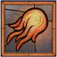

# Bellowing Roar

### 우레와같은 울부짖음 




<br/>


## 참조링크테스트

모모폰 성지 네이버카페: <https://cafe.naver.com/momoscafe/311939>

D4 아이콘참조: <https://diablo4.life/builds/planner/6660766bd6913ac48dd58b11>


참조링크테스트정상 [참조링크]

[참조링크]: http://otp.ktc.re.kr/

[KTC 링크 바로가기 테스트 정상](http://otp.ktc.re.kr/)

구글 홈페이지 클릭테스트 정상: <https://google.com>

구글 홈페이지 클릭테스트 정상<https://google.com>

<br/>

## Season of Discovery

### Emerald Wardens(에메랄드 감시자)
### Dusk wood(그늘숲 Level 25)
### Ashen vale(잿빛골짜기 Level 40)
### Feralas(페랄라스 Level 50) Emerald Chip -> Rune Rewards
### The Hinterlands(동부내륙지 Level 50) Emerald Chip -> Rune Rewards

### [SoD Phase 2 Gnomeregan Loot](https://www.wowhead.com/classic/ko/news/%EB%94%94%EC%8A%A4%EC%BB%A4%EB%B2%84%EB%A6%AC-%EC%8B%9C%EC%A6%8C-2%EB%8B%A8%EA%B3%84-1-15-1-%ED%8C%A8%EC%B9%98-ptr-%EB%82%B4-%EB%86%88%EB%A6%AC%EA%B1%B4-%EC%A0%84%EB%A6%AC%ED%92%88-%EB%8D%B0%EC%9D%B4%ED%84%B0%EB%A7%88%EC%9D%B4%EB%8B%9D-337464)   


### [SoD Phase 2 Sunken Temple Loot](https://www.wowhead.com/classic/guide/season-of-discovery/sunken-temple-level-up-raid-loot)

<br/>
## Season Of Discovery Dugeon Information
```
Ragefire Chasm: 성난불길 협곡
Shadowfang Keep:그림자송곳니성채
Blackfathom Deeps:검은심연의 나락
The Stockade:지하감옥
Gnomregan:놈리건
Razorfen Kraul:가시덩굴 우리
Scarlet Monastery:주홍색 수도원
Razorfen Downs:가시덩굴 구리
Uldaman:울다만
Zul'Farrak:줄파락
Maraudon:마라우돈
Temple of Atal'Hakkar:가라앉은 사원(아탈학카르 신전)
Blackrock Depths:검은바위 나락
Dire Maul West(Capital Gardens):혈투의 전장
Dire Maul North(Gordoks Commons):
Lower Blackrock Spire(LBRS):검은바위첨탑 하층
Scholomance:스칼로맨스
Stratholme:스트라솔룸
Upper Blackrock Spirs(UBRS);검은바위첨탑

```

### 사냥꾼 펫
```
    https://m.inven.co.kr/board/wow/5518/443?my=post
    공속이 1.2인 희귀등급 살쾡이
    부송(황야의땅) 출몰지역 근처 은신 하고 있는 살괭이류 
    긴울음 안개늑대 공속1.3
    잿빛 일반늑대 1.3
    우두머리 유령발늑대 1.3
    그림자송곳니 검은늑대 1.2
    버섯봉우리 사자 1.2
    힐스브레드 사자 1.2

    황야의땅 희귀 부러진 송곳니(살쾡이 레벨37) 공속 1.0
    늪지재규어(상쾡이 레벨36+ 슬픔의 늪)
    흉포한 산사자(살쾡이 레벨 27+ 힐스) 
```