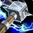

# Bellowing Roar

### 우레와같은 울부짖음 


Create PullRequest,Merge PullRequest 하지마!
여기서는 branch 만들면 안돼!!!
branch 지우고자 하면, 현재의 branch를 바꾸고 vsc에서 커맨드 파렛에 가서 git delete branch 쳐봐!


## POE2

[개굴덱의 데드아이 레인저 번개화살 스타터](https://www.youtube.com/watch?v=f9TXpxa0ngg)

[PoEasy 위치 스타터빌드 가이드  노드리뷰](https://www.youtube.com/watch?v=fxbCzHk-85U)
1. 소환수 저항과 치명타노드는 비추
1. 해골방화범은 
    * 기본물리피해 고로 중량:최대물리피해 30%증폭 을 사용해야(3레벨 보조젬)
    * 투사체,화염,범위 태그를 가지고 있다
        * 무도의 속도(공격속도 25%증폭)
        * 난사(투사체 2개 추가)
        * 패스브에서(소환수효과범위 증가)

[인퍼널리스트 화염조폭소환](https://www.youtube.com/watch?v=m05G96p2wUc)
1. 인퍼널리스트 화염조폭소환(350이상의 정신력)

    * 소환수의 원소저항은 찍지 않는다(격노의유령의 체렴감소를 줄이기에)
    * 해골방화범의 맵핑력, 해골저격수(중독구름을 사용,보스밑에 깔아줘야)의 보스딜
    * 해골저격수: 격분주입,화염숙련,물리숙련 (번제) (효과범위)
    * 해골방화범: 다중투사체,공격속도 증가,투사체 속도,효과범위
    * 격노의유령: 소환수불안정,지옥불군단,육탄방어 
    * 지옥사냥개:
    * 인화성(7렙고정해야)
    * 고통의 공물
    * 해골성직자
    * 으스스한 연회: 명상,활력
    * 방패돌진(저레벨 스킬젬으로 사용해야 힘제한) - 이동기


1. 위치: 블러드메이지(담연,추봉이),인퍼널리스트(핑트쿠마) 
    * 균열과는 상극
    * 82렙 셉터를 퀄리티+20 정신력21% 증가 하여 총정신력 199, 소환수스킬 레벨+5

2. 스톰위버와 인보커
    * 스톰위버의 스타터로도 핑크의 방화범사용하다가 아틀라스에서 다 갈아타 (셉터 18렙에 소환수스킬레벨+2,36렙에 소환수 스킬레벨+3 사용가능)

[패스오브엑자일2 액트동선 필수퀘스트](https://blog.naver.com/zodiac0503/223705072836)

1. 액트1장: 냉기저항10%,정신력30,패시브포인트4개,최대생명력 20
2. 액트2장: 번개저항10%,패시브포인트4개,호신부충전
3. 액트3장: 화염저항10%,패시브포인트4개,정신력30,독액영약,재련대

[추봉이의 위치 부캐(블러드메이지,추후매찬) 육성법  패스브스킬 참조요망](https://www.youtube.com/watch?v=GmQJtxaPEGI)
[담연의 위치 스타터 가이드](https://www.youtube.com/watch?v=ZyyS_-e7Lrk)
[담연의 블러드 메이지 사술 폭발 빌드 가이드](https://www.youtube.com/watch?v=WKEnmvEC35U)

1. 사슬폭발: 시전속도증가,신중한 시전,영감
2. 신성모독: 절망,효과범위,의식의 저주
3. 정수흡수: 관통,지속시간증폭, 혼돈의동결
4. 어둠의제웅:  위축의손길,선대의다급함   
51. 한기의방어구 -> 
52. 으스스한 연회: 명상,식인

[핑크쿠마 위치 인퍼널리스트 해골서리마법사 70렙이후 추천](https://www.youtube.com/watch?v=f-V313RzLE0) 


[핑크쿠마 위치 인퍼널리스트 방화범](https://www.youtube.com/watch?v=rfHn3J6mpmU) 
1. 초반 셋팅: 정수흡수(관통,고통격화),전염(강해진효과),해골저격수(마지막 헐떡임)
2. 정신력젬획득후: 해골방화범(난사,강해진효과),인화성(임박한 멸망),고통의공물(원소의군단,지속성), 격노의유령(화염주입,소환수불안정),화염벽(고통격화,요새),태양의보주(점화) 
3. 1차전직후 인퍼널리스트로 지옥불사냥개소환
4. 중반 세팅(1차전직후):
    * 해골방화범(격분주입,난사,화염주입,무도의속도,마지막헐떡임)
    * 해골전사(포악함,묵직한 휘두르기,힘줄절단,압도)
    * 화염벽(요새,비전쇄도,비전의속도)
    * 격노의유령(화염숙련,소환수숙련,번제,원소집중,마무리타격)
    * 인화성(조고된저주,저주받은지대,지속성)
    * 지옥불사냥개(육탄방어,점화,원소의군단.과도한노출)
    * 고통의공물(피의샘,삭마,격노의샘)
    * 으스스한연회() : 사냥시 약2배의 에보를 확보할수 있다.


1. 위치 소환수
    * 셉터(소환수 레벨+ 정신력30%),참나무맹세 방패/참호목 가시 박힌 곤봉(굿)
    * 투구 목걸이(소환수 스킬 레벨)
2. 위치 스킬셋팅(추봉이)
    * 화염벽(레벨) - 화염숙련+비전의 속도+연속주문
    * 해골방화범(레벨) - 난사+무도의 속도+소환수숙련 : 구멍하나 뚫자!
    * 격노의 유령(레벨) - 화염주입+격분주입 + 화염관통 (마지막 헐떡임 x)
    * 태양의 보주 -화염노출+과도한 노출+과잉
    * 인화성 -조고된 저주+영감+사술의꽃
    * 고통의 공물(레벨) -지속성+삭마+광장


1. Eldritch Battery 
    * EB 는 자기가 가진 모든 에쉴을 마나로 전환
2. Mind Over Matter 
    *  MON 는 생명력대신 마나가 먼저 까이도록 변경함,대신 마나 재생이 절반이 된다(50% LOSS) 
3. Chaos Inoculation
    - CI는 생명력이 1이 되는 대신,카오스 데미지에 면역이 됨    


[푸들멈머의 패스오브엑자일2 소서리스 화염구](https://www.youtube.com/watch?v=v4AoH7jiiCs)
    
1. 화염구: 난사,촉발,난무하는 파편,비전의속도
2. 불씨일제사격: 신중한시전,효과집중,원소집중,화염숙련
3. 대마법사: 명상(추가정신력10소모)+번개숙련
4. 태양의보주/화염벽: 과잉,번개노출,화염노출
5. 서리방벽: 연속주문+고드름+빙하작용+밀려오는 폭풍+ 냉기숙련

1. 점멸(정신력 60소모)
2. 전도성(대마법사 사용시): 저주받은 지대+ 조고된저주+광장 
3. 인화성(대마법사 미사용시)
4. 힘의부적(보스전에서)
5. 격노의유령(화염구랑 쓰면 프레임드랍문제)
6. 마나가 많이 부족하면 주로 사용하는 기술에 (스킬비용40%감폭)이나 영혼고갈(마나회복)을 사용

<!--  -->


[POE2 TRADE SITE ](https://poe.game.daum.net/trade2/search/poe2/Standard)

1. 모든 주얼 -> 화염피해 + 원소 피해
2. 마법봉 -> 
3. 목걸이 -> 마나 재생 + 번개저항 + 마나 최대치 + 모든 원소 저항
4. 반지 -> 마나 재생 + 마나 최대치 + 모든 원소 저항 + 냉기 저항
5. 장갑 -> 마나 최대치 + 처치한 적 하나당 마나 획득 + 생명력 최대치 + 방어도 및 에너지 보호막 
6. 머리 -> 마나 최대치 + 생명력 최대치 + 방어도 및 에너지 보호막 
7. 갑옷 -> 생명력 최대치 + 방어도 및 에너지 보호막 + 번개 화염 냉기 저항
8. 허리 -> 생명력 최대치 + 마나 최대치 + 번개 화염 냉기 저항
9. 신발 -> 생명력 최대치 + 마나 최대치 + 이동 속도 + 번개 화염 냉기 저항

[패시브 스킬 연습 ](https://poe2db.tw/kr/)

[추봉이 패스 오브 엑자일2 보면서 따라하기 - 소서리스 1장](https://www.youtube.com/watch?v=CbEeFKMQFeA)

[소서리스-스톰위버! 시작 ~ 액트/레벨링 가이드](https://www.youtube.com/watch?v=oag2qWGi76I)

[POE2 뉴비를 위한 극초반 달달한 꿀파밍 장소 소개합니다!](https://www.youtube.com/watch?v=wBQcChmZUoA)

    뺑뺑이 맵에서 보스잡든지 금고열든지 해서 아이템 먹고 다시 체크포인트를 클릭해서  거점을 눌러서
    거기로 이동하고 다시 '집정관의 능묘(1장)'클릭하고 집정관의 능묘 클릭(Control + 왼쪽마우스) 하영
    신규버튼 누르면 이 이스턴스가 초기화(새로운 맵이 열린다) 된다 


1. 먼저
    * 300p 사용 m 눌러 상점 -> 화페보관함,프리미엄보관함 
    * 'Z' 키를 누르면  떨어진 아이템이 보인다!!!
    * CTRL+ALT+click 하면 대화창에 띄워줘!
    * 상점에서  화염주문 +3렙에  제왕->액잘 발러 사용 번개주문 +4렙짜리 지팡이

2. 무기옵션

    * 양손무기 둔기 , 물리피해 50%
    * G를 눌러 스킬창에서 양손무기또는 한손무기등으로 셋팅해놔야
    * 소서 : 주문피해즈아,시전속도증가옵션 , 주문시전시 원소피해 #~#추가 옵션이 가장 중요!!!!
    * 두벌의 무기세트를 등록하여 키보드x로 전환하여 사용한다.
    * 무기선택에 따른 패스브스킬은 동일하여 효율에 한계가 있지만 별도의 스킬포인트가 도입,퀘스트에서 얻은   '전문화의 책'을통해 가능 보유한 액티브스킬마다 사용될 무기세트를 설정가능,즉 해당스킬에 따라 무기세트가 변경될 수 있다.
3. 다양한 기본화페들
    * 진화,확장,제왕,엑잘티드,연금술의 오브
    * 소켓이있는 아템은 룬이나 영혼의 핵을 넣어서 사용(한번사용후 끝)
    * 변환의구슬(진화의오브) : 일반 > 마법 아이템
    * 증강의구슬(변화의오브) : 옵션변경
    * 확장의오브 : 옵션1줄추가해 접두1/접미1 풀옵션 매직을 만든다.
    * 풀옵션매직아이템이 훌륭하면 제왕의오브를 사용해서 희귀로 업글후 추가옵션은 애잘을 사용해 붙힌다.
        * Alt키를 사용해 접두/접미 확인 필요,접두만 3개 붙어있을수 도 있기에


* 기회의구슬(기회의오브) : 일반-> 무작위 마법또는 희귀 
* 레갈오브(제왕의오브,분해로 파편10개 ) : 마법 > 희귀아이템
* 연금술의구슬(연금술의오브) : 일반 > 희귀아이템  
* 고귀한구슬(액잘티드오브 exalt) : 희귀아이템에 옵션1개 추가,2개까지 사용가능
* 무효화의구슬(소멸의오브) : 옵션한개를 랜덤하게 제거

* 보석상의구슬(스킬잼)
* 하급,대형,완벽한보석상의구슬(스킬 소켓추가)
* 숙련공의오브로 소켓도 뚫을수 있다.(액트2에서 분해작업대에서 소켓이 있는 아이템을 분해(파편) x10)


1. 냉기소서리스 스톰위버 
* 지팡이 동결의 파편
* 전기불꽃 - 잼연결은 전도만 사용
*    -> 마나폭풍을 배우면 이걸 사용

* 서리폭탄 - 매핑과 보스전에 굿
* 혜성

- 화염벽 - 요새, 지속시간 증폭
- 얼음폭팔 - 주문메아리 와 서리 연결부
- 서리구체 - 다중투사체 와 자유(가탈)
- 한파 - 촉발,제어된 파괴, 효과집중   :메인딜 

4. maxroll  
    * [maxroll](https://maxroll.gg/poe2)

3. Zen_M Sorceress
    * [Stormweaver/Sorceress Comet 15th campain Leveling Guide](https://www.youtube.com/watch?v=i9ApSVoEy7E) 
2. 추봉이 소서리스 
    * [소서리스-스톰위버 패시브 스킬](https://buly.kr/5q6KXvL)
    * [소서리스-스톰위버 패시브 스킬- 보호막없이 생명력사용 - 보호막장비 맞추어지면 한번에 바꾸는걸 추천 ](https://buly.kr/G3CIDPp)

    * 화염벽 - 효과집중
    * 불씨 일제 사격 -다중투사체,지속시간 감폭
    * 태양의 보주 제어된파괴 
    * 인화성 
    * 시체폭발(원소말고 비술쪽에 있다) - 시전속도증가,효과범위
    * 격노유령 - 공속증가,하염피해 추가

    * 균열 직공 말려버린 마법봉(2막)
        * 퀄리티 +14%
        * 요구사항: 레벨 10,25지능
        * Grants Skill : Level 4 카오스 화살
        * 주문피해 30증가
        * 지능+10
        * 처치한 적하나당 생명력 5
        * 처치한 적하나당 마나 5    
    * 맹공수호 잔가지 집중구
        * 에너지 보호막 26
        * 에너지 보호막 최대치 +10
        * 에너지 보호막 18% 증가
        * 화염피해 31%
        * 시전속도 9%
        * 화염저항 7%
        * 냉기저항 9%

1. 무기 초반에 골드모으고 렙업시마다 무기상 찾아 운좋게 레어템뜨면 사냥 할만함
무기상인한테서 레어못구하면 흰템이나 매직 베이스 구해서 오브발라서 레어로 만든다. 소켓도 가능하면 뚫고 룬 박고 화폐 아낄필요 없다.
2. 신발 파란색이든 흰색이든 주워서 진화의 오브 발라, 이속뜨면 대충사용
3. 장비가 딸리면, 렙 더 올려서 진행 한다. 무리해서 1시간2시간 트라이 할 이유가 없다. 몇렙 더하고 가면 쉽게 잡힌다.


3. 소환수(위치) -> 인퍼널리스트로 전직
4. 머셔너리가 진짜 편함
5. 백작 - 생명력 400에 냉기저항40%면 맞으면서!


<br/>

## The War Within Season 1 begins on September 10th,2024

[포탈 위치및 노선](https://www.inven.co.kr/board/wow/17/38702?category=_%EA%B8%B0%ED%83%80)


## 고술.

[고술 기초 가이드](https://www.inven.co.kr/board/wow/44/99948)


뜨거운손 버프 확인? 용채를 계속사용해야
채찍화염 
연쇄번개사용으로 피뢰침을 여러마리에 발라줘야
낙뢰
불꽃회오리 화충하나당 1마엘 획득
 
+ 단일딜
    + 야정-태고-용채-폭격-(이후 필러기 쿨이오는대로)-번화 
    + 야정-태고-용채-[**승천**]-바격-바격-바격    
+ 광딜(6마리) 
    + 한마리에 화염충격 발라
    + 야정-태고-용채(화충전이)-불회(불꽃회오리)-낙뢰-용채/폭격-(마엘이 쌓이면 연번/폭풍으로 소모)
    + 야수정령 + 태고의파도 + (낙뢰) + 용암채찍(화충이 전이)
        + 8마엘이 되면 번개화살
            + 용암채찍+폭풍의일격 + 낙뢰
            ```
            여기서 코드사용 정상
            코드사용 정상
            ```                    
        + 8마엘이 되면 번개화살(연쇄번개)
            + 용암채찍 + 폭격+ 낙뢰
        + 야수정령은 쿨마다  

***

 태고의파도
 야수정령
 용암채찍
 폭풍의일격
 번개화살
연쇄번개

### 스킬설명
+ **폭풍의일격**:7.5초
```
가속이 20%이상이되어야 그리고 특화를 올려야
```
+ **용암채찍**:18초,화충이 전이


    1. **폭풍의일격**:7.5초
    ```
    가속이 20%이상이되어야 그리고 특화를 올려야
    ```
    2. **용암채찍**:18초,화충이 전이
    3. **낙뢰**: 12초 광딜시 계속 유지 
    4. **태고의 파도**: 화염충격,추가로 번개화살효률상승
    ```
    여기서 코드사용
    ```
    5. **야수정령**: 늑대의 종류(냉기,자연,)  쿨1.5분
    ```
    여기서 들여쓰기로 시작
    여기서 들여쓰기로 시작
    ```
    6. **승천** : 폭풍의 일격이 -> 바람의일격  , 쿨 3분


[고술 휘발유튜브 참조](https://www.youtube.com/watch?v=T5Jlrq6duwc)

### 왼쪽끝에서 탭으로 들여쓰기 시작
**승천**
```
승천이 있을때  폭폭의 일격->바람의 일격이 된다
```    

**영웅특성** 
```
폭풍을 얼마나 많이 쓸수 있나가 관건
폭풍인도자사용 폭풍(40마엘사용하면 폭풍) - 예열이 필요
폭풍을 많이 사용해야        
위크오라사용해서 마엘을 트렉킹해야 - 확인
채찍화염보다 피래침을 많이 발라야(탭으로)
깨어나는폭풍 3중첩시 폭풍을 쓸수도 있다 -예열이 필요
```
### 왼쪽끝에서 탭으로 들여쓰기 시작

    폭풍의 일격(폭격)
        질풍의 무기
        용암채찍(용채)
    세분(세계의 분리:전방에 불길충격)
    태고(태고의 파도: 화염충격,추가로 번개화살효률상승)
    야정(야수정령:늑대2마리)

    *속박의 토템
    천둥폭풍: 사기스킬 '천둥충격' 노드 사요해야  + 광역차단
    늑대정령: 굿
    수면걷기:
    천리안: 불요
    대지의정령: 사기, 5분
    연쇄번개: 5명까지  2명적중시 낙뢰공격증가
    축전토템: 사기 광역 기절, 최대 33초 쿨
    돌의 보루 토템: 보호막, 채용 ,쿨 3분
    영혼이동: 생존기
    치유의토템: 동료 한명 치유
    고대의 인도: 같이 사용
    바람질주토템: 이속 
    영혼정화: 저주 
    진동의 토템: 공포 13초동안
    치유의파도: 힐  캐스팅이 없이 사용가능
    토템의귀환: 가장최근사용 토템의 초기화 
        축전토템 + 토귀 + 축전토템, 천둥폭풍 ,치유의토템,돌의 보루 토템
    하늘의경로: 특화2%
    피의욕망: 블러드 
    화염충격: 최대6명,지속 

    대지의보호막 : 9번 맞으면 힐 
    늑대정령,천둥발
    선조의늑대신화 
    구속의 토템: 아직
    자연의수호자: 굿
    독정화토템

    고양
    *폭풍의일격: 소용돌이치는무기 1중첩 
     질풍의무기 발라,불꽃혓바닥
    **용암의채찍** - 용암공세 - 용암충격이 전이 
        용암충격 + 용채 
        5 마일스톰 즉발 총10마일(분노의) -> 번개화살
        넘치는소용돌이 폭풍
    세개의분리 기절: 거의 차단기         
        단일딜특화 냉기 한랭+
    *불꽃회오리: 소분1중첩    
        마엘 5획득   
        마엘수급 10중첩에 사용해야하는 스킬은 ?폭풍     
    뜨거운손 버프시 용채 계속사용해야 채찍화염
    낙뢰: 버프12초 광딜시 계속 유지 
    몰아치는 폭풍: 연쇄번개 추가

    태고의파도: 화충 15초 버프, 번개화살이 6마리에게 

    야수정령: 늑대의 종류(냉기,자연,)  쿨1.5분
        쿨감소 
    원소정령: 
    전령의 맹공: 100%마엘 수급
    승천(50이후에): 폭풍의 일격이 -> 바람의일격  , 쿨 3분
    깊이뿌리내린:

    영웅특성 - 폭풍을 얼마나 많이 쓸수 있나가 관건
        폭풍인도자사용 폭풍(40마엘사용하면 폭풍) - 예열이 필요
        폭풍을 많이 사용해야        
        위크오라사용해야 
        피래침을 많이 발라야
        깨어나는폭풍 3중첩시 폭풍을 쓸수도 있다 -예열이 필요

        예열 
    딜사이클

    승천이 없을때

    6마리중에 한놈에게 화염충격을 발라 야수정령 태고의파도 를 사용 낙뢰사용 용암채찍
        10마일 되면 번개화살 
        그후에는 용채(폭풍의일격)  낙뢰 사용 + 용채
        10마일 되면 소모해야 번개화살/폭풍       
        용채 + 낙뢰 + 폭격                
        ...
        10마일(8마엘에서) 되면 연쇄번개

        야수정령/태고의파도 은 쿨마다 먼저

        자원은 평타만 써도 
        마엘의 낭비를 없애기 위해 10마엘에 번화를 쓸 필요가 없다. 8마엘에

    승천이 있을때  폭폭의 일격이 바람의 일격이 된다
        승천 특성 발동시 폭퉁의 일격이 바람의 일격으로 변경된다

    단일특성
        한랭의 일격        
        우박폭풍
        냉기충격 
        야수정령(냉기피해)

        폭격,용채 
        폭풍의 분노
        야수정령 태고 승천 바람의일격
        마엘 소모가 우선(번개화살,폭풍)

    물리고술 폭풍의일격이 두번

    가속가 최우선
    특화 
    치명타 순
    유연성은 마지막

    티어효과 이면 굿


            


### 던전
    일반던전 완료 보상 554
    영웅 567

    [새벽]인도자호
    [바위금고]
    [메아리]의 도시 아라카라
    [실타래]의 도시
    신성한 불꽃의 수도원
    어둠불꽃 동굴
    잿불맥주 양조장
    [부화장]
    

### 뉴비

    1-70렙 

    70-8렙 
        70이면 내부전쟁지역에서 메인 퀘스트 + 무작위던전
        신성한협곡의 랜덤한 위치에 젠되는 정예몹(벨레다르의 자손?) - 3%확률로 반지
    80렙이후
        -템렙을 567이상으로 맞추어야
        -전역퀘스트 개방됨
        -아즈카헤트 전역퀘스트 개방은 그지역을 직접 가줘야 개방됨. 가운데 매달려 있는 거미련한테 말걸어야, 
            이지역 전역퀘는 도르노갈에서 열어주는 다른지역과 달리 따로 한번 더 가서 열어 주어야
        -도르노갈 여관앞에 있는 npc에게서 파란느낌표 퀘스트를 받고 수행
        -각 지역에 있는 금빛 휘장 퀘스트(열쇠로 잠겨있고 지역퀘스트3개 진행하고 오라한다) - 이건 몇일 단위로 열리는듯
        -주간에 한번만 잡을수있는 필드보스 전역퀘스트 (공격대 검색 에서 퀘스트 이름의 팟 신청)
        -지도를 열고 아이템을 주는 전역퀘를 모두 한다
        위의 내용을 모두 수행후 560레벨 이상의 아이템이 아닌부위는 경매장에서 초록템(555이상)을 산다
        -용맹석 사용하여 업글
        -567레벨이 되면 공격대찾기 진행
        -구렁
            구렁열쇠4개(한주에 4개까지 줌)를 받았을것이다
            가능하면 8단아니면6단까지 밀고 구렁주에서 '노란빛이나는 풍요로운 구렁'에서 완료하고 열쇠를 사용하면 606아이템을 받는다.


### 갓만렙
[직접 해보는 갓만렙 영던컷 파밍도전(일던,구렁안가고)](https://www.inven.co.kr/board/wow/17/39513?category=_%EA%B8%B0%ED%83%80)

    평판템 구입(모자,어깨,가슴 노련가 1/8 584)
        모든 대장정과 사이드퀘를 다 했다면 가장 쉽게 얻을 수 있는 아이템들입니다.
        어깨 - 도르노갈 영예7, 공명의 수정 2600개
        모자 - 심연의 회합 영예8, 공명의 수정 2600개
        가슴 - 신성한 협곡 아라시 영예7,공명의 수정 2600개
    주간 퀘스트
        구렁을 즐기고 싶으면 4개까진 해야되고, 구렁에 안가고 주간상자를 다 채우고 싶으면 8개를 해야.
        주간퀘스트는 모두 일주일에 한번 가능하고,목요일 오전8시에 초기화 된다.
        1.도르노갈 주간퀘스트(3가지  여관을 나오면 보통 받을수 있다)
            -'정점 보관함'을 주는 주간 퀘스트
            -던전 퀘스트 - 평판이 부족할때 활용
            -주간(주말)퀘스트 - 달력(/달력)으로 확인할수 있는 주간 이벤트에 따라 퀘스트 변경,보상도 변경됨
        2.도른의 섬
            -극장 공연단

        3.울리는 심연 (주간퀘 2개)
            -심연에서 구르고 굴러(필드에서 파헤쳐진 흙에서 밀랍을 모으는 퀘) 
                인터페이스설정->테두리모드,
            -문제 대비

        4.신성한 협곡
            -맵12시에 있는 '퍼져나가는 빛' 주간전역퀘
            겸사겸사할수 있는 아라시 영예5에 받을수 있는 571목걸이 퀘스트도 있슴

        5.아즈카헤트
            재상의 손/방직공의 눈/장군의 칼날
    
    전역퀘스트 : 대장정을 마치면 이제 전역 퀘스트가 가능합니다 라고 멘트가 뜬다.

        필드전역퀘스트 World Quest Tracker같은 애드온사용시 좀 더 쉽게 파악가능
        -일반적인 전역퀘스트
        -특별임무:특별과제가 있는 맵에서 전역퀘스트 3개를 완료하면 해제,주간할동으로 인정됨(주2회)
            아즈카헤트 특별과제 작은팁: 특별전역퀘가 열리면 100%채워야 하는데 정예를 잡아야 5%찬다. 
            맵상부에 동굴로 가면 정예 피통4천몹(이기티스 이크타트) 잡으면 75%(지금은 리젠 안된다함)
        -필드보스


    각종 주간 이벤트를 자동으로 추적해주는 애드온 SavedInstances
    업적확인  업적-퀘스트-내부전쟁-카즈알가르의 현자
    반지(554) 받을 수 있는 방직공의 소굴에서 받는 실타래의 도시, 잿불맥주 양조장 인던 안에서 받는 양조장 퀘스트 만렙에 수행해! 

### 기타
```


만렙찍고 바로 영던 템렙 맞추는 방법
    1. 전역퀘 + 일던 + 대장전하면서 템 최대한 맞추기
    2. 경매장에서 무기 사기
    3. 구렁7단까지 솔풀하기 - 높은 컨트롤이 필요
        구렁7단부터 열쇠사용시 챔피온템(597 1/8)이 드랍 
        생존위주의 스킬트리셋팅해야 + 빨간물약 반드시 필수,구간패스를 위해 투명물약도 있으면 좋아 보임
        중간보스(탈라 벨로 씹생키)가 센놈이면 과감히 리셋후 다시 도전
    4. 풍요 구렁 8단 4곳 돌기
        주간퀘 하다보면 열쇠 4개를 주는데 그거 받고 풍요 구렁 돈다.
        탱이 부족하기에 탱커가 가능한 직업은 이번기회에 탱을 배워 보는것도 좋음


금방 만렙찍고 신화 던전 가는 조건
    신성한 협곡 영예7등급 판매중인 영예 물품
        어둑한 형광의 전투판금 아템레벨 584 노련가1/8 공명의 수정 773 있어야

    -첫케릭 만렙은 대장정 퀘스트를 모두 완료하면 도르노갈4등급.
    목표는 8등급 왜냐면, 노련가 장비구입가능하기에
    -전역퀘를 꼬박꼬박 다해서 상위전역퀘 해제하여 초반 노련가아이템 보상을 받는다.
    -만렙 대장정 궤스트는 용맹석을 꽤 많이 준다
    -구렁6레벨 위대한 금고템 해제
    -도르노갈의 일일퀘 
    -무기강화하는곳에 들러서 퀘스트 진행
    -영던렙 맞추기 첫케릭인 경우,
        영던입장렙,신화입장렙  만렙찍고 일주일정도 만렙대장정퀘스트 필수로 해야
        경매장에서 비교적좋은 다크문장신구 구매,탐험가등급의 장비만 용맹석으로 렙업한다.
        
    -영던렙 맞추기 추가케릭인경우, 
        대개 전지역의 전역퀘를 했고,경매장 아이템구입 만렙되자마자 일반던전을 갈횟수를 줄인채 영던렙을 맞출수 있다 
    -신화렙 맞추기
        위대한금고를 이용하면 쉽다.
        전역퀘로 금고 3단계를 개방한 상태에서 5단계이상의 구렁을 3번 완료하면 된다. 금고의 선택지가 공찾,영던
        영던8번돌면 금고3단계 개방할 조건이 되는데 탐험가 장비부터 풀업을 하는것을 권장 왜냐 재료비가 저렴. 이정도에서 대개 신화렙은 맞춰진다.
    정리
        1. 금고를 이용하는 것이 가장 빨라
        2. 구렁은 최소 5단계
        3. 첫케릭은 용맹석 수급을 위해 일반던전 10번정도는 가야
        4. 추가케릭은 대개 일반던전 갔다오지 않아도
        5. 추가케릭은 영웅던전 10번정도 갔다 와야 신화에 도전할 템렙이 된다.
        6. 전역퀘는 가급적 다 할 수 있도록 한다.

계정귀속템
풍구렁(풍요로운 구렁) 위크오라
초보들이 봐야 하는 쐐기 지침서 : 
    1. 허수아비 단일딜 900k 이상의 목표로 연마
    2. 치유물약무조건사서 사용,  단축키에 저장(만피가 500만정도이고, 물약이 거진 400만을 회복시킨다)
    3. 차단으로 시작해서 cc로 끝난다. cc 한번 못하면 데미지가 2~400만 들어온다.
       차단이 먹히지 않는 시전은 cc를 걸어라
    4. Hekili 에드온 사용     
메즈(Mesmerization) == CC기(군중제어기,Crowd Control)    
공격기회 퀘스트  드로노갈 ->포탈 -> 아즈카헤트
검사 시던 레이드(시간의 던전 검은사원 와우 레이드)
    만렙아니어도 퀘받을 수 있다?
    주간퀘 받으시고,출발은 샤트라스의 npc에게 말걸기
금고보상 위크오라  
    금고위치: 도르노갈 은행 가장 안쪽  
    금고시스템(한주에 템1개,템3개가 금고보상으로 뜨더라도 그중 1개만 선택가능): 와우에서 내가 활동한 횟수에 따라 주1회 추가 아이템을 획득 기회
        -레이드: 킬한 난이도와 넴드
        -던전: 영웅/신화/쐐기 던전의 단수와 클리어 횟수
        -필드: 그주에 클리어한 구렁단수와 횟수 
노련가 아이템
신던(신화던전)
시간여행 던전(시던) 이벤트
발드라켄(용군단) - 이거 용의섬 거점, 여기에 은행 금고 
템렙업글시스템 : 탐험가-모험가-노련가-챔피언(용사)-영웅-신화의 순(템별로 상태창 확인해봐)
    일반던전클리어 드랍템 554 탐험가는 558부터 580까지
    구렁5단에서 584템렙(노련가1/8)획득가능 복원된금고열쇠로 추가 상자를 열수 있다(구렁중에 "풍요로운 구렁"이라고 뜬 구렁의 경우)
    업그레이드 시스템(용군단에서 도입) - 용맹석
    주문제작 시스템(용군단에서 도입) 
초보분들은 탐험가등급을 신화등급까지 문장과 재료만으로 업글가능
도르노갈의 일일퀘
    도르노갈에서 주는 파란색 퀘스트, 지역별 주간활동(?)
무기강화하는곳에서 퀘스트 진행(용맹석과 그외 재료)
```


### 와우 확장팩
```
    불타는 성전(2007)
    리치왕의 분노(2008)
    대격변(2010)
    판다리아의 안개(2012)
    드레노어의 전쟁군주(2014)
    군단(2016)
    격전의 아제로스(2018)
    어둠땅(2020)
    용군단(2022)
    내부전쟁(2024)

```
### 신화 쐐기돌(Mythic Keystone)
```
    신화던전 막넴 드랍
    신화난이도 던전 안에 있는 마력의 샘에 넣어야
```    

### 용의포효
 격노
 칼날폭풍
 용의포효

[용의포효](./res/Wow/용의포효.jpg)
[격노](./res/Wow/격노.jpg)
[칼날폭풍](./res/Wow/칼날폭풍.jpg)

### 군중제어기

[광란](./res/Wow/광란.jpg) 범위의적에게 cc

[폭풍망치](./res/Wow/폭풍망치.jpg) 단일적에게 cc

```
[격노]버프가 상시 적용되게 하는것이 데미지 상승
분노를 소모해야 [격노]버프 5초 돌입

분노소모: [광란][분노의강타]
분노수급: 
    [피의갈증] 8분노생성
    [마무리일격] 20분노생성
    [소용돌이] 광역분노수급 리뷰 고기칼특성
    [오딘의격노] 15분노생성 45초쿨의 강력한 광역딜링기

Heroic and Mythic 0 Dungeons
칼날폭풍: (분노) 멈출 수 없는 파괴의 소용돌이가 되어 6초동안 주위의 모든적에게 물리피해.
[칼날폭풍]이 피해를 2회 입힐 때 마다 [피의갈증]이 자동으로 사용되고 [격노]상태에서는 [격노]의 지속시간을 1초 증가.
```


## 참조링크테스트

모모폰 성지 네이버카페: <https://cafe.naver.com/momoscafe/311939>

D4 아이콘참조: <https://diablo4.life/builds/planner/6660766bd6913ac48dd58b11>


참조링크테스트정상 [참조링크]

[참조링크]: http://otp.ktc.re.kr/

[KTC 링크 바로가기 테스트 정상](http://otp.ktc.re.kr/)

구글 홈페이지 클릭테스트 정상: <https://google.com>

구글 홈페이지 클릭테스트 정상<https://google.com>

<br/>

## Season of Discovery

### Emerald Wardens(에메랄드 감시자)
### Dusk wood(그늘숲 Level 25)
### Ashen vale(잿빛골짜기 Level 40)
### Feralas(페랄라스 Level 50) Emerald Chip -> Rune Rewards
### The Hinterlands(동부내륙지 Level 50) Emerald Chip -> Rune Rewards

### [SoD Phase 2 Gnomeregan Loot](https://www.wowhead.com/classic/ko/news/%EB%94%94%EC%8A%A4%EC%BB%A4%EB%B2%84%EB%A6%AC-%EC%8B%9C%EC%A6%8C-2%EB%8B%A8%EA%B3%84-1-15-1-%ED%8C%A8%EC%B9%98-ptr-%EB%82%B4-%EB%86%88%EB%A6%AC%EA%B1%B4-%EC%A0%84%EB%A6%AC%ED%92%88-%EB%8D%B0%EC%9D%B4%ED%84%B0%EB%A7%88%EC%9D%B4%EB%8B%9D-337464)   


### [SoD Phase 2 Sunken Temple Loot](https://www.wowhead.com/classic/guide/season-of-discovery/sunken-temple-level-up-raid-loot)

<br/>
## Season Of Discovery Dugeon Information
```
Ragefire Chasm: 성난불길 협곡
Shadowfang Keep:그림자송곳니성채
Blackfathom Deeps:검은심연의 나락
The Stockade:지하감옥
Gnomregan:놈리건
Razorfen Kraul:가시덩굴 우리
Scarlet Monastery:주홍색 수도원
Razorfen Downs:가시덩굴 구리
Uldaman:울다만
Zul'Farrak:줄파락
Maraudon:마라우돈
Temple of Atal'Hakkar:가라앉은 사원(아탈학카르 신전)
Blackrock Depths:검은바위 나락
Dire Maul West(Capital Gardens):혈투의 전장
Dire Maul North(Gordoks Commons):
Lower Blackrock Spire(LBRS):검은바위첨탑 하층
Scholomance:스칼로맨스
Stratholme:스트라솔룸
Upper Blackrock Spirs(UBRS);검은바위첨탑

```

### 사냥꾼 펫
```
    https://m.inven.co.kr/board/wow/5518/443?my=post
    공속이 1.2인 희귀등급 살쾡이
    부송(황야의땅) 출몰지역 근처 은신 하고 있는 살괭이류 
    긴울음 안개늑대 공속1.3
    잿빛 일반늑대 1.3
    우두머리 유령발늑대 1.3
    그림자송곳니 검은늑대 1.2
    버섯봉우리 사자 1.2
    힐스브레드 사자 1.2

    황야의땅 희귀 부러진 송곳니(살쾡이 레벨37) 공속 1.0
    늪지재규어(상쾡이 레벨36+ 슬픔의 늪)
    흉포한 산사자(살쾡이 레벨 27+ 힐스) 
```