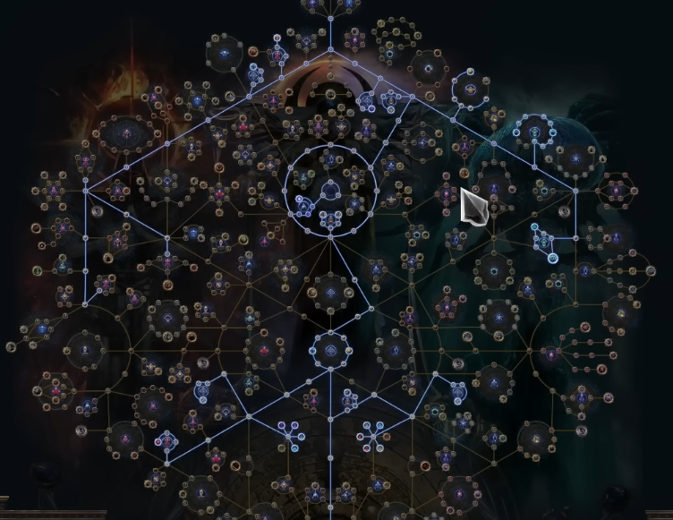

# Clear Fell


### C# ide에서 자동생성된 메타데이터 소스
``` 
이 메타데이터는 이진 형식으로 존재하므로 IDE에서 직접적인 소스 코드 파일 형태로 확인할 수는 없습니다. 대신, Visual Studio와 같은 IDE에서 외부 라이브러리의 클래스 정의로 이동할 때 보이는 내용은 컴파일된 어셈블리를 역컴파일하여 생성된 의사 코드(metadata-as-source)입니다. 이는 실제 작성된 소스 코드가 아니라 메타데이터를 기반으로 재구성된 코드입니다.     

C# 9.0에서 도입된 소스 생성기는 컴파일러 파이프라인에 연결되어 컴파일 시점에 새로운 C# 소스 파일을 생성하고 기존 코드와 함께 컴파일되도록 하는 기능입니다.

NET SDK 7.0이 설치되어 있어 .NET Framework 4.5 gs프로젝트
```

### Witch's Essence Drain 


## POE1 3.27 리그 2025년 11월 1일(3개월간) Keepers of the Flames(불길의 수호자들)
## POE1 3.28 확장팩은 2026년 3월 7일(토요일) 공개





### 이름없는 예견자(더럽혀진 대성당 -> 으스스한 대성당)
- 행운아(해변,들판),짝사랑(거울파편:40딥 드랍,도리아나의 기계실),약제사,의사,행운아 
- **더럽혀진 대성당**을 계속돌아서 **이름없는 예견자**을 만나야 클릭하여 '지도 예지하기' **으스스한 대성당**으로 예지를 한다.
- 이름없는 예견자 
    - 아틀라스를 열고 지도위에 Alt를 누르면 점술카드가 나와
    - 16티어에서만 모든몹을 다잡아야
    - 세케마에서도 나와

### 중요 지도

|고속 맵핑| 카드파밍.수익|
|---|---|
|메사|열대섬(보스방2개)|
|해안|도시 광장(3보스)|
|사구| - |

### 중요 카드 

    - 점술카드 약제사(The Apothecary) - 마법사의 피 허리띠,더럽혀진 대성당 지도에서 드랍
    - 점술카드 마귀(The Fiend) DivinationCardTheFiend - HeadHunter 벨트
    - 아키텍트의 영혼(The Architect) ?
    - 점술카드 공허(The Void) - 도박카드
    - 점술카드 불멸자(The Immortal) - 거울의 집
    - 부의 재분재(The Wealthy Exile) ?
    - 제작자의 소원(The Crafter's wish) ?
    - 완벽한 형태(The Perfect Form) ?

### Mageblood Heavy Belt : 
- **마법사의 피(Wizard's Blood)** 허리띠 
- 플라스크에  상시 유지로 효과25%증가 접두어 와 효과 증가 70% 인첸트
- 약제사(The Apothecary) 카드 5장으로 획득

### Svalinn:
- **스발린** 둘러싼 거대 방패:

**마피** **스발린**까지 rf로 하시고 머니 모으시면
대세인 **맹약빌드** or **수호파괴시시전빌드** 하시면됩니다


[번역 펍건 - 3.28 아틀라스 진행 가이드](https://gall.dcinside.com/mgallery/board/view/?id=pathofexile&no=1161528)

[How to Progress your Atlas in 3.28 Mirage League - Path of Exile 1](https://www.youtube.com/watch?v=HlCwgdALnNo)

1. 1돌(섬뜩한 공허석)
1. 2돌(기원의 공허석): 새로추가,기억보스를 처치해야
1. 3돌(메이븐의 공허석) 메이븐
1. 4돌(부패한 공허석) 엘더+쉐이퍼: 효율이 별로,고로 맨 마지막
1. 17등급 지도가 이제는 악몽지도로 변경됨
2. 두번째 공허석은 일반 쉐이퍼 1번, 일반 엘더 1번 잡으면 두번째 공허식 (난이도 높아)
3. 화신(기억보스) 세명을 잡으면 세번째 공허식을 얻는다.
    - '이건(Egan)'이 주는 세명의 화신 처치 퀘스트 라인을 꼭 완료해야 16.5등급이라고 볼수 있는 '악몽지도'를 열수 있다. 
    - 방치의 화신(IgnoranceBossUBER),두려움의 화신(AngerBossUBER), 불안의 화신(BenevolenceBoss,퀘스트아이템,숭배의 메아리)
    을 처치하고   **기원의 공허석(Ominous VoidStone)** 획득하면 11시방향의 지도에서 특출난 보조젬(Exceptional Support Gems)이 드랍될 수도 
    - Incarnation of Neglect(방치의 화신)
    - Incarnation of Fear(두려움의 화신)
    - Incarnation of Dread(불안의 화신)
    - [퀘스트 태초자 보스](https://www.youtube.com/watch?v=Ga6yf--qHCI)
4. 네번재 공허석은 메이븐(난이도 더높아)
    - 일반적인 메이븐 인카운터는 14등급 이상의 10개의 다른 종류의 보스를 10마리 처치해야
    - 지도장치에서 메이븐 비콘을 활성화 - 지도보스에 다가가면 메이븐이 공중에 등장 전투를 지켜본다. 보스 처치시 메이븐 인타운터의 진행도가 카운트 된다
    - 메이븐 비콘이 활성화되는 지도 10개 클리어 하면 키락에게서 **메이븐의 초대:아틀라스**를 진행할수 있다
    - 여기서 **초승달파편**을 얻어
    - 이걸 실패없이 완료 해야 메이븐에 도전할수 있는 기회를 얻어
    - 아틀라스 패스브 '가장 많은 장난감' : 메이븐이 지도 보스 1마리를 추가로 목격하는 것으로 간주!
    - **초승달파편**을 더 빠르게 모으기 위해 더 어려운 메이븐으 초대를 진행
    - 더어려운 메이븐의 초대: 형성된 영역, 뒤틀린 영역


[대형 스킬군주얼 작업](https://www.youtube.com/watch?v=3dNIYy8aSvg)
- **굴절하는 안개**

[카드 묶음런](https://www.youtube.com/watch?v=UBFgJVBgkIc)
- **화랑의 점술 갑충석** 사용

[농사는 필수](https://www.youtube.com/watch?v=8eon6cfyaEY)

1. **기량의 주화** :20레벨 스킬젬을 타락시켜 무작위 민첩 보조 효과를 부여 한다
    - 농사를 많이 하는 이유가 기량의주화를 얻어 이걸로 **돌아오는 투사체보조** 만들려고?
    - 이걸로 망령소환에 사용하면 **돌아오는 투사체 보조** 나오면 40딥
    - **왕알현** 농사용으로 반지에 구멍 **공허의눈 모조품 무보석반지**
    - **계몽 보조** : 소모및 점유배율이 적용 
1. 2026-02-27에 GGG라이브스트리밍에서 세부정보 공개
2. 듀얼리스트(슬레이어/글래디에이터/챔피언)
3. 돌(**VoidStone**) 
    - 섬뜩한공허석(Eldritch VoidStone) 
    - 기원의공허석(Originator VoidStone)
    - 부패한공허석(Decayed VoidStone)
    - Imbued Gems()
3. 총포런(총주교와포식자)을 통해 16티어 진행 7시방향 
    - 7시방향으로 부가목표 작업하면서 진행
    - 총포 중간보스 위치 확보 후 다른지역 작업
    - 총포런으로 빠르게 1돌 획득
    - 섬뜩한공허석(1돌?)을 획득하여 사용해야 +1등급 높은지도나와(7시방향에서)
    - 총주교.포식자 재단에서 추가 효과

    - 1~5티어: 마법지도
    - 6~10티어: 희귀지도(80~85렙 추천)
    - 11~16티어: 희귀 (타락) 지도

4. 이건 퀘스트후 2돌 획득 : 11시 지역에 효과  

5. 3돌 4돌과 지도장치 작업

[할배(가디언,인퀴지터,하이로펀트) 종낙시소 ](https://www.youtube.com/watch?v=plii6LcbHwI&t=277s)

[카키카키 종말낙인 시체소각 엑트가이드 위치 엘리 1~5장 완전정복](https://www.youtube.com/watch?v=XsG_bMqeNcI)

[하이로펀트 역학일제사격토템 스타터](https://www.youtube.com/watch?v=7MgznAmeWuA)

[김발라 버서커 지면분쇄](https://www.youtube.com/watch?v=5vDzfRpu-xM)
- 7:07/8:07
- 비-집중 유지 스킬의 총 마나 소모 -7
- 비-집중 유지 스킬의 총마나 소모 -5
- 비-집중 유지 스킬의 총마나 소모 -4
- 자동전력 함성 5~6개
- 스킬트리 '꾸짖는 자'
- 아틀라스 노드 4:51

[까까모리 출혈 피부찍기 글레디에이터](https://www.youtube.com/watch?v=qM1c_gk4WB0)

[까까모리 풀블럭 출혈 피부찍기 글레디에이터](https://www.youtube.com/watch?v=yXqh2NFygz0)

- 한손도끼 : 물피 200-380 또는 '도끼마 잭 바알 손도끼'(고유)
    - '피의 격노'로 공속증가와 격분충전획득
    - 머리 '찬탈자의 속죄 영원의 기병 투구'(고유)
    - 장갑에 **포식자옵션**으로 '주문 피해 억제 확률',**총주교 옵션**으로 '지속 물리 피해 배율' 챙겨
    - '취약성' 사용해 보자
    - 목걸이 성유 인챈트로 '사악한 칼날'로 출혈피해 증가
    - '판테온'  에 달린 옵션들은 모두 수확해주시는게 매우 좋다
- 방어에서 '공격피해 막기 확률' 70%이상 '주문피해 막기 확률'
    - '유현한 전투원'으로 제한초과 공격 피해 막기확률 1%당 주문피해 막기 확률 +2%
    - 막기 확률은 방패와 패시브 노드로 모두 채울수 있다
    - 피해야 할 맵은 **재생불가,막기확률 감소** 맵정도는 걸러 주어야
- 출혈은 물리기반의 지속피해 이면서 피해를 주는 상태이상 피해를 뜻한다
    - 물리피해,지속피해,출혈피해,일반피해
    - 출혈중에 이동을 하면 200%의 데미지(출혈 가중은 항시 이동중으로 판정 '들쭉날쭉한 기술')
- 액트6 파우스투스 npc한테 골드 사용해서 패시브 포인트 반환해서 다시 찍을 수 있다.
- 스킬의 점유효율 증가(**대의의 용사**,**무리의 우두머리**)
- 물리공격피해의 0.5%를 마나로 흡수/공격의 마나소모 15%감소(전쟁의 정신),마나숙련(마나점유효율)
- 액트2차전직후 물리 100~200정도 한손도끼를 얻으시면 피부찢기로 갈아 타도 된다, 그전에는 산산조각
    - 2차전직의 전직노드중에 '출혈가중','공격및주문막기'
    - 오라는 순수의 전령,한기의 방어구,자부심,명상,**결의**(마나점유효율노드를 다찍은후 한기의 방어구대신에 사용)
    - 일촉즉발보조,잔혹보조,마무리타격보조 미리 레벨업
    - 보스전에 칼날폭풍-마무리타격보조-힘줄절단보조
    - 피격시 시전보조 -용암방패(액트 1에서 구매,Molten shell) : 피격시 시전보조 2레벨,용암방패 8레벨 고정!
    - 실혈의 피부찢기(한손) 변성젬 노가다 
    - MoltenShell: basic duration 3seconds, cooldown 4 seconds, cast speed: instant cast
[석스의 지면분쇄 버서커](https://www.youtube.com/watch?v=X5tnRgW0zwQ)
- 자부심 오라 사용하기위해 고유 목걸이 '아울의반란 오닉스 목걸이'를 사용해 점유율을 제로로!
- 피격시 시전보조 - (바알)용암방패 - 피의 격노 - 피와모래
- 신발 분열된 카오스 저항 +#%
- 반지는 접두어가 비어있는걸 구매해서 작업대에서 '마나 소모'로 검색하여 제작
- 목걸이 할당 '꾸짖는 자' 함성속도 50%증가, 최근4초이내 함성 사용 횟수 하나당 피해 15%증가
- 목걸이나 허리에 '함성이 이동전용 스킬을 전력 공격으로 사용하지 않음'(접미어 속성 )
- 플라스크 생명력에 '출혈 상태에서 사용시 출형 면역','타락한 피의 영향을 받는 동안 면역'
- 화염/번개/냉기/저항 최대치 +5% 에다가  :::: **구매**해서 사용해
        '**효과를 받는동안 저주감소나 방어도 증가및  기타...**' 
        '**적에게 피격시 충전 2획득**' 
        '**충전이 가득차면 사용**' 작업대 작업

- 주얼 하나에서는 무조건 '**물리 공격 피해의 0.38%를 마나로 흡수**' 넣어줘    
- **의미의 빛 분광주얼 대형**: 반경 내 패시브 스킬이 추가로 방어도 7% 증가 부여  
- **의미의 빛 분광주얼 대형**: 반경 내 패시브 스킬이 추가로 물리피해 6% 증가 부여
- 소형 주얼 슬롯에는 **최대 생명력 7%증가** 
- 폭풍연막 진청록 주얼(고유)을 소형 주얼 슬롯에 장착
    - 번개저항 +15% 
    - **감전 긴급회피 확률 속성이 모든 원소 상태 이상에 적용** **!!!** 비싸!


[자동함성과 무한아드 지면분쇄 10디바인 빌드 콘테스트](https://www.youtube.com/watch?v=aTo7sCONOFo)
- 저거넛 전직노드(명명백백) 공격피해 40%
- 저거넛 전직노드(견인불발) 자해피해를 초당 1000이상의 생명력재생으로 확보
- 저거넛 전직노드(무적) 약 3만의 방어를 쉽게 획득
- 4자동함성(위협,집결,지진,장군)+2수동함성(지옥불,전투마법사)
- **창조의 메아리** 왕실 기병 투구(고유) + **올로스**의 돌진 룬 쇠구두(고유) - 자해딜을 활용해 아드레날린 상시 보유
- 거물 징 박힌 허리띠(고유) 힘 200이상시 2배피해,400이상시 3배피해
- 노드(살육): 도끼 명중시 격노 1획득
- '명명백백'으로 정확도를 올려 '정확한 기술'을 적용(정확도가 최대생명력보다 높으면 피해 40%증폭)
- 생존 매커니즘
- 저거넛의 무적노드와 **견인불발**노드(전투시 초당 생명력 1천이상!) , 결의 오라 채용으로 방어도 업, 
- '방어도 및 회피 숙련' 에서 장착한 투구의 방어도로 출혈면역
- 목걸이와 반지에 비집중 마나감소, 투구 함성으로 피해 증폭    

[젤또의 버서커 지면 분쇄 총포런](https://www.youtube.com/watch?v=UeI6MTsE2Ow)

[출혈 글래디 1일차 산산조각](https://www.youtube.com/watch?v=9wHDeoGrNm8)

[아르의 소환수 스타터](https://www.youtube.com/watch?v=gfzC46yBKZA)


출혈 글래디 1일차  

    - 영원의 투쟁 오닉스 목걸이 + 도끼마 잭 바알 손도끼(고유) + 아자디 문양 옻칠한 버클러( 실혈의 피부찢기: 출혈피해 증폭)
    - 탐험으로   특이한주화 -> 거래 확인


[포이지 아틀라스초반](https://www.youtube.com/watch?v=i8nOmPGSPX4)
    - 3:20/8.16

[포이지 POE1 3.28 아틀라스 ](https://www.youtube.com/watch?v=V5mePBz2a2M)    
    - 아틀라스 스킬(6:06/21:40)

[게이머비누의 아틀라스](https://www.youtube.com/watch?v=nQO-fNMQo1w)


## POE2(0.4.0) 2025년 12월 13일 새시즌 시즌4

[poe2 way](https://www.poe2way.com/)

[카키카키의 바라시타 3번째](https://www.youtube.com/watch?v=kjK89aOS864)
1. 토리센세의 소환수 가이드 영상및 문서 찾아봐
1. 정신력 398
1. 해골저격수: 마지막헐떡임,육탄방어2, 원소의군단
2. 해골강탈자: 마지막헐떡임,육탄방어2, 희생양2
3. 나비라파열: 쿠르갈 가죽끈(30%업), 소환수 숙련(12%), 육중 소환수(방대)(19.8%) 
    - 가죽끈은 '나비라 품'사용시 적용, '나비라의 바열'만 쓰면 적용 안돼
    - 나비라의 품,나비라의 파열 사용해야 그래서 귀찮어 
4. 스킬젬 19렙 사서 써(개당 5엑)   
5. 강화된맹신자에서 관통대신 빠른시전으로 


[카키카키의 바라시타 빌드(마지막4회 종결편) 변경점](https://www.youtube.com/watch?v=B6E8vnWorOE)
1. 스킬트리 확인및 주얼(오래된사파이어(대형)를 쓰려면 전직의 '바리아 지맥'을 찍어줘야)사용 확인
    - 오래된 사파이어(반경내 주요 패시브 스킬이 소환수의 치명타 피해 보너스 8% 증가도 부여)
    - 허무의 산물 다이아모드 주얼(의식 운율) 구매해야 4:41분 봐봐!!!!
    - 반경내 소형패시브 스킬이 소환수가 주는 피해 2% 증가도 부여
    - 반경내 주요패시브 스킬이 소환수의 치명타 명중 확률 9% 증가도 부여
    - 반경이 대형으로 업그레이드
2. 나비라의 파열 평균피해(힘의부적 2단계에서는 48만정도 ) : 312,254.44, 치명타 명중확률: 43.6%

[카키카키의 소서리스 바라시타 성장가이드](https://www.youtube.com/watch?v=hCo7F4JeNMk)
1. 원소착취,용승 사용 , 무기 1,2번 사용예 등등

[CI 바라시타 빌드](https://www.youtube.com/watch?v=B6E8vnWorOE)
1. 고통의 공물 : 지속시간연장2,희생의공물,섬뜩한 무도,브루투스의 두뇌,소환수 숙련 
2. 해골서리 마법사: 서리연결부,빠른시전2,격분주입2,효율2
3. 강화된 맹신자: 관통3,난무하는 파편2 ,결집,격분주입2,빠른시전2 

[소환수 정신력/효율](https://www.youtube.com/watch?v=KGvoFX0_ubw)
1. 정신력 퀘스트 30(1장)+30(3장)+40(막간)=100
2. 패시브 노드 '부정한 지휘관'
3. 셉터 150, 갑옷 45 , 목걸이 40 , 장대한 파장 에머랄드
4. '율러의 뼈'  고유템  망령,해골소환수
5. 갑옷에 스킬의 정신력 점유효율 % 증가 옵션

[아르의 바라시타 하이엔드](https://www.youtube.com/watch?v=30FNAu6YQ8g&t=34s)

1. 맵핑초입 : 에너지보호막 3,000이상
    - T15맵핑 : 에보 7,000이상
    - 하이엔드 : 에보 10,000~ 15,000 
1. 반지 '거머쥐는 손아귀의 반지'로 추가 카오스 피해,'벤토의 도박 반지'
1. 목걸이에 할당은 '전쟁군주대표', 셉터는 '영장류 우상'
1. 맵핑: 나리바의파열 
    - 서리폭탄: 과잉3,주문메아리,짧은퓨즈2,조화로운잔류물2,재사용시간회복2
        - 한번시전으로 냉기주입 2~3개
    - 얼음 폭발: 잠식하는 지대,우주의영사,확장,빠른시전2,기동성
        - 플레이어 주변이 아닌 '마우스 지정위치'
        - 지대가 넓어지며 화면전체로 냉기 지대 증식
    - 나비라의 파열: 서리연결부,지시3,결집,잠식하는지대,툴의고요        
    - 서폭->얼폭->파열
    - 생존력 전직패스브의 '네번째 가르침' ->구르기 한번이면 충전시작 , 전직패시브의 '성스러운의식', 숭배의 비단(고유템)- 현재에보가 원소피해감소도 부여

2. 보스: 강화된 맹신자
    - 보조젬은 관통3(보조젬으로 '다단히트' 판정) ,난무하는 파편2 , 결집,격분주입2,알라의갈망,라키아타의 흐름
3. 결집 보조젬, 최적의 소환수 비율
    맹신자(55) -> 맹신자 1마리대신 -> 저격수(30)와 성직자(20) 두마리   
    총정신력 380인경우  맹신자 8마리 vs 맹신자 6마리 + 해골 5종

4. 숭배의비단(로브),거머쥐는 손아귀의 반지(동료피해),벤토의도박(정신력+저항)+기발함 특수허리띠    

5. 정신력 397,생명력1,보막 10,000, 마나 969
    - 소환수 비율, 저격수(30),성직자(20)
    - 시나리오1: 맹신자올인형 맹신자(8)+성직자1 =366, 결집증폭:7%x5종(전직3+맹신자+성직자)
    - 시나리오2: 맹신자6마리+성직자+저격수,강탈자
6. 현재에너지보호막의 60%가 방어도에 기여 '전직노드,성스러운의식'    
    - 코어 아이템 '숭배의비단' - 에너지보호막이 원소피해감소도 부여
    - '네번재 가르침'
    - 카오스피해: CI(카오스면역) 키스톤 : 주의 '묵직한 완충 '
7. 패스브스킬 : 6:55/11:52    
8. 기발함+벤토의 도박 반지
9. 반지 '거머쥐는 손아귀(동료피해증가)',벤토의 도박(정신력) + '기발함'고유 허리띠
10. 고유주얼 : 허무의 산물- 의식운율노드를 챙겨 8:45
11. 9:22
    - 해골서리: 마지막 헐떡임,서리연결,다중사격2
    - 해골폭풍: 마지막 헐떡,감전,과충전
    - 해골 저격수: 마지막,마무리타격,힘줄절단
    - 해골 강탈: 마지막,지옥불군단3,아마나무의 십일조,육탄방어2,희생양2,죽음의 행군
    - 해골 성직자: 마지막,육탄방어2,빠른시전2
    - 고통의공물: 희생의공물,지속시간연장2,섬뜩한무도,육탄방어2 
    - 나비라의파열: 서리연결,지시3,결집,잠식하는지대,툴의고요,툴의 고요
    - 강화된맹신자: 결집,관통3,난무하는파편2,테크로드의 복수,격분주입2(디알라의욕망/라키아타의흐름)
    - 무기세트2
    - 차임벨 지팡이 '힘의부적'+모든주문스킬레벨이 높은 지팡이
    - 힘의 부적: 범위확대2,지속시간연장,빠른시전2,재사용대기시간회복2
    - 요양:재사용대기시간회복2,새로운활력3,지속시간연장2
    - 켈라리의 바리야(더럽혀진 사막 켈라리, 치명타 약화): 지시3,결집,범위집중,쿠르갈의가죽끈,육중한소환수
    - 루잔의 바리야: 효력있는노출,결집,범위확대3,육중한소환수,소환수숙련
    - 단축키 Q:서리,W:얼음,E:켈라리의 잔인성,R:고통의공물,T:힘의부적

    - 맵핑시 Q(서리)->W(얼음)->우클릭(파열)
    - 보스 T->Q->W->보스등장,우클릭->E->R


[카키카키의 소서리스 바라시타 빌드 액트 클리어](https://www.youtube.com/watch?v=O44zlyC53zk)
1. 굿!
2. [토리센세님의 소환수 문서](https://docs.google.com/document/d/1zwA6QlCqQULi2BWQXESCXERuLJ5UaC8leo8MyrepAzA/edit?tab=t.0#heading=h.on86lm97b6t3) 

[아르의 리치 소환수 스타터 | 해골 저격수 | 바알 수호병 | 격노의 유령](https://www.youtube.com/watch?v=Q5x1HkEVLCs&t=610s)
1. 굿, 설명 정말 잘되 있어!