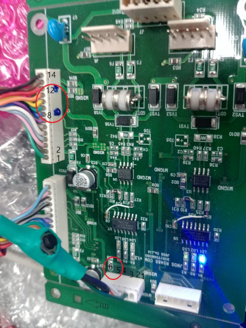

# Frightsome Howl

## 섬찟한 울음소리

## JPOS3000 메인보드

    Top connection:
        vfd-conn#1/vfd-conn#2,upboard-conn,jtag-conn,nozzleSW-conn
    Left connection:
        232/isp-conn,keypad-conn,lcd-conn,ac-conn
    Right connection:
        printer-sel-conn,printer-conn,rftag-conn,counter-conn,bat-conn
    Bottom connection:
        pump-conn,sol-conn

## JPOS3000 업보드

    serial monitering(5pin): 115200baud, activated by press 'P' and then 'U' in Tera

    KTC OTP 전자봉인관련 개발문서:
        D:\wj\A.PROJECTS\KTC OTP
  

    KTC로 부터 인증후 받은 인증서를 uSD카드에 갱신해서 사용해야 한다. 여기에 인증시받은 소스코드의 해시가
    들어 있고 무결성과 관련된다        

## JPOS3000 485/422 통신보드

    Input:
        MainA 232rx/tx,isp(rx,tx,reset,boot)
        MainA 232rx/tx,isp(rx,tx,reset,boot)
    Output:
        IspA(6pin) for MainA download
        IspB(6pin) for MainB download
        RS422A for Round Robin Polling 
        RS422B for Round Robin Polling 
        RS485 -NA

    *422통신(마스터/슬레이브 모드,1:N 모드,멀티드롭,다중분기방식)
    마스터는 사무실통신프로그램이고 
    마스터는 항시 tx,rx가 인에블되어있다.
    슬레이브의 수신은 항시온되어 있고  
    슬레이브는 송신은 전송후 디스에이블 되어야

## JPOS3000 ext-interface 통신보드

    How to re-entering BootLoader Menu in dnw.exe
    4번핀(리셋) 5번핀(부트) 6번핀(그라운드)
    6핀커넥터의 5,6번 쇼트된상태에서 6번핀을 4번핀에 쇼트시키고 분리하면 DNW의 부트로더메뉴(Flash Write)로 재진입된다

## JPOS3000 485/232 쪽보드 for PC

    422 마스터용

