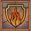
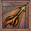

# Hawezar

### Diablo 4 Sorcerer Skills - Season 4







```
  화염탄 원소술사
    마법부여 : 화염탄,운석낙하
    머리,가슴,다리,목걸이 - 담금질- 화염보호막 지속시간
    재사용대기시간(재감) 50%이상 + 화염보호막 지속시간 5초 (16/5등급 아이템기여: 11)
    상의에 화염보호막, 중심점에 재사용대기시간 있어야...

    [분주의 위상] 기본기술을 5번 사용할때마다 재사용 대기중인 기술중 하나의 대기시간이 감소한다
                 공격속도 옵션도 함께 확보 해서 분주의 위상 효과를 적극 활용
    순간이동후 몬스터 한곳으로 모으고 화염 보막과 화염벽사용 하고 화염탄 난사!!!     
    순간이동,얼음칼날(재사용대기시간 감소효과의 20%가 다른기술에 적용)   번개창(Lightning Spear):극대화로 적중하면 2초 기절            

```
#### How to get Hectic Aspect
#### The most optimal item to gamble is Boots !

D4 The most optimal item to gamble for 분주의위상: <https://diablo4.life/tools/gambling>

### 디아블로 시즌4
원소술사 스타터 맨땅 레벨업 가이드: <https://www.youtube.com/watch?v=p-yxISbP5Ik>


```
아이템드랍: 95+레벨이상 몬스터에서 925 아이템 레벨 무조건 드랍
악몽난이도 ->신성 아이템 드랍, 고행난이도 ->선조 아이템
악몽에서 우버유니크및 유니크 아이템 드랍
```
```
힘의 전서: 분해시 자동으로 힘의전서에 등록
신규 힘의 전서는 총16단계 상위위상을 찾아서 등록해야(고행)
```

```
유저가 직접 얻은 장비에 어픽스(Affix)를 추가해 맞춤 설정할 수 있는 '담금질' 시스템이 추가, 아이템 어픽스를 큰폭으로 강화하는 '명품화'도 선보여. 드롭되는 아이템에 일반 속성보다 더 높은 수치가 적용되는 '상급속성'개녕도 생겨

담금질을 통해 기존에 아이템에 없던 속성을 추가(횟수제한,고유아템은 불가)

```
```
명품화(Masterworking):
기존에는 아이템강화가 최대 5강까지 였는데 12강으로 늘어남
4강을 할때마다 특정옵션 한줄이 큰폭으로 증가(4,8,>12강 이렇게 세번이 특정 옵션 강화)
운이 좋으면 특정옵션만 강화가 될수 있슴 '재사용대기시간','자원증가및 소모량' 이 선호됨
유니크템에 강화하여 엄청난 아이템이 탄생하게 될 것
```
```
보석:
일반보석은 51렙에,온전한 보석은 71렙에,왕실보석은 91레벨에 제작가능

```

```
상급속성:
아이콘 표시된 아이템은 상급 속성이 붙었다는 표시
```


```
강철늑대단에 합류 '늑대의 부름'이라는 시즌활동을 진행하여 여러 보상
```