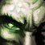

# Waking Nightmare

### 생생한 악몽



## Season Of Discovery Dugeon Information
```
Ragefire Chasm: 성난불길 협곡
Shadowfang Keep:그림자송곳니성채
Blackfathom Deeps:검은심연의 나락
The Stockade:지하감옥
Gnomregan:놈리건
Razorfen Kraul:가시덩굴 우리
Scarlet Monastery:주홍색 수도원
Razorfen Downs:가시덩굴 구리
Uldaman:울다만
Zul'Farrak:줄파락
Maraudon:마라우돈
Temple of Atal'Hakkar:가라앉은 사원(아탈학카르 신전)
Blackrock Depths:검은바위 나락
Dire Maul West(Capital Gardens):혈투의 전장
Dire Maul North(Gordoks Commons):
Lower Blackrock Spire(LBRS):검은바위첨탑 하층
Scholomance:스칼로맨스
Stratholme:스트라솔룸
Upper Blackrock Spirs(UBRS);검은바위첨탑

```
